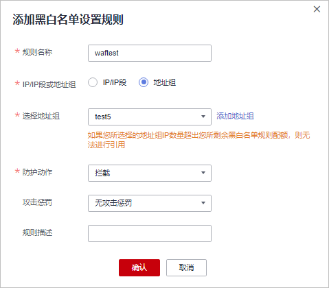
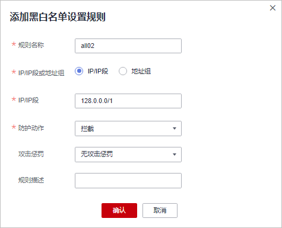

# 配置IP黑白名单规则

IP地址默认全部放行，您可以通过配置黑白名单规则，阻断、仅记录或放行指定IP地址/IP地址段的访问请求。

> **说明：** 
>如果您已开通企业项目，您需要在“企业项目“下拉列表中选择您所在的企业项目并确保已开通操作权限，才能为该企业项目下域名配置防护策略。

## 前提条件

已添加防护网站。

## 约束条件

-   检测版不支持该功能。
-   WAF支持批量导入黑白名单，如果您需要配置多个IP/IP地址段规则，请添加地址组，详细操作请参见[添加黑白名单IP地址组](添加黑白名单IP地址组.md)。
-   添加或修改防护规则后，规则生效需要等待几分钟。规则生效后，您可以在“防护事件“页面查看防护效果。
-   WAF黑白名单规则不支持配置0.0.0.0/0 IP地址段，且白名单规则优先级高于黑名单规则。如果您需要放行某个网段指定的IP并拦截某个网段其他所有IP，请先添加黑名单规则，拦截将该网段的所有IP，然后添加白名单规则，放行指定IP。

    > **须知：** 
    >如果您需要拦截所有来源IP或仅允许指定IP访问防护网站，请参见[拦截所有来源IP或仅允许指定IP访问防护网站，如何配置？](https://support.huaweicloud.com/waf_faq/waf_01_0312.html)进行配置。

-   当黑白名单规则的“防护动作“设置为“拦截“时，您可以[配置攻击惩罚标准](配置攻击惩罚标准.md)。配置攻击惩罚后，如果访问者的IP、Cookie或Params恶意请求被拦截时，WAF将根据攻击惩罚设置的拦截时长来封禁访问者。

## 规格限制

-   云模式各版本、独享模式和ELB模式支持创建的IP黑白名单规则条数请参见[服务版本差异](https://support.huaweicloud.com/productdesc-waf/waf_01_0106.html#section1)。
-   如果您购买了云模式，当前版本的IP黑白名单防护规则条数不能满足要求时，您可以通过购买规则扩展包或升级云模式版本增加IP黑白名单防护规则条数，以满足的防护配置需求。

    一个规则扩展包包含10条IP黑白名单防护规则。有关升级规则的详细操作，请参见[升级WAF云模式版本和规格](https://support.huaweicloud.com/usermanual-waf/waf_01_0114.html)。

## 系统影响

将IP或IP地址段配置为黑名单/白名单后，来自该IP或IP地址段的访问，WAF将不会做任何检测，直接拦截/放行。

## 操作步骤

1.  [登录管理控制台](https://console.huaweicloud.com/?locale=zh-cn)。
2.  进入防护策略配置入口，如[图1](#waf_01_0008_fig089771664710)所示。

    **图 1**  防护策略配置入口  
    

3.  在“黑白名单设置“配置框中，用户可根据自己的需要更改“状态“，单击“自定义黑白名单设置规则“，进入黑白名单设置规则页面，如[图2](#fig0358162863015)所示。

    **图 2**  黑白名单配置框  
    

4.  在“黑白名单“设置规则页面左上角，单击“添加规则“。
5.  在弹出的对话框中，添加黑白名单规则，如[图3](#fig1810352211544)和[图4](#fig1936217171553)所示，参数说明如[表1](#table147241231818)所示。

    > **说明：** 
    >-   将IP配置为仅记录后，来自该IP的访问，WAF将根据防护规则进行检测并记录该IP的防护事件数据。
    >-   其他的IP将根据配置的WAF防护规则进行检测。

    **图 3**  添加单个IP/IP地址段黑白名单规则  
    

    **图 4**  批量添加IP/IP地址段黑白名单规则  
    

    **表 1**  黑白名单参数说明

    
    <table><thead align="left"><tr id="row167071221814"><th class="cellrowborder" valign="top" width="18.81188118811881%" id="mcps1.2.4.1.1">
参数

    </th>
    <th class="cellrowborder" valign="top" width="35.913591359135914%" id="mcps1.2.4.1.2">
参数说明

    </th>
    <th class="cellrowborder" valign="top" width="45.274527452745275%" id="mcps1.2.4.1.3">
取值样例

    </th>
    </tr>
    </thead>
    <tbody><tr id="row17828105919582"><td class="cellrowborder" valign="top" width="18.81188118811881%" headers="mcps1.2.4.1.1 ">
规则名称

    </td>
    <td class="cellrowborder" valign="top" width="35.913591359135914%" headers="mcps1.2.4.1.2 ">
用户自定义黑白名单规则的名字。

    </td>
    <td class="cellrowborder" valign="top" width="45.274527452745275%" headers="mcps1.2.4.1.3 ">
waftest

    </td>
    </tr>
    <tr id="row188736565586"><td class="cellrowborder" valign="top" width="18.81188118811881%" headers="mcps1.2.4.1.1 ">
IP/IP段或地址组

    </td>
    <td class="cellrowborder" valign="top" width="35.913591359135914%" headers="mcps1.2.4.1.2 ">
支持添加黑白名单规则的方式，“IP/IP段”或“地址组”。

    </td>
    <td class="cellrowborder" valign="top" width="45.274527452745275%" headers="mcps1.2.4.1.3 ">
IP/IP段

    </td>
    </tr>
    <tr id="row671212161816"><td class="cellrowborder" valign="top" width="18.81188118811881%" headers="mcps1.2.4.1.1 ">
IP/IP段

    </td>
    <td class="cellrowborder" valign="top" width="35.913591359135914%" headers="mcps1.2.4.1.2 ">
当“IP/IP段或地址组” 选择“IP/IP段”时需要设置该参数。

    
支持IPv4和IPv6格式的IP地址或IP地址段。

    <ul id="ul16332155911817"><li>IP地址：添加黑名单或者白名单的IP地址。</li><li>IP地址段：IP地址与子网掩码。</li></ul>
    
 须知： 

仅专业版（原企业版）和铂金版（原旗舰版）支持IPv6防护，且当前仅“华东”和“华北”区域支持IPv4/IPv6双栈和NAT64。

    

    </td>
    <td class="cellrowborder" valign="top" width="45.274527452745275%" headers="mcps1.2.4.1.3 "><ul id="ul20137241191011"><li>IPv4格式：<ul id="ul2071625551110"><li>192.168.2.3</li><li>10.1.1.0/24</li></ul>
    </li><li>IPv6格式：1050:0:0:0:5:600:300c:326b</li></ul>
    </td>
    </tr>
    <tr id="row2935529135819"><td class="cellrowborder" valign="top" width="18.81188118811881%" headers="mcps1.2.4.1.1 ">
选择地址组

    </td>
    <td class="cellrowborder" valign="top" width="35.913591359135914%" headers="mcps1.2.4.1.2 ">
当“IP/IP段或地址组” 选择“地址组”时需要设置该参数，在下拉列表框中选择已添加的地址组。您也可以单击“添加地址组”创建新的地址组，详细操作请参见<a href="添加黑白名单IP地址组.md">添加黑白名单IP地址组</a>。

    </td>
    <td class="cellrowborder" valign="top" width="45.274527452745275%" headers="mcps1.2.4.1.3 ">
groupwaf

    </td>
    </tr>
    <tr id="row127111201815"><td class="cellrowborder" valign="top" width="18.81188118811881%" headers="mcps1.2.4.1.1 ">
防护动作

    </td>
    <td class="cellrowborder" valign="top" width="35.913591359135914%" headers="mcps1.2.4.1.2 "><ul id="ul14238171916485"><li>拦截：IP地址或IP地址段设置的是黑名单且需要拦截，则选择“拦截”。</li><li>放行：IP地址或IP地址段设置的是白名单，则选择“放行”。</li><li>仅记录：需要观察的IP地址或IP地址段，可选择“仅记录”。再根据<a href="下载防护事件数据.md">防护事件数据</a>判断该IP地址或IP地址段是黑名单还是白名单。</li></ul>
    </td>
    <td class="cellrowborder" valign="top" width="45.274527452745275%" headers="mcps1.2.4.1.3 ">
拦截

    </td>
    </tr>
    <tr id="row145743412307"><td class="cellrowborder" valign="top" width="18.81188118811881%" headers="mcps1.2.4.1.1 ">
攻击惩罚

    </td>
    <td class="cellrowborder" valign="top" width="35.913591359135914%" headers="mcps1.2.4.1.2 ">
当“防护动作”设置为“拦截”时，您可以设置攻击惩罚标准。设置攻击惩罚后，当访问者的IP、Cookie或Params恶意请求被拦截时，WAF将根据惩罚标准设置的拦截时长来封禁访问者。

    </td>
    <td class="cellrowborder" valign="top" width="45.274527452745275%" headers="mcps1.2.4.1.3 ">
长时间IP拦截

    </td>
    </tr>
    <tr id="row147241221818"><td class="cellrowborder" valign="top" width="18.81188118811881%" headers="mcps1.2.4.1.1 ">
规则描述

    </td>
    <td class="cellrowborder" valign="top" width="35.913591359135914%" headers="mcps1.2.4.1.2 ">
可选参数，设置该规则的备注信息。

    </td>
    <td class="cellrowborder" valign="top" width="45.274527452745275%" headers="mcps1.2.4.1.3 ">
--

    </td>
    </tr>
    </tbody>
    </table>

6.  输入完成后，单击“确认添加“，添加的黑白名单展示在黑白名单规则列表中。

    **图 5**  黑白名单规则列表  
    

    -   规则添加成功后，默认的“规则状态“为“已开启“，若您暂时不想使该规则生效，可在目标规则所在行的“操作“列，单击“关闭“。
    -   若需要修改添加的黑白名单规则时，可单击待修改的黑白名单IP规则所在行的“修改“，修改黑白名单规则。
    -   若需要删除添加的黑白名单规则时，可单击待删除的黑白名单IP规则所在行的“删除“，删除黑白名单规则。

## 配置示例-放行指定IP

假如防护域名“www.example.com“已接入WAF，您可以参照以下操作步骤验证放行指定IP防护效果。

1.  添加以下2条黑白名单规则，拦截所有来源IP。

    **图 6**  拦截1.0.0.0/1 IP地址段  
    

    **图 7**  拦截128.0.0.0/1 IP地址段  
    

    您也可以通过添加一条精准访问防护规则，拦截所有访问请求，如[图8](#fig489116305597)所示。

    **图 8**  拦截所有访问请求  
    

    有关配置精准访问防护规则的详细介绍，请参见[配置精准访问防护规则](https://support.huaweicloud.com/usermanual-waf/waf_01_0010.html)。

2.  参照[图9](#fig5519155016115)示例添加黑白名单规则，放行指定IP，例如，XXX.XXX.2.3。

    **图 9**  放行指定IP  
    

3.  开启黑白名单防护规则。

    **图 10**  黑白名单配置框  
    

4.  清理浏览器缓存，在浏览器中访问“http://www.example.com“页面。

    当访问者的源IP不属于[2](#li839632265215)中设置的放行IP地址时，WAF将拦截该访问请求，拦截页面示例如[图11](#fig11778435913)所示。

    **图 11**  WAF拦截攻击请求  
    

5.  返回Web应用防火墙管理控制台，在左侧导航树中，单击“防护事件“，进入“防护事件“页面，您可以查看该防护事件。

