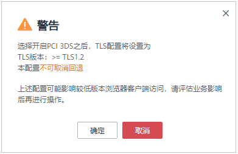
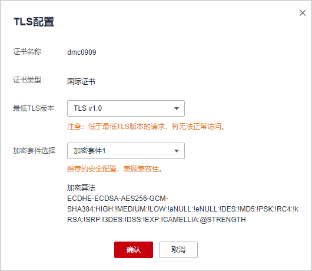

# 配置PCI DSS/3DS合规与TLS

安全传输层协议（Transport Layer Security，TLS）在两个通信应用程序之间提供保密性和数据完整性。HTTPS协议是由TLS+HTTP协议构建的可进行加密传输、身份认证的网络协议。当防护网站的部署模式为“云模式“或“独享模式“且“对外协议“为“HTTPS“时，您可以通过WAF为网站设置最低TLS版本和加密套件（多种加密算法的集合），对于低于最低TLS版本的请求，将无法正常访问网站，以满足行业客户的安全需求。

WAF默认配置的最低TLS版本为TLS v1.0，加密套件为加密套件1，为了确保网站安全，建议您将网站的最低TLS版本和TLS加密套件配置为安全性更高TLS版本和加密套件。

同时，WAF支持开启PCI DSS和PCI 3DS合规认证功能，开启合规认证后，最低TLS版本将设置为TLS v1.2，以满足PCI DSS和PCI 3DS合规认证要求。

> **说明：** 
>如果您已开通企业项目，您可以在“企业项目“下拉列表中选择您所在的企业项目，为该企业项目下的域名配置PCI DSS/3DS合规与TLS。

## 前提条件

-   防护网站的部署模式为“云模式“或“独享模式“。
-   防护网站的“对外协议“使用了HTTPS协议。

## 约束条件

当防护网站的“对外协议“为“HTTP“时，HTTP协议不涉及TLS，请忽略该章节。

## 应用场景

WAF默认配置的最低TLS版本为“TLS v1.0“，为了确保网站安全，建议您根据业务实际需求进行配置，推荐配置的最低TLS版本如[表1](#table19196118195712)所示。

**表 1**  推荐配置的最低TLS版本说明

<table><thead align="left"><tr id="row5197583579"><th class="cellrowborder" valign="top" width="32.879999999999995%" id="mcps1.2.4.1.1">
场景

</th>
<th class="cellrowborder" valign="top" width="27.73%" id="mcps1.2.4.1.2">
最低TLS版本（推荐）

</th>
<th class="cellrowborder" valign="top" width="39.39%" id="mcps1.2.4.1.3">
防护效果

</th>
</tr>
</thead>
<tbody><tr id="row101976814577"><td class="cellrowborder" valign="top" width="32.879999999999995%" headers="mcps1.2.4.1.1 ">
网站安全性能要求很高（例如，银行金融、证券、电子商务等有重要商业信息和重要数据的行业）

</td>
<td class="cellrowborder" valign="top" width="27.73%" headers="mcps1.2.4.1.2 ">
TLS v1.2

</td>
<td class="cellrowborder" valign="top" width="39.39%" headers="mcps1.2.4.1.3 ">
WAF将自动拦截TLS v1.0和TLS v1.1协议的访问请求。

</td>
</tr>
<tr id="row4197138135711"><td class="cellrowborder" valign="top" width="32.879999999999995%" headers="mcps1.2.4.1.1 ">
网站安全性能要求一般（例如，中小企业门户网站）

</td>
<td class="cellrowborder" valign="top" width="27.73%" headers="mcps1.2.4.1.2 ">
TLS v1.1

</td>
<td class="cellrowborder" valign="top" width="39.39%" headers="mcps1.2.4.1.3 ">
WAF将自动拦截TLS1.0协议的访问请求。

</td>
</tr>
<tr id="row15198128125718"><td class="cellrowborder" valign="top" width="32.879999999999995%" headers="mcps1.2.4.1.1 ">
客户端APP无安全性要求，可以正常访问网站

</td>
<td class="cellrowborder" valign="top" width="27.73%" headers="mcps1.2.4.1.2 ">
TLS v1.0

</td>
<td class="cellrowborder" valign="top" width="39.39%" headers="mcps1.2.4.1.3 ">
所有的TLS协议都可以访问网站。

</td>
</tr>
</tbody>
</table>

> **说明：** 
>在配置前TLS前，您可以先[查看网站TLS版本](https://myssl.com/ssl.html)。

WAF推荐配置的加密套件为“加密套件1“，可以满足浏览器兼容性和安全性，各加密套件相关说明如[表2](#table173581645172115)所示。

**表 2**  加密套件说明

<table><thead align="left"><tr id="row735934517212"><th class="cellrowborder" valign="top" width="20.830000000000002%" id="mcps1.2.4.1.1">
加密套件名称

</th>
<th class="cellrowborder" valign="top" width="40.160000000000004%" id="mcps1.2.4.1.2">
加密算法

</th>
<th class="cellrowborder" valign="top" width="39.01%" id="mcps1.2.4.1.3">
说明

</th>
</tr>
</thead>
<tbody><tr id="row2359154512119"><td class="cellrowborder" valign="top" width="20.830000000000002%" headers="mcps1.2.4.1.1 ">
默认加密套件

</td>
<td class="cellrowborder" valign="top" width="40.160000000000004%" headers="mcps1.2.4.1.2 ">
ECDHE-RSA-AES256-SHA384:AES256-SHA256:RC4:HIGH:!MD5:!aNULL:!eNULL:!NULL:!DH:!EDH:!AESGCM

</td>
<td class="cellrowborder" valign="top" width="39.01%" headers="mcps1.2.4.1.3 "><ul id="ul435984513212"><li>兼容性：较好，支持的客户端较为广泛</li><li>安全性：一般</li></ul>
</td>
</tr>
<tr id="row2036074516211"><td class="cellrowborder" valign="top" width="20.830000000000002%" headers="mcps1.2.4.1.1 ">
加密套件1

</td>
<td class="cellrowborder" valign="top" width="40.160000000000004%" headers="mcps1.2.4.1.2 ">
ECDHE-ECDSA-AES256-GCM-SHA384:HIGH:!MEDIUM:!LOW:!aNULL:!eNULL:!DES:!MD5:!PSK:!RC4:!kRSA:!SRP:!3DES:!DSS:!EXP:!CAMELLIA:@STRENGTH

</td>
<td class="cellrowborder" valign="top" width="39.01%" headers="mcps1.2.4.1.3 ">
默认推荐配置。

<ul id="ul173601845132114"><li>兼容性：较好，支持的客户端较为广泛</li><li>安全性：较高</li></ul>
</td>
</tr>
<tr id="row3360545172111"><td class="cellrowborder" valign="top" width="20.830000000000002%" headers="mcps1.2.4.1.1 ">
加密套件2

</td>
<td class="cellrowborder" valign="top" width="40.160000000000004%" headers="mcps1.2.4.1.2 ">
EECDH+AESGCM:EDH+AESGCM

</td>
<td class="cellrowborder" valign="top" width="39.01%" headers="mcps1.2.4.1.3 "><ul id="ul33601445152117"><li>兼容性：一般，严格符合PCI DSS的FS要求，较低版本浏览器可能无法访问。</li><li>安全性：高</li></ul>
</td>
</tr>
<tr id="row3360114572113"><td class="cellrowborder" valign="top" width="20.830000000000002%" headers="mcps1.2.4.1.1 ">
加密套件3

</td>
<td class="cellrowborder" valign="top" width="40.160000000000004%" headers="mcps1.2.4.1.2 ">
ECDHE-RSA-AES128-GCM-SHA256:ECDHE-RSA-AES256-GCM-SHA384:ECDHE-RSA-AES256-SHA384:RC4:HIGH:!MD5:!aNULL:!eNULL:!NULL:!DH:!EDH

</td>
<td class="cellrowborder" valign="top" width="39.01%" headers="mcps1.2.4.1.3 "><ul id="ul163611045152110"><li>兼容性：一般，较低版本浏览器可能无法访问。</li><li>安全性：高，支持ECDHE、DHE-GCM、RSA-AES-GCM多种算法。</li></ul>
</td>
</tr>
<tr id="row83611245192116"><td class="cellrowborder" valign="top" width="20.830000000000002%" headers="mcps1.2.4.1.1 ">
加密套件4

</td>
<td class="cellrowborder" valign="top" width="40.160000000000004%" headers="mcps1.2.4.1.2 ">
ECDHE-RSA-AES256-GCM-SHA384:ECDHE-RSA-AES128-GCM-SHA256:ECDHE-RSA-AES256-SHA384:AES256-SHA256:RC4:HIGH:!MD5:!aNULL:!eNULL:!NULL:!EDH

</td>
<td class="cellrowborder" valign="top" width="39.01%" headers="mcps1.2.4.1.3 "><ul id="ul12361134522117"><li>兼容性：较好，支持的客户端较为广泛</li><li>安全性：一般，新增支持GCM算法。</li></ul>
</td>
</tr>
</tbody>
</table>

WAF提供的TLS加密套件对于高版本的浏览器及客户端都可以兼容，不能兼容部分老版本的浏览器，以TLS v1.0协议为例，加密套件不兼容的浏览器及客户端参考说明如[表3](#table893015311885)所示。

> **须知：** 
>建议您以实际客户端环境测试的兼容情况为准，避免影响现网业务。

**表 3**  加密套件不兼容的浏览器/客户端参考说明（TLS v1.0）

<table><thead align="left"><tr id="row119311731483"><th class="cellrowborder" valign="top" width="26.97%" id="mcps1.2.7.1.1">
浏览器/客户端

</th>
<th class="cellrowborder" valign="top" width="17.349999999999998%" id="mcps1.2.7.1.2">
默认加密套件

</th>
<th class="cellrowborder" valign="top" width="13.36%" id="mcps1.2.7.1.3">
加密套件1

</th>
<th class="cellrowborder" valign="top" width="13.389999999999999%" id="mcps1.2.7.1.4">
加密套件2

</th>
<th class="cellrowborder" valign="top" width="14.610000000000001%" id="mcps1.2.7.1.5">
加密套件3

</th>
<th class="cellrowborder" valign="top" width="14.32%" id="mcps1.2.7.1.6">
加密套件4

</th>
</tr>
</thead>
<tbody><tr id="row13746162393812"><td class="cellrowborder" valign="top" width="26.97%" headers="mcps1.2.7.1.1 ">
Google Chrome 63 /macOS High Sierra 10.13.2

</td>
<td class="cellrowborder" valign="top" width="17.349999999999998%" headers="mcps1.2.7.1.2 ">
×

</td>
<td class="cellrowborder" valign="top" width="13.36%" headers="mcps1.2.7.1.3 ">
√

</td>
<td class="cellrowborder" valign="top" width="13.389999999999999%" headers="mcps1.2.7.1.4 ">
√

</td>
<td class="cellrowborder" valign="top" width="14.610000000000001%" headers="mcps1.2.7.1.5 ">
√

</td>
<td class="cellrowborder" valign="top" width="14.32%" headers="mcps1.2.7.1.6 ">
×

</td>
</tr>
<tr id="row1493112317816"><td class="cellrowborder" valign="top" width="26.97%" headers="mcps1.2.7.1.1 ">
Google Chrome 49/ Windows XP SP3

</td>
<td class="cellrowborder" valign="top" width="17.349999999999998%" headers="mcps1.2.7.1.2 ">
×

</td>
<td class="cellrowborder" valign="top" width="13.36%" headers="mcps1.2.7.1.3 ">
×

</td>
<td class="cellrowborder" valign="top" width="13.389999999999999%" headers="mcps1.2.7.1.4 ">
×

</td>
<td class="cellrowborder" valign="top" width="14.610000000000001%" headers="mcps1.2.7.1.5 ">
×

</td>
<td class="cellrowborder" valign="top" width="14.32%" headers="mcps1.2.7.1.6 ">
×

</td>
</tr>
<tr id="row493112311784"><td class="cellrowborder" valign="top" width="26.97%" headers="mcps1.2.7.1.1 ">
Internet Explorer

6/Windows XP

</td>
<td class="cellrowborder" valign="top" width="17.349999999999998%" headers="mcps1.2.7.1.2 ">
×

</td>
<td class="cellrowborder" valign="top" width="13.36%" headers="mcps1.2.7.1.3 ">
×

</td>
<td class="cellrowborder" valign="top" width="13.389999999999999%" headers="mcps1.2.7.1.4 ">
×

</td>
<td class="cellrowborder" valign="top" width="14.610000000000001%" headers="mcps1.2.7.1.5 ">
×

</td>
<td class="cellrowborder" valign="top" width="14.32%" headers="mcps1.2.7.1.6 ">
×

</td>
</tr>
<tr id="row12932153114810"><td class="cellrowborder" valign="top" width="26.97%" headers="mcps1.2.7.1.1 ">
Internet Explorer

8/Windows XP

</td>
<td class="cellrowborder" valign="top" width="17.349999999999998%" headers="mcps1.2.7.1.2 ">
×

</td>
<td class="cellrowborder" valign="top" width="13.36%" headers="mcps1.2.7.1.3 ">
×

</td>
<td class="cellrowborder" valign="top" width="13.389999999999999%" headers="mcps1.2.7.1.4 ">
×

</td>
<td class="cellrowborder" valign="top" width="14.610000000000001%" headers="mcps1.2.7.1.5 ">
×

</td>
<td class="cellrowborder" valign="top" width="14.32%" headers="mcps1.2.7.1.6 ">
×

</td>
</tr>
<tr id="row59327312819"><td class="cellrowborder" valign="top" width="26.97%" headers="mcps1.2.7.1.1 ">
Safari 6/iOS 6.0.1

</td>
<td class="cellrowborder" valign="top" width="17.349999999999998%" headers="mcps1.2.7.1.2 ">
√

</td>
<td class="cellrowborder" valign="top" width="13.36%" headers="mcps1.2.7.1.3 ">
√

</td>
<td class="cellrowborder" valign="top" width="13.389999999999999%" headers="mcps1.2.7.1.4 ">
×

</td>
<td class="cellrowborder" valign="top" width="14.610000000000001%" headers="mcps1.2.7.1.5 ">
√

</td>
<td class="cellrowborder" valign="top" width="14.32%" headers="mcps1.2.7.1.6 ">
√

</td>
</tr>
<tr id="row1352661317186"><td class="cellrowborder" valign="top" width="26.97%" headers="mcps1.2.7.1.1 ">
Safari 7/iOS 7.1

</td>
<td class="cellrowborder" valign="top" width="17.349999999999998%" headers="mcps1.2.7.1.2 ">
√

</td>
<td class="cellrowborder" valign="top" width="13.36%" headers="mcps1.2.7.1.3 ">
√

</td>
<td class="cellrowborder" valign="top" width="13.389999999999999%" headers="mcps1.2.7.1.4 ">
×

</td>
<td class="cellrowborder" valign="top" width="14.610000000000001%" headers="mcps1.2.7.1.5 ">
√

</td>
<td class="cellrowborder" valign="top" width="14.32%" headers="mcps1.2.7.1.6 ">
√

</td>
</tr>
<tr id="row49883179189"><td class="cellrowborder" valign="top" width="26.97%" headers="mcps1.2.7.1.1 ">
Safari 7/OS X 10.9

</td>
<td class="cellrowborder" valign="top" width="17.349999999999998%" headers="mcps1.2.7.1.2 ">
√

</td>
<td class="cellrowborder" valign="top" width="13.36%" headers="mcps1.2.7.1.3 ">
√

</td>
<td class="cellrowborder" valign="top" width="13.389999999999999%" headers="mcps1.2.7.1.4 ">
×

</td>
<td class="cellrowborder" valign="top" width="14.610000000000001%" headers="mcps1.2.7.1.5 ">
√

</td>
<td class="cellrowborder" valign="top" width="14.32%" headers="mcps1.2.7.1.6 ">
√

</td>
</tr>
<tr id="row322742921817"><td class="cellrowborder" valign="top" width="26.97%" headers="mcps1.2.7.1.1 ">
Safari 8/iOS 8.4

</td>
<td class="cellrowborder" valign="top" width="17.349999999999998%" headers="mcps1.2.7.1.2 ">
√

</td>
<td class="cellrowborder" valign="top" width="13.36%" headers="mcps1.2.7.1.3 ">
√

</td>
<td class="cellrowborder" valign="top" width="13.389999999999999%" headers="mcps1.2.7.1.4 ">
×

</td>
<td class="cellrowborder" valign="top" width="14.610000000000001%" headers="mcps1.2.7.1.5 ">
√

</td>
<td class="cellrowborder" valign="top" width="14.32%" headers="mcps1.2.7.1.6 ">
√

</td>
</tr>
<tr id="row499015324184"><td class="cellrowborder" valign="top" width="26.97%" headers="mcps1.2.7.1.1 ">
Safari 8/OS X 10.10

</td>
<td class="cellrowborder" valign="top" width="17.349999999999998%" headers="mcps1.2.7.1.2 ">
√

</td>
<td class="cellrowborder" valign="top" width="13.36%" headers="mcps1.2.7.1.3 ">
√

</td>
<td class="cellrowborder" valign="top" width="13.389999999999999%" headers="mcps1.2.7.1.4 ">
×

</td>
<td class="cellrowborder" valign="top" width="14.610000000000001%" headers="mcps1.2.7.1.5 ">
√

</td>
<td class="cellrowborder" valign="top" width="14.32%" headers="mcps1.2.7.1.6 ">
√

</td>
</tr>
<tr id="row19291110171920"><td class="cellrowborder" valign="top" width="26.97%" headers="mcps1.2.7.1.1 ">
Internet Explorer

7/Windows Vista

</td>
<td class="cellrowborder" valign="top" width="17.349999999999998%" headers="mcps1.2.7.1.2 ">
√

</td>
<td class="cellrowborder" valign="top" width="13.36%" headers="mcps1.2.7.1.3 ">
√

</td>
<td class="cellrowborder" valign="top" width="13.389999999999999%" headers="mcps1.2.7.1.4 ">
×

</td>
<td class="cellrowborder" valign="top" width="14.610000000000001%" headers="mcps1.2.7.1.5 ">
√

</td>
<td class="cellrowborder" valign="top" width="14.32%" headers="mcps1.2.7.1.6 ">
√

</td>
</tr>
<tr id="row243482441911"><td class="cellrowborder" valign="top" width="26.97%" headers="mcps1.2.7.1.1 ">
Internet Explorer

8～10/Windows 7

</td>
<td class="cellrowborder" valign="top" width="17.349999999999998%" headers="mcps1.2.7.1.2 ">
√

</td>
<td class="cellrowborder" valign="top" width="13.36%" headers="mcps1.2.7.1.3 ">
√

</td>
<td class="cellrowborder" valign="top" width="13.389999999999999%" headers="mcps1.2.7.1.4 ">
×

</td>
<td class="cellrowborder" valign="top" width="14.610000000000001%" headers="mcps1.2.7.1.5 ">
√

</td>
<td class="cellrowborder" valign="top" width="14.32%" headers="mcps1.2.7.1.6 ">
√

</td>
</tr>
<tr id="row19932121113195"><td class="cellrowborder" valign="top" width="26.97%" headers="mcps1.2.7.1.1 ">
Internet Explorer

10/Windows Phone 8.0

</td>
<td class="cellrowborder" valign="top" width="17.349999999999998%" headers="mcps1.2.7.1.2 ">
√

</td>
<td class="cellrowborder" valign="top" width="13.36%" headers="mcps1.2.7.1.3 ">
√

</td>
<td class="cellrowborder" valign="top" width="13.389999999999999%" headers="mcps1.2.7.1.4 ">
×

</td>
<td class="cellrowborder" valign="top" width="14.610000000000001%" headers="mcps1.2.7.1.5 ">
√

</td>
<td class="cellrowborder" valign="top" width="14.32%" headers="mcps1.2.7.1.6 ">
√

</td>
</tr>
<tr id="row780362131911"><td class="cellrowborder" valign="top" width="26.97%" headers="mcps1.2.7.1.1 ">
Java 7u25

</td>
<td class="cellrowborder" valign="top" width="17.349999999999998%" headers="mcps1.2.7.1.2 ">
√

</td>
<td class="cellrowborder" valign="top" width="13.36%" headers="mcps1.2.7.1.3 ">
√

</td>
<td class="cellrowborder" valign="top" width="13.389999999999999%" headers="mcps1.2.7.1.4 ">
×

</td>
<td class="cellrowborder" valign="top" width="14.610000000000001%" headers="mcps1.2.7.1.5 ">
√

</td>
<td class="cellrowborder" valign="top" width="14.32%" headers="mcps1.2.7.1.6 ">
√

</td>
</tr>
<tr id="row89175614197"><td class="cellrowborder" valign="top" width="26.97%" headers="mcps1.2.7.1.1 ">
OpenSSL 0.9.8y

</td>
<td class="cellrowborder" valign="top" width="17.349999999999998%" headers="mcps1.2.7.1.2 ">
×

</td>
<td class="cellrowborder" valign="top" width="13.36%" headers="mcps1.2.7.1.3 ">
×

</td>
<td class="cellrowborder" valign="top" width="13.389999999999999%" headers="mcps1.2.7.1.4 ">
×

</td>
<td class="cellrowborder" valign="top" width="14.610000000000001%" headers="mcps1.2.7.1.5 ">
×

</td>
<td class="cellrowborder" valign="top" width="14.32%" headers="mcps1.2.7.1.6 ">
×

</td>
</tr>
<tr id="row178987528195"><td class="cellrowborder" valign="top" width="26.97%" headers="mcps1.2.7.1.1 ">
Safari 5.1.9/OS X 10.6.8

</td>
<td class="cellrowborder" valign="top" width="17.349999999999998%" headers="mcps1.2.7.1.2 ">
√

</td>
<td class="cellrowborder" valign="top" width="13.36%" headers="mcps1.2.7.1.3 ">
√

</td>
<td class="cellrowborder" valign="top" width="13.389999999999999%" headers="mcps1.2.7.1.4 ">
×

</td>
<td class="cellrowborder" valign="top" width="14.610000000000001%" headers="mcps1.2.7.1.5 ">
√

</td>
<td class="cellrowborder" valign="top" width="14.32%" headers="mcps1.2.7.1.6 ">
√

</td>
</tr>
<tr id="row921993612203"><td class="cellrowborder" valign="top" width="26.97%" headers="mcps1.2.7.1.1 ">
Safari 6.0.4/OS X 10.8.4

</td>
<td class="cellrowborder" valign="top" width="17.349999999999998%" headers="mcps1.2.7.1.2 ">
√

</td>
<td class="cellrowborder" valign="top" width="13.36%" headers="mcps1.2.7.1.3 ">
√

</td>
<td class="cellrowborder" valign="top" width="13.389999999999999%" headers="mcps1.2.7.1.4 ">
×

</td>
<td class="cellrowborder" valign="top" width="14.610000000000001%" headers="mcps1.2.7.1.5 ">
√

</td>
<td class="cellrowborder" valign="top" width="14.32%" headers="mcps1.2.7.1.6 ">
√

</td>
</tr>
</tbody>
</table>

## 系统影响

-   PCI DSS
    -   开启PCI DSS合规认证后，不能修改TLS最低版本和加密套件，且最低TLS版本将设置为“TLS v1.2“，加密套件设置为EECDH+AESGCM:EDH+AESGCM。
    -   开启PCI DSS合规认证后，如果您需要修改TLS最低版本和加密套件，请关闭该认证。

-   PCI 3DS
    -   开启PCI 3DS合规认证后，不能修改TLS最低版本，且最低TLS版本将设置为“TLS v1.2“。
    -   开启PCI 3DS合规认证后，您将不能关闭该认证，请根据业务实际需求进行操作。

## 操作步骤

1.  [登录管理控制台](https://console.huaweicloud.com/?locale=zh-cn)。
2.  进入网站设置页面入口，如[图1](#waf_01_0002_fig172535820151)所示。

    **图 1**  网站设置入口  
    

3.  在目标网站所在行的“防护网站“列中，单击目标网站，进入网站基本信息页面。
4.  在“合规认证“行，可以勾选“PCI DSS“或“PCI 3DS“开启合规认证，也可以在“TLS配置“所在行，单击修改TLS配置，如[图2](#fig158391141135917)所示。

    **图 2**  修改TLS配置  
    

    -   勾选“PCI DSS“，系统弹出“警告“对话框，单击“确定“，开启该合规认证。

        

        > **须知：** 
        >选择开启PCI DSS合规认证后，您将不能修改TLS最低版本和加密套件。

    -   勾选“PCI 3DS“，系统弹出“警告“对话框，单击“确定“，开启该合规认证。

        

        > **须知：** 
        >-   选择开启PCI 3DS合规认证后，您将不能修改TLS最低版本。
        >-   选择开启PCI 3DS合规认证后，您将不能关闭该认证，请根据业务实际需求进行操作。

5.  在弹出的“TLS配置“对话框中，选择最低TLS版本和加密套件，如[图3](#fig1518314493518)所示。

    **图 3** “TLS配置“对话框  
    

    选择“最低TLS版本“，相关说明如下：

    -   默认为TLS v1.0版本，TLS v1.0及以上版本的请求可以访问域名。
    -   选择TLS v1.1版本时，TLS v1.1及以上版本的请求可以访问域名。
    -   选择TLS v1.2版本时，TLS v1.2及以上版本的请求可以访问域名。

6.  单击“确定“，TLS配置完成。

## 生效条件

如果“最低TLS版本“配置为“TLS v1.2“，则TLS v1.2协议可以正常访问网站，TLS v1.1及以下协议不能正常访问网站。

