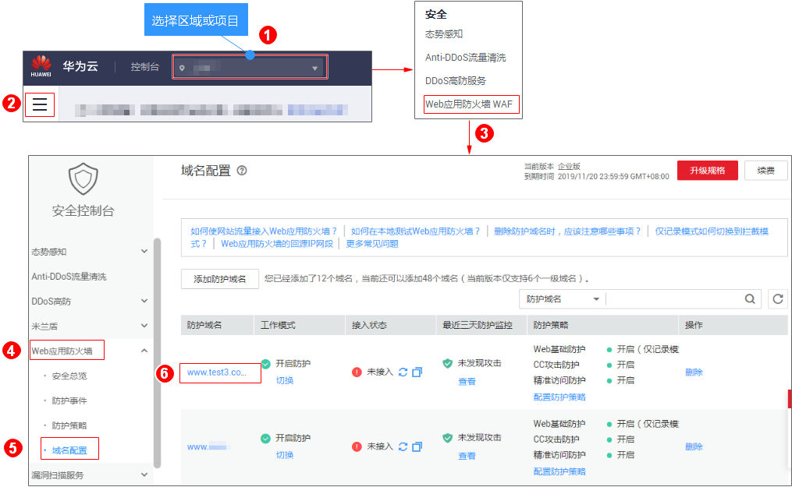
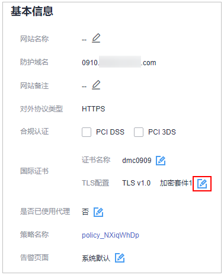
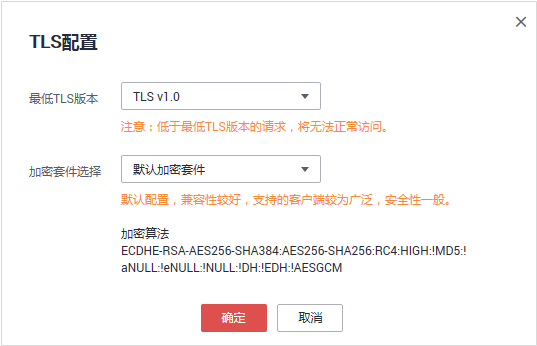

# 配置TLS最低版本和加密套件

安全传输层协议（Transport Layer Security，TLS）用于在两个通信应用程序之间提供保密性和数据完整性。当防护域名的“对外协议“为“HTTPS“时，WAF为了满足行业客户的安全需求，提供了设置最低TLS版本和加密套件（多种加密算法的集合）功能。

WAF默认配置的最低TLS版本为TLS v1.0，加密套件为默认加密套件（安全性一般），为了确保TLS连接的安全性，您可以更新访问源站的最低TLS版本和TLS加密套件。

## 前提条件

-   已添加防护域名。
-   防护域名的“对外协议“使用了HTTPS协议。

## 操作步骤

1.  [登录管理控制台](https://console.huaweicloud.com/?locale=zh-cn)。
2.  进入目标域名基本信息页面入口，如[图1](#waf_01_0079_fig1373412710218)所示。

    **图 1**  进入基本信息页面  
    

3.  在目标域名所在行的“防护域名“列中，单击目标域名，进入域名基本信息页面。
4.  在“TLS配置“所在行，单击，如[图2](#fig139001072302)所示。

    **图 2**  修改TLS配置  
    

5.  在弹出的“TLS配置“对话框中，选择最低TLS版本和加密套件，如[图3](#fig1518314493518)所示。

    **图 3** “TLS配置“对话框  
    

    -   选择“最低TLS版本“
        -   默认为TLS v1.0版本，即允许TLS v1.0、TLS v1.1、TLS v1.2的网络协议都可以访问网站。
        -   选择TLS v1.1版本时，允许TLS v1.1、TLS v1.2的网络协议访问网站。
        -   选择TLS v1.2版本时，只允许TLS v1.2的网络协议访问网站。

    -   选择“加密套件选择“
        -   默认加密套件：默认配置，兼容性较好，支持的客户端较为广泛，安全性一般。
        -   加密套件1：推荐的安全配置，兼顾兼容性。
        -   加密套件2：严格符合PCI DSS的FS要求，较低版本浏览器可能无法访问。
        -   加密套件3：支持ECDHE、DHE-GCM、RSA-AES-GCM，不支持CBC算法。

6.  单击“确定“，TLS配置完成。

