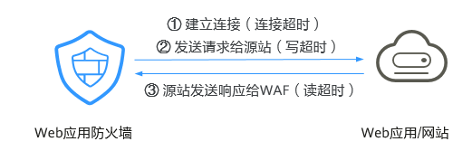

# 配置WAF到网站服务器的连接超时时间

如果您需要针对域名的每个请求设置超时时间，可参考本章节开启WAF到客户源站的“超时配置“并设置“连接超时“、“读超时“、“写超时“的时间。开启后不支持关闭。

-   **连接超时**：WAF转发客户端请求时，TCP三次握手超时时间。
-   **写超时**：WAF向源站发送请求的超时时间，若在设定的写超时时间内源站未接收到请求，则认为连接超时。
-   **读超时**：WAF从源站读取响应的超时时间，若在设定的读超时时间内未收到来自源站的响应，则认为连接超时。

WAF转发请求给源站的三个步骤如[图1](#fig1746612284428)所示。

**图 1**  WAF转发请求给源站  

> **说明：** 
>-   浏览器到WAF引擎的连接超时时长是120秒，该值取决于浏览器的配置，该值在WAF界面不可以手动设置。
>-   WAF到客户源站的连接超时时长默认为60秒，该值可以手动设置，但仅“独享模式”和“云模式”的专业版、铂金版支持手动设置连接超时时长。
>-   更多约束限制请参考[约束条件](#section115301864413)。

## 前提条件

已添加防护网站。

## 约束条件

-   防护网站的部署模式为“云模式“或者“独享模式“。
-   “云模式“仅专业版、铂金版支持手动设置连接超时时长。
-   WAF不支持手动设置浏览器到WAF引擎的连接超时时长，仅支持配置WAF到客户源站的连接超时时长。
-   开启后不支持关闭。
-   支持配置网站连接超时时间的区域，请参考[功能总览](https://support.huaweicloud.com/function-waf/index.html#)。

## 操作步骤

1.  [登录管理控制台](https://console.huaweicloud.com/?locale=zh-cn)。
2.  单击管理控制台左上角的，选择区域或项目。
3.  单击页面左上方的，选择“安全与合规  \>  Web应用防火墙 WAF“。
4.  在左侧导航树中，选择“网站设置“，进入“网站设置“页面。
5.  在目标网站所在行的“域名“列中，单击目标网站，进入网站基本信息页面。
6.  在“超时配置“所在行，单击“启用状态“图标，开启超时配置。
7.  单击，设置“连接超时“、“读超时“、“写超时“的时间，并单击保存设置。

