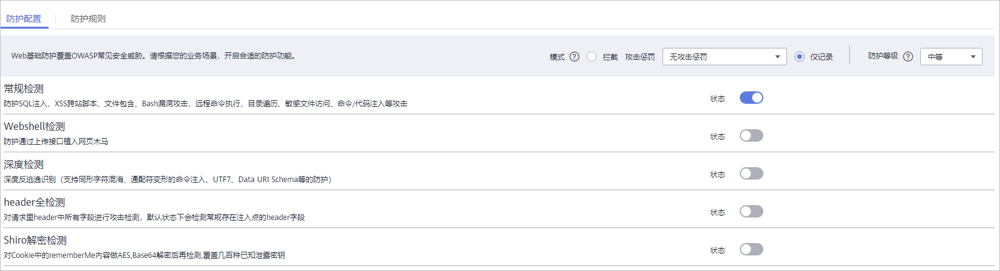

# 配置Web基础防护规则

该任务指导您通过Web应用防火墙服务灵活配置Web基础防护策略。Web基础防护开启后，可防范SQL注入、XSS跨站脚本、远程溢出攻击、文件包含、Bash漏洞攻击、远程命令执行、目录遍历、敏感文件访问、命令/代码注入等常规的web攻击，以及可支持Webshell检测、搜索引擎、扫描器、脚本工具、其它爬虫等Web基础防护。

## 前提条件

-   已获取管理控制台的帐号和密码。
-   已添加防护域名。

## 操作步骤

1.  登录管理控制台（https://console.huaweicloud.com/）。
2.  单击管理控制台左上角的，选择区域或项目。
3.  单击页面上方的“服务列表“，选择“安全  \>  Web应用防火墙“，在左侧导航树中选择“域名配置“，进入“域名配置“页面，如[图1](#fig164792010154510)所示。

    **图 1**  域名配置页面  
    

4.  在目标域名所在行的“防护策略“栏中，单击“配置防护策略“，进入“防护配置“页面。
5.  在“Web基础防护“配置框中，用户可根据自己的需要参照[表1](#table42360431192825)更改Web基础防护的“状态“和“模式“，如[图2](#fig193788379)所示。

    **图 2**  Web基础防护配置框  
    

    **表 1**  防护动作参数说明

    
    <table><thead align="left"><tr id="row66262481192825"><th class="cellrowborder" valign="top" width="36.28%" id="mcps1.2.3.1.1">
参数

    </th>
    <th class="cellrowborder" valign="top" width="63.72%" id="mcps1.2.3.1.2">
说明

    </th>
    </tr>
    </thead>
    <tbody><tr id="row8899732153112"><td class="cellrowborder" valign="top" width="36.28%" headers="mcps1.2.3.1.1 ">
状态

    </td>
    <td class="cellrowborder" valign="top" width="63.72%" headers="mcps1.2.3.1.2 ">
Web应用防护攻击的状态。

    <ul id="ul115452316468"><li>：开启状态。</li><li>：关闭状态。</li></ul>
    </td>
    </tr>
    <tr id="row28096830192825"><td class="cellrowborder" valign="top" width="36.28%" headers="mcps1.2.3.1.1 ">
模式

    </td>
    <td class="cellrowborder" valign="top" width="63.72%" headers="mcps1.2.3.1.2 "><ul id="ul946621183715"><li>拦截：发现攻击行为后立即阻断并记录。</li><li>仅记录：发现攻击行为后只记录不阻断攻击。</li></ul>
    </td>
    </tr>
    </tbody>
    </table>

6.  在“Web基础防护“配置框中，单击“高级设置“，进入“Web基础防护“界面，根据您的业务场景，开启合适的防护功能，如[图3](#fig17347539113910)所示。

    **图 3**  Web基础防护  
    

    1.  防护等级设置。

        在页面上方，选择防护等级，Web基础防护设置了三种防护等级：“宽松“、“中等“、“严格“，默认情况下，选择“中等“。

        -   “宽松“：不检测header中的XSS攻击和CMDI攻击，当发现防护规则拦截了您的正常业务时，可调整防护等级为“宽松“，“宽松“防护下对业务的误报率降低，但漏报率可能会增高，例如：wget、curl等检测。
        -   “中等“：根据文件的敏感程度区分，中危检测有远程文件包含、第三方软件漏洞、Webshell、cp、ftp。
        -   “严格“：当您需要更严格的防护等级时，建议选择“严格“，而“严格“防护下对业务的误报率可能会增高，但漏报率降低，例如nc、nmap、kill等。

    2.  防护检测类型设置。

        默认开启“常规检测“和“扫描器“防护检测，用户可根据业务需要，开启其他需要防护的检测类型。

## 防护效果

假如已添加域名“www.example.com“，且已开启了Web基础防护的“常规检测“，防护模式为“拦截“。您可以参照以下步骤验证WAF防护效果：

1.  清理浏览器缓存，在浏览器中输入防护域名，测试网站域名是否能正常访问。
2.  清理浏览器缓存，在浏览器中输入“http://www.example.com?id=1%20or%201%20=1“模拟SQL注入攻击，测试WAF是否拦截了此条攻击。
3.  返回Web应用防火墙控制界面，在左侧导航树中，单击“防护事件“，进入“防护事件“页面，查看防护域名拦截日志。

