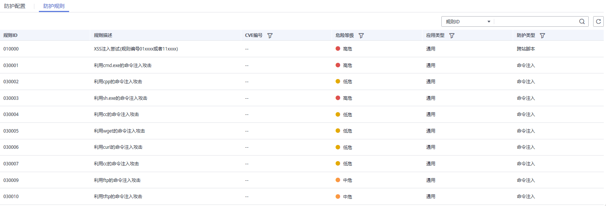

# 配置Web基础防护规则

Web基础防护开启后，可防范SQL注入、XSS跨站脚本、远程溢出攻击、文件包含、Bash漏洞攻击、远程命令执行、目录遍历、敏感文件访问、命令/代码注入等常规的Web攻击，以及可支持Webshell检测、深度反逃逸检测等Web基础防护。

您也可以参考[Web基础防护功能最佳实践](https://support.huaweicloud.com/bestpractice-waf/waf_06_0014.html)了解更多Web基础防护规则的配置信息。

> **说明：** 
>如果您已开通企业项目，您可以在“企业项目“下拉列表中选择您所在的企业项目，为该企业项目下域名配置防护策略。

## 前提条件

已添加防护网站。

## 约束条件

-   Web基础防护支持“拦截“和“仅记录“模式，检测版仅支持“仅记录“模式。
-   添加或修改防护规则后，规则生效需要几分钟。规则生效后，您可以在“防护事件“页面查看防护效果。
-   当Web基础防护设置为“拦截“模式时，您可以设置攻击惩罚。设置攻击惩罚后，如果访问者的IP、Cookie或Params恶意请求被拦截时，WAF将根据攻击惩罚设置的拦截时长来封禁访问者。有关配置攻击惩罚的详细操作，请参见[配置攻击惩罚标准](配置攻击惩罚标准.md)。

## 操作步骤

1.  [登录管理控制台](https://console.huaweicloud.com/?locale=zh-cn)。
2.  进入防护策略配置入口，如[图1](#fig089771664710)所示。

    **图 1**  防护策略配置入口  
    

3.  在“Web基础防护“配置框中，用户可根据自己的需要参照[表1](#table42360431192825)更改Web基础防护的“状态“和“模式“，如[图2](#fig193788379)所示。

    **图 2**  Web基础防护配置框  
    

    **表 1**  防护动作参数说明

    
    <table><thead align="left"><tr id="row66262481192825"><th class="cellrowborder" valign="top" width="22.49%" id="mcps1.2.3.1.1">
参数

    </th>
    <th class="cellrowborder" valign="top" width="77.51%" id="mcps1.2.3.1.2">
说明

    </th>
    </tr>
    </thead>
    <tbody><tr id="row8899732153112"><td class="cellrowborder" valign="top" width="22.49%" headers="mcps1.2.3.1.1 ">
状态

    </td>
    <td class="cellrowborder" valign="top" width="77.51%" headers="mcps1.2.3.1.2 ">
Web应用防护攻击的状态。

    <ul id="ul115452316468"><li>：开启状态。</li><li>：关闭状态。</li></ul>
    </td>
    </tr>
    <tr id="row28096830192825"><td class="cellrowborder" valign="top" width="22.49%" headers="mcps1.2.3.1.1 ">
模式

    </td>
    <td class="cellrowborder" valign="top" width="77.51%" headers="mcps1.2.3.1.2 "><ul id="ul946621183715"><li>拦截：发现攻击行为后立即阻断并记录。</li><li>仅记录：发现攻击行为后只记录不阻断攻击。</li></ul>
    
 须知： 

检测版仅支持“仅记录”模式。

    

    </td>
    </tr>
    </tbody>
    </table>

4.  在“Web基础防护“配置框中，单击“高级设置“，进入“Web基础防护“界面。
5.  选择“防护配置“页签，根据您的业务场景，开启合适的防护功能，如[图3](#fig17347539113910)所示，检测项说明如[表2](#table1054818371898)所示。

    **图 3**  Web基础防护  
    

    > **须知：** 
    >当“模式“设置为“拦截“时，您可以根据需要选择配置的攻击惩罚。

    **表 2**  检测项说明

    
    <table><thead align="left"><tr id="row25491137297"><th class="cellrowborder" valign="top" width="25.28%" id="mcps1.2.3.1.1">
检测项

    </th>
    <th class="cellrowborder" valign="top" width="74.72%" id="mcps1.2.3.1.2">
说明

    </th>
    </tr>
    </thead>
    <tbody><tr id="row354983713918"><td class="cellrowborder" valign="top" width="25.28%" headers="mcps1.2.3.1.1 ">
常规检测

    </td>
    <td class="cellrowborder" valign="top" width="74.72%" headers="mcps1.2.3.1.2 ">
防护SQL注入、XSS跨站脚本、远程溢出攻击、文件包含、Bash漏洞攻击、远程命令执行、目录遍历、敏感文件访问、命令/代码注入等攻击。

    
 说明： 

开启“常规检测”后，WAF将根据内置规则对常规检测项进行检测。

    

    </td>
    </tr>
    <tr id="row5549123715914"><td class="cellrowborder" valign="top" width="25.28%" headers="mcps1.2.3.1.1 ">
Webshell检测

    </td>
    <td class="cellrowborder" valign="top" width="74.72%" headers="mcps1.2.3.1.2 ">
防护通过上传接口植入网页木马。

    
 说明： 

开启“Webshell检测”后，WAF将对通过上传接口植入的网页木马进行检测。

    

    </td>
    </tr>
    <tr id="row837585613435"><td class="cellrowborder" valign="top" width="25.28%" headers="mcps1.2.3.1.1 ">
深度检测

    </td>
    <td class="cellrowborder" valign="top" width="74.72%" headers="mcps1.2.3.1.2 ">
防护同形字符混淆、通配符变形的命令注入、UTF7、Data URI Scheme等深度反逃逸。

    
 说明： 

开启“深度检测”后，WAF将对深度反逃逸进行检测防护。

    

    </td>
    </tr>
    <tr id="row124533351015"><td class="cellrowborder" valign="top" width="25.28%" headers="mcps1.2.3.1.1 ">
header全检测

    </td>
    <td class="cellrowborder" valign="top" width="74.72%" headers="mcps1.2.3.1.2 ">
默认关闭。关闭状态下WAF会检测常规存在注入点的header字段。

    
 说明： 

开启“header全检测”后，WAF将对请求里header中所有字段进行攻击检测。

    

    </td>
    </tr>
    </tbody>
    </table>

    1.  防护等级设置。

        在页面上方，选择防护等级，Web基础防护设置了三种防护等级：“宽松“、“中等“、“严格“，默认情况下，选择“中等“。

        **表 3**  防护等级说明

        
        <table><thead align="left"><tr id="zh-cn_topic_0165951356_row257619443717"><th class="cellrowborder" valign="top" width="28.849999999999998%" id="mcps1.2.3.1.1">
防护等级

        </th>
        <th class="cellrowborder" valign="top" width="71.15%" id="mcps1.2.3.1.2">
说明

        </th>
        </tr>
        </thead>
        <tbody><tr id="zh-cn_topic_0165951356_row2576644570"><td class="cellrowborder" valign="top" width="28.849999999999998%" headers="mcps1.2.3.1.1 ">
宽松

        </td>
        <td class="cellrowborder" valign="top" width="71.15%" headers="mcps1.2.3.1.2 ">
防护粒度较粗，只拦截攻击特征比较明显的请求。

        
当误报情况较多的场景下，建议选择“宽松”模式。

        </td>
        </tr>
        <tr id="zh-cn_topic_0165951356_row18576344378"><td class="cellrowborder" valign="top" width="28.849999999999998%" headers="mcps1.2.3.1.1 ">
中等

        </td>
        <td class="cellrowborder" valign="top" width="71.15%" headers="mcps1.2.3.1.2 ">
默认为“中等”防护模式，满足大多数场景下的Web防护需求。

        </td>
        </tr>
        <tr id="zh-cn_topic_0165951356_row857616441575"><td class="cellrowborder" valign="top" width="28.849999999999998%" headers="mcps1.2.3.1.1 ">
严格

        </td>
        <td class="cellrowborder" valign="top" width="71.15%" headers="mcps1.2.3.1.2 ">
防护粒度最精细，可以拦截具有复杂的绕过特征的攻击请求。

        
当需要更严格地防护SQL注入、跨站脚本、命令注入等攻击行为时，建议使用“严格”模式。

        </td>
        </tr>
        </tbody>
        </table>

    2.  防护检测类型设置。

        默认开启“常规检测“防护检测，用户可根据业务需要，参照[表2](#table1054818371898)开启其他需要防护的检测类型。

6.  选择“防护规则“页签，查看Web基础防护规则的详细信息，如[图4](#fig8837434185019)所示，相关参数说明如[表4](#table19135226105218)所示。

    **图 4**  查看防护规则  
    

    > **说明：** 
    >单击，您可以根据“CVE编号“、“危险等级“、“应用类型“或“防护类型“，搜索指定规则。

    **表 4**  防护规则说明

    
    <table><thead align="left"><tr id="row1813682605214"><th class="cellrowborder" valign="top" width="25.28%" id="mcps1.2.3.1.1">
参数

    </th>
    <th class="cellrowborder" valign="top" width="74.72%" id="mcps1.2.3.1.2">
说明

    </th>
    </tr>
    </thead>
    <tbody><tr id="row171361526115216"><td class="cellrowborder" valign="top" width="25.28%" headers="mcps1.2.3.1.1 ">
规则ID

    </td>
    <td class="cellrowborder" valign="top" width="74.72%" headers="mcps1.2.3.1.2 ">
防护规则的ID，由系统自动生成。

    </td>
    </tr>
    <tr id="row678613065320"><td class="cellrowborder" valign="top" width="25.28%" headers="mcps1.2.3.1.1 ">
规则描述

    </td>
    <td class="cellrowborder" valign="top" width="74.72%" headers="mcps1.2.3.1.2 ">
防护规则对应的攻击详细描述。

    </td>
    </tr>
    <tr id="row1213782612529"><td class="cellrowborder" valign="top" width="25.28%" headers="mcps1.2.3.1.1 ">
CVE编号

    </td>
    <td class="cellrowborder" valign="top" width="74.72%" headers="mcps1.2.3.1.2 ">
防护规则对应的CVE（Common Vulnerabilities &amp; Exposures，通用漏洞披露）编号。对于非CVE漏洞，显示为--。

    </td>
    </tr>
    <tr id="row10137226195213"><td class="cellrowborder" valign="top" width="25.28%" headers="mcps1.2.3.1.1 ">
危险等级

    </td>
    <td class="cellrowborder" valign="top" width="74.72%" headers="mcps1.2.3.1.2 ">
防护规则防护漏洞的危险等级，包括：

    <ul id="ul17258349201"><li>高危</li><li>中危</li><li>低危</li></ul>
    </td>
    </tr>
    <tr id="row1137122612524"><td class="cellrowborder" valign="top" width="25.28%" headers="mcps1.2.3.1.1 ">
应用类型

    </td>
    <td class="cellrowborder" valign="top" width="74.72%" headers="mcps1.2.3.1.2 ">
防护规则对应的应用类型，例如，WordPress。

    </td>
    </tr>
    <tr id="row8138122611524"><td class="cellrowborder" valign="top" width="25.28%" headers="mcps1.2.3.1.1 ">
防护类型

    </td>
    <td class="cellrowborder" valign="top" width="74.72%" headers="mcps1.2.3.1.2 ">
防护规则的类型，例如，命令注入。

    </td>
    </tr>
    </tbody>
    </table>

## 防护效果

假如已添加域名“www.example.com“，且已开启了Web基础防护的“常规检测“，防护模式为“拦截“。您可以参照以下步骤验证WAF防护效果：

1.  清理浏览器缓存，在浏览器中输入防护域名，测试网站域名是否能正常访问。
    -   不能正常访问，参照[步骤三：域名接入配置](步骤三-域名接入配置.md)章节重新完成域名接入。
    -   能正常访问，执行[2](#li2057953372517)。

2.  清理浏览器缓存，在浏览器中输入“http://www.example.com?id=1%27%20or%201=1“模拟SQL注入攻击。
3.  返回Web应用防火墙控制界面，在左侧导航树中，单击“防护事件“，进入“防护事件“页面，查看防护域名拦截日志，您也可以[下载防护事件数据](下载防护事件数据.md)。

## 配置示例-拦截SQL注入攻击

模拟SQL攻击，查看WAF是否拦截该请求。

在Web主机上执行以下命令，模拟SQL注入查看是否拦截该请求。

**curl -kv "http://www.example.com?id=1 or 1=1"**

如果WAF拦截成功，拦截页面如下所示，返回状态码：418。

