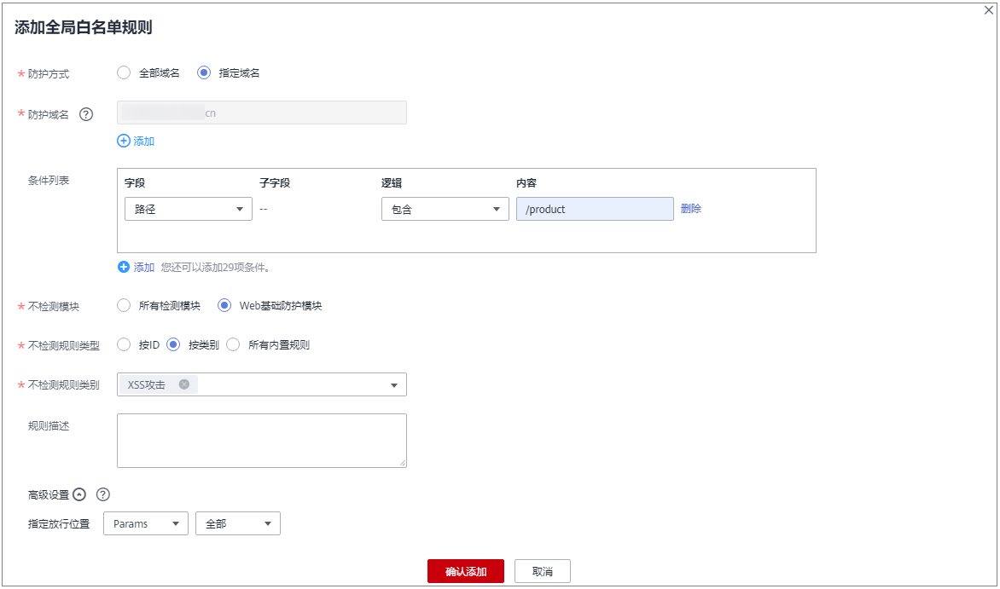

# 配置全局白名单（原误报屏蔽）规则对误报进行忽略

当WAF根据您配置的Web基础防护规则或自定义规则检测到符合规则的恶意攻击时，会按照规则中的防护动作对攻击事件进行处理。

对于误报情况，您可以添加白名单对误报进行忽略，对某些规则ID或者事件类别进行忽略设置（例如，某URL不进行XSS的检查，可设置屏蔽规则，屏蔽XSS检查）。

-   “不检测模块“选择“所有检测模块“时：通过WAF配置的其他所有的规则都不会生效，WAF将放行该域名下的所有请求流量。
-   “不检测模块“选择“Web基础防护模块“时：可根据选择的“不检测规则类型“，对某些规则ID或者事件类别进行忽略设置（例如，某URL不进行XSS的检查，可设置屏蔽规则，屏蔽XSS检查）。

> **说明：** 
>如果您已开通企业项目，您需要在“企业项目“下拉列表中选择您所在的企业项目并确保已开通操作权限，才能为该企业项目下域名配置防护策略。

## 前提条件

已添加防护网站。

-   云模式的接入方式参见[网站接入WAF（云模式）](网站接入WAF（云模式）.md)章节。
-   独享模式的接入方式参见[网站接入WAF（独享模式）](网站接入WAF（独享模式）.md)章节。

## 约束条件

-   当“不检测模块“配置为“所有检测模块“时，通过WAF配置的其他所有的规则都不会生效，WAF将放行该域名下的所有请求流量。
-   当“不检测模块“配置为“Web基础防护模块“时，仅对WAF预置的Web基础防护规则和网站反爬虫的“特征反爬虫“拦截或记录的攻击事件可以配置全局白名单（原误报屏蔽）规则，防护规则相关说明如下：
    -   Web基础防护规则

        防范SQL注入、XSS跨站脚本、远程溢出攻击、文件包含、Bash漏洞攻击、远程命令执行、目录遍历、敏感文件访问、命令/代码注入等常规的Web攻击，以及Webshell检测、深度反逃逸检测等Web基础防护。

    -   网站反爬虫的“特征反爬虫“规则

        可防护搜索引擎、扫描器、脚本工具、其它爬虫等爬虫。

-   添加或修改防护规则后，规则生效需要等待几分钟。规则生效后，您可以在“防护事件“页面查看防护效果。
-   您可以通过[处理误报事件](处理误报事件.md)来配置全局白名单（原误报屏蔽）规则，处理误报事件后，您可以在全局白名单（原误报屏蔽）规则列表中查看该误报事件对应的全局白名单（原误报屏蔽）规则。

## 操作步骤

1.  [登录管理控制台](https://console.huaweicloud.com/?locale=zh-cn)。
2.  单击管理控制台左上角的，选择区域或项目。
3.  单击页面左上方的，选择“安全与合规  \>  Web应用防火墙 WAF“。
4.  在左侧导航树中，选择“防护策略“，进入“防护策略“页面。
5.  单击目标策略名称，进入目标策略的防护配置页面。
6.  在“全局白名单（原误报屏蔽）“配置框中，用户可根据自己的需要更改“状态“，单击“自定义全局白名单规则“，进入规则配置页面。

    **图 1**  全局白名单配置框  
    

7.  在“全局白名单“规则配置页面左上角，单击“添加规则“。
8.  添加全局白名单规则，参数说明如[表1](#table1623195815237)所示，

    **图 2**  添加全局白名单规则  
    

    **表 1**  参数说明

    
    <table><thead align="left"><tr id="row1423118585235"><th class="cellrowborder" valign="top" width="22.91229122912291%" id="mcps1.2.4.1.1">
参数

    </th>
    <th class="cellrowborder" valign="top" width="49.09490949094909%" id="mcps1.2.4.1.2">
参数说明

    </th>
    <th class="cellrowborder" valign="top" width="27.992799279927993%" id="mcps1.2.4.1.3">
取值样例

    </th>
    </tr>
    </thead>
    <tbody><tr id="row523119581238"><td class="cellrowborder" valign="top" width="22.91229122912291%" headers="mcps1.2.4.1.1 ">
防护方式

    </td>
    <td class="cellrowborder" valign="top" width="49.09490949094909%" headers="mcps1.2.4.1.2 "><ul id="ul1738010421244"><li>“全部域名”：默认防护当前策略下绑定的所有域名。</li><li>“指定域名”：选择策略绑定的防护域名或手动输入泛域名对应的单域名。</li></ul>
    </td>
    <td class="cellrowborder" valign="top" width="27.992799279927993%" headers="mcps1.2.4.1.3 ">
指定域名

    </td>
    </tr>
    <tr id="row523114586234"><td class="cellrowborder" valign="top" width="22.91229122912291%" headers="mcps1.2.4.1.1 ">
防护域名

    </td>
    <td class="cellrowborder" valign="top" width="49.09490949094909%" headers="mcps1.2.4.1.2 ">
“防护方式”选择“指定域名”时，需要配置此参数。

    
需要手动输入当前策略下绑定的需要防护的泛域名对应的单域名，且需要输入完整的域名。

    
单击“添加”，支持配置多个域名。

    </td>
    <td class="cellrowborder" valign="top" width="27.992799279927993%" headers="mcps1.2.4.1.3 ">
www.example.com

    </td>
    </tr>
    <tr id="row82316589236"><td class="cellrowborder" valign="top" width="22.91229122912291%" headers="mcps1.2.4.1.1 ">
条件列表

    </td>
    <td class="cellrowborder" valign="top" width="49.09490949094909%" headers="mcps1.2.4.1.2 ">
单击“添加”增加新的条件，一个防护规则至少包含一项条件，最多可添加30项条件，多个条件同时满足时，本条规则才生效。

    
条件设置参数说明如下：<ul id="ul61829843104748"><li>字段</li><li>子字段：当字段选择“Params”、“Cookie”或者“Header”时，请根据实际使用需求配置子字段。
 须知： 

子字段的长度不能超过2048字节，且只能由数字、字母、下划线和中划线组成。

    

    </li><li>逻辑：在“逻辑”下拉列表中选择需要的逻辑关系。</li><li>内容：输入或者选择条件匹配的内容。</li></ul>
    

    </td>
    <td class="cellrowborder" valign="top" width="27.992799279927993%" headers="mcps1.2.4.1.3 ">
“路径”包含“/product”

    </td>
    </tr>
    <tr id="row923743404110"><td class="cellrowborder" valign="top" width="22.91229122912291%" headers="mcps1.2.4.1.1 ">
不检测模块

    </td>
    <td class="cellrowborder" valign="top" width="49.09490949094909%" headers="mcps1.2.4.1.2 "><ul id="ul1685775011413"><li>“所有检测模块”：通过WAF配置的其他所有的规则都不会生效，WAF将放行该域名下的所有请求流量。</li><li>“Web基础防护模块”：选择此参数时，可根据选择的“不检测规则类型”，对某些规则ID或者事件类别进行忽略设置（例如，某URL不进行XSS的检查，可设置屏蔽规则，屏蔽XSS检查）。</li></ul>
    </td>
    <td class="cellrowborder" valign="top" width="27.992799279927993%" headers="mcps1.2.4.1.3 ">
Web基础防护模块

    </td>
    </tr>
    <tr id="row1623110581230"><td class="cellrowborder" valign="top" width="22.91229122912291%" headers="mcps1.2.4.1.1 ">
不检测规则类型

    </td>
    <td class="cellrowborder" valign="top" width="49.09490949094909%" headers="mcps1.2.4.1.2 ">
“不检测模块”选择“Web基础防护模块”时，您可以选择以下三种方式进行配置：

    <ul id="ul240411253712"><li>按ID：按攻击事件的ID进行配置。</li><li>按类别：按攻击事件类别进行配置，如：XSS、SQL注入等。一个类别会包含一个或者多个规则id。</li><li>所有内置规则：<a href="配置Web基础防护规则防御常见Web攻击.md">Web基础防护规则</a>里开启的所有防护规则。</li></ul>
    </td>
    <td class="cellrowborder" valign="top" width="27.992799279927993%" headers="mcps1.2.4.1.3 ">
按类别

    </td>
    </tr>
    <tr id="row2023105819230"><td class="cellrowborder" valign="top" width="22.91229122912291%" headers="mcps1.2.4.1.1 ">
不检测规则ID

    </td>
    <td class="cellrowborder" valign="top" width="49.09490949094909%" headers="mcps1.2.4.1.2 ">
当“不检测规则类型”选择“按ID”时，需要配置此参数。

    
“防护事件”列表中事件类型为非自定义规则的攻击事件所对应的规则编号。建议您直接在防护事件页面进行误报处理。

    </td>
    <td class="cellrowborder" valign="top" width="27.992799279927993%" headers="mcps1.2.4.1.3 ">
041046

    </td>
    </tr>
    <tr id="row8239175812416"><td class="cellrowborder" valign="top" width="22.91229122912291%" headers="mcps1.2.4.1.1 ">
不检测规则类别

    </td>
    <td class="cellrowborder" valign="top" width="49.09490949094909%" headers="mcps1.2.4.1.2 ">
当“不检测规则类型”选择“按类别”时，需要配置此参数。

    
在下拉框中选择事件类别。

    
WAF支持的防护事件类别有：XSS攻击、网站木马、其他类型攻击、SQL注入攻击、恶意爬虫、远程文件包含、本地文件包含、命令注入攻击。

    </td>
    <td class="cellrowborder" valign="top" width="27.992799279927993%" headers="mcps1.2.4.1.3 ">
SQL注入攻击

    </td>
    </tr>
    <tr id="row11239185832410"><td class="cellrowborder" valign="top" width="22.91229122912291%" headers="mcps1.2.4.1.1 ">
规则描述

    </td>
    <td class="cellrowborder" valign="top" width="49.09490949094909%" headers="mcps1.2.4.1.2 ">
可选参数，设置该规则的备注信息。

    </td>
    <td class="cellrowborder" valign="top" width="27.992799279927993%" headers="mcps1.2.4.1.3 ">
不拦截SQL注入攻击

    </td>
    </tr>
    <tr id="row16239195816246"><td class="cellrowborder" valign="top" width="22.91229122912291%" headers="mcps1.2.4.1.1 ">
高级设置

    </td>
    <td class="cellrowborder" valign="top" width="49.09490949094909%" headers="mcps1.2.4.1.2 ">
如果您只想忽略来源于某攻击事件下指定字段的攻击，可在“高级设置”里选择指定字段进行配置，配置完成后，WAF将不再拦截指定字段的攻击事件。

    
在左边第一个下拉列表中选择目标字段。支持的字段有：Params、Cookie、Header、Body、Multipart。<ul id="ul33023151373"><li>当选择“Params”、“Cookie”或者“Header”字段时，可以配置“全部”或根据需求配置子字段。</li><li>当选择“Body”或“Multipart”字段时，可以配置“全部”。</li><li>当选择“Cookie”字段时，“防护域名”可以为空。</li></ul>
    
 说明： 

当字段配置为“全部”时，配置完成后，WAF将不再拦截该字段的所有攻击事件。

    

    

    </td>
    <td class="cellrowborder" valign="top" width="27.992799279927993%" headers="mcps1.2.4.1.3 ">
Params

    
全部

    </td>
    </tr>
    </tbody>
    </table>

9.  单击“确认添加“。

## 相关操作

-   规则添加成功后，默认的“规则状态“为“已开启“，若您暂时不想使该规则生效，可在目标规则所在行的“操作“列，单击“关闭“。
-   若需要修改添加的全局白名单（原误报屏蔽）规则时，可单击待修改的全局白名单（原误报屏蔽）规则所在行的“修改“，修改全局白名单（原误报屏蔽）规则。
-   若需要删除添加的**全**局白名单（原误报屏蔽）规则时，可单击待删除的全局白名单（原误报屏蔽）规则所在行的“删除“，删除全局白名单（原误报屏蔽）规则。

