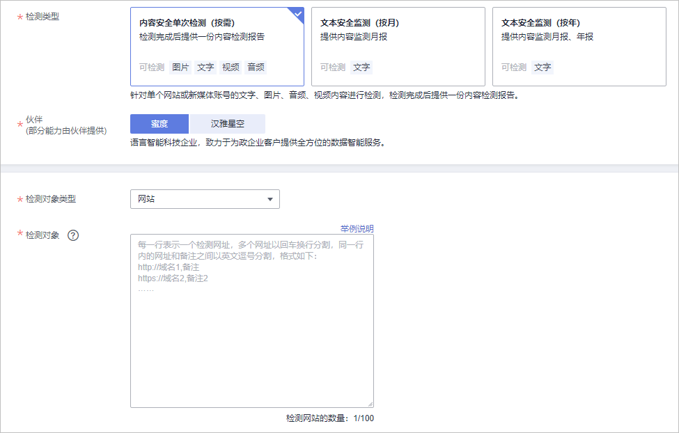

# 配置内容安全检测

Web应用防火墙提供内容安全检测服务，基于丰富的违规样例库和内容审核专家经验，通过机器审核加人工审核结合的方式，帮助您准确检测出Web网站和新媒体平台上的关于涉黄、涉赌、涉毒、暴恐、涉政、惊悚、违禁广告等敏感违规内容，并提供文本内容纠错审校（错别字、生僻字、语法表述不当等有违准确性内容）。并提供专业检测报告助您自纠自查，降低内容违规风险。

> **说明：** 
>使用该功能前，需[提交工单](https://support.huaweicloud.com/usermanual-ticket/zh-cn_topic_0127038618.html)申请开通。

## 使用须知

-   购买内容安全检测服务后，系统立即执行检测。
-   检测过程中，不支持修改检测域名、暂停任务、退费等操作。
-   确定网站检测配额，请参见[购买内容安全检测服务时，如何确定网站检测配额？](https://support.huaweicloud.com/waf_faq/waf_01_4002.html)。
-   “检测类型“选择“内容安全单次检测（按需）“时，下单后的7个工作日内出报告。
-   “检测类型“选择“文本安全监测（按月/按年）“时，下单后的检测周期（1个月）后的7个工作日内出报告。

## 步骤一：购买内容安全检测

购买内容安全检测，配置“检测类型“和“检测对象“，可对“检测对象“对应的文本类型进行安全检测。

支持批量购买内容安全检测，可一次输入一个或多个“检测对象“进行安全检测。

1.  登录管理控制台。
2.  单击管理控制台左上角的，选择区域或项目。
3.  单击页面左上方的，选择“安全与合规  \>  Web应用防火墙 WAF“。
4.  在左侧导航栏，选择“高阶功能  \>  内容安全检测“，进入“内容安全检测“页面。
5.  在页面右上角，单击“购买内容安全检测服务“，进入购买页面，参见[表1](#zh-cn_topic_0000001545730977_table1573618196482)配置相关参数。

    **图 1**  购买内容安全检测服务  
    

    **表 1**  参数说明

    
    <table><thead align="left"><tr id="zh-cn_topic_0000001545730977_row1873891934817"><th class="cellrowborder" valign="top" width="25.82%" id="mcps1.2.4.1.1">
参数

    </th>
    <th class="cellrowborder" valign="top" width="46.339999999999996%" id="mcps1.2.4.1.2">
说明

    </th>
    <th class="cellrowborder" valign="top" width="27.839999999999996%" id="mcps1.2.4.1.3">
示例

    </th>
    </tr>
    </thead>
    <tbody><tr id="zh-cn_topic_0000001545730977_row75301489550"><td class="cellrowborder" valign="top" width="25.82%" headers="mcps1.2.4.1.1 ">
企业项目

    </td>
    <td class="cellrowborder" valign="top" width="46.339999999999996%" headers="mcps1.2.4.1.2 ">
选择您所在的企业项目。

    </td>
    <td class="cellrowborder" valign="top" width="27.839999999999996%" headers="mcps1.2.4.1.3 ">
default

    </td>
    </tr>
    <tr id="zh-cn_topic_0000001545730977_row157408195486"><td class="cellrowborder" valign="top" width="25.82%" headers="mcps1.2.4.1.1 ">
检测类型

    </td>
    <td class="cellrowborder" valign="top" width="46.339999999999996%" headers="mcps1.2.4.1.2 "><ul id="zh-cn_topic_0000001545730977_ul94214142513"><li>“内容安全单次检测（按需）”：针对单个网站或新媒体账号的文字、图片、音频、视频内容进行检测，检测完成后提供一份内容检测报告。</li><li>“文本安全监测（按月）”：针对单个网站或新媒体账号的文字内容进行内容安全监测，并在一个自然月后输出内容监测月报。</li><li>“文本安全监测（按年）”：针对单个网站或新媒体账号的文字内容进行内容安全监测，并在每一个自然月后输出内容监测月报，一个自然年后输出内容监测年报。</li></ul>
    </td>
    <td class="cellrowborder" valign="top" width="27.839999999999996%" headers="mcps1.2.4.1.3 ">
内容安全单次检测（按需）

    </td>
    </tr>
    <tr id="zh-cn_topic_0000001545730977_row1274018195483"><td class="cellrowborder" valign="top" width="25.82%" headers="mcps1.2.4.1.1 ">
伙伴

    </td>
    <td class="cellrowborder" valign="top" width="46.339999999999996%" headers="mcps1.2.4.1.2 ">
以下两个伙伴供您选择：

    <ul id="zh-cn_topic_0000001545730977_ul2599155717581"><li>“蜜度”：语言智能科技企业，致力于为政企客户提供全方位的数据智能服务。</li><li>“汉雅星空”：面向文旅、广电等行业领域，提供内容安全审核解决方案的运营服务商。</li></ul>
    </td>
    <td class="cellrowborder" valign="top" width="27.839999999999996%" headers="mcps1.2.4.1.3 ">
蜜度

    </td>
    </tr>
    <tr id="zh-cn_topic_0000001545730977_row3740419194819"><td class="cellrowborder" valign="top" width="25.82%" headers="mcps1.2.4.1.1 ">
检测对象类型

    </td>
    <td class="cellrowborder" valign="top" width="46.339999999999996%" headers="mcps1.2.4.1.2 ">
检测对象类型包含：<ul id="zh-cn_topic_0000001545730977_ul18599126132218"><li>“新媒体”：支持主流新媒体平台的内容审查，包括文本、图片、音频、视频等。</li><li>“网站”：支持网站内容审查，可根据URL检测网站内容，可自行排查检测站内网页、链接内容，包括文本、图片、音频、视频等。</li></ul>
    

    </td>
    <td class="cellrowborder" valign="top" width="27.839999999999996%" headers="mcps1.2.4.1.3 ">
新媒体

    </td>
    </tr>
    <tr id="zh-cn_topic_0000001545730977_row87412019114811"><td class="cellrowborder" valign="top" width="25.82%" headers="mcps1.2.4.1.1 ">
检测对象

    </td>
    <td class="cellrowborder" valign="top" width="46.339999999999996%" headers="mcps1.2.4.1.2 "><ul id="zh-cn_topic_0000001545730977_ul318920502"><li>“检测对象类型”选择“新媒体”时：输入需要检测的账号名称，并备注新媒体平台。
 说明： 

每一行表示一个新媒体账号，多个新媒体账号以回车换行分割；同一行内的新媒体账号和备注之间以英文逗号分割，每行最多支持500个英文字符（1个中文字符等于2个英文字符）。

    

    </li><li>“检测对象类型”选择“网站”时：输入被检测网站完整域名与备注信息。
 说明： 

每一行表示一个检测网址，多个网址以回车换行分割；同一行内的网址和备注之间以英文逗号分割，如无备注，可只输入网址，每行最多支持500个英文字符（1个中文字符等于2个英文字符）。

    

    </li></ul>
    </td>
    <td class="cellrowborder" valign="top" width="27.839999999999996%" headers="mcps1.2.4.1.3 "><ul id="ul7180548878"><li><strong id="b17231125815712">检测对象类型</strong>：新媒体</li><li><strong id="b19338225819">检测对象</strong>：华为云</li><li><strong id="b102321468814">备注</strong>：微博。如果未备注平台名称，默认为微博平台。</li></ul>
    
或

    <ul id="ul7749145314713"><li><strong id="b16578121219813">检测对象类型</strong>：网站</li><li><strong id="b18868915882">检测对象</strong>：https://www.huaweicloud.com</li><li><strong id="b5294319382">备注</strong>：华为云官网</li></ul>
    </td>
    </tr>
    </tbody>
    </table>

6.  请仔细阅读“重要提示“内容并勾选“我已知晓“。

    > **注意：** 
    >检测任务创建后，一次性扣费，不支持修改和暂停任务，请您仔细核对检测信息。

7.  确认订单详情无误后，单击“立即使用“，并在弹框中单击“确认“。

## 步骤二：下载检测报告

1.  在左侧导航栏选择“高阶功能  \>  内容安全检测“，进入“内容安全检测“页面。
2.  在目标检测对象所在行的“操作“列，单击“下载报告“，可将检测报告下载到本地。

    报告中呈现检测出的合规性风险、内容安全风险等相关内容。用户根据报告内容选择整改或者保留。

    > **说明：** 
    >“检测状态“为“检测完成“时，才支持下载报告。

## 其他操作

如果您需要对检测对象进行再次检测时，在该检测对象所在行的“操作“列，单击“复购“。

