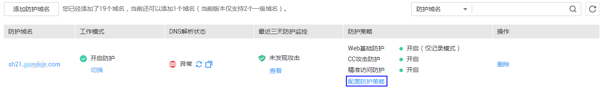

# 配置地理位置访问控制规则

该任务指导用户通过Web应用防火墙服务配置地理位置访问控制规则。可针对指定国家、地区的来源IP自定义访问控制。

## 前提条件

-   已获取管理控制台的帐号和密码。
-   已添加防护域名。

## 操作步骤

1.  登录管理控制台（https://console.huaweicloud.com/）。
2.  单击管理控制台左上角的，选择区域或项目。
3.  单击页面上方的“服务列表“，选择“安全  \>  Web应用防火墙“，在左侧导航树中选择“域名配置“，进入“域名配置“页面，如[图1](#waf_01_0008_fig164792010154510)所示。

    **图 1**  域名配置页面  
    

4.  在目标域名所在行的“防护策略“栏中，单击“配置防护策略“，进入“防护配置“页面。
5.  在“地理位置访问控制“配置框中，用户可根据自己的需要更改“状态“，单击“自定义地理位置访问控制规则“，进入“地理位置访问控制“页面，如[图2](#fig1841026151810)所示。

    **图 2**  地理位置访问控制配置框  
    

6.  在“地理位置访问控制“页面左上角，单击“添加规则“。
7.  在弹出的对话框，添加地理位置访问控制规则，根据[表1](#table4696626918715)配置参数。

    **表 1**  添加地理位置访问控制规则参数说明

    
    <table><thead align="left"><tr id="row151760118715"><th class="cellrowborder" valign="top" width="19%" id="mcps1.2.4.1.1">
参数

    </th>
    <th class="cellrowborder" valign="top" width="49%" id="mcps1.2.4.1.2">
参数说明

    </th>
    <th class="cellrowborder" valign="top" width="32%" id="mcps1.2.4.1.3">
取值样例

    </th>
    </tr>
    </thead>
    <tbody><tr id="row125751318715"><td class="cellrowborder" valign="top" width="19%" headers="mcps1.2.4.1.1 ">
地理位置

    </td>
    <td class="cellrowborder" valign="top" width="49%" headers="mcps1.2.4.1.2 ">
IP访问的地理范围。

    </td>
    <td class="cellrowborder" valign="top" width="32%" headers="mcps1.2.4.1.3 ">
“中国”，“北京”

    </td>
    </tr>
    <tr id="row3251580618715"><td class="cellrowborder" valign="top" width="19%" headers="mcps1.2.4.1.1 ">
防护动作

    </td>
    <td class="cellrowborder" valign="top" width="49%" headers="mcps1.2.4.1.2 ">
可以根据需要选择“拦截”或者“放行”。

    </td>
    <td class="cellrowborder" valign="top" width="32%" headers="mcps1.2.4.1.3 ">
“拦截”

    </td>
    </tr>
    </tbody>
    </table>

8.  单击“确认添加“，在页面右上角弹出“添加成功“，则表示添加地理位置访问控制规则成功。
    -   若需要修改添加的地理位置访问控制规则时，可单击待修改的地理位置访问控制规则所在行的“修改“，修改地理位置访问控制规则。
    -   若需要删除添加的地理位置访问控制规则时，可单击待删除的地理位置访问控制规则所在行的“删除“，删除地理位置访问控制规则。

