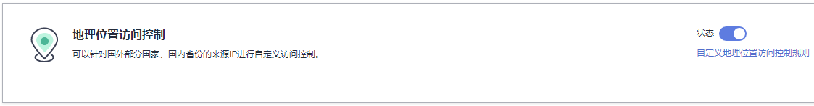
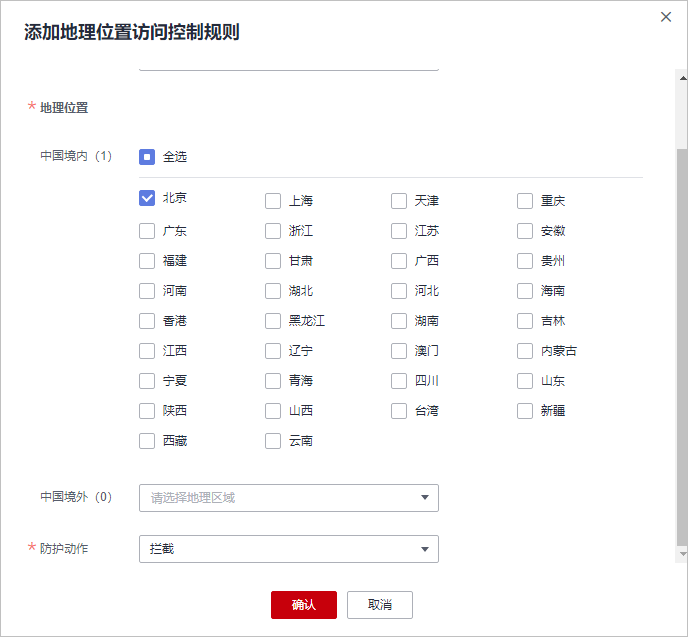
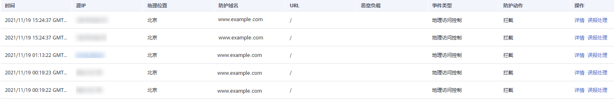

# 配置地理位置访问控制规则

您可以通过Web应用防火墙服务配置地理位置访问控制规则。可针对指定国家、地区的来源IP自定义访问控制。

如果您仅允许某一地区的来源IP访问防护网站，请参见[配置示例-仅允许某一地区来源IP访问请求](#section199411058152915)进行配置。

> **说明：** 
>如果您已开通企业项目，您需要在“企业项目“下拉列表中选择您所在的企业项目并确保已开通操作权限，才能为该企业项目下域名配置防护策略。

## 前提条件

已添加防护网站。

## 约束条件

添加或修改防护规则后，规则生效需要几分钟。规则生效后，您可以在“防护事件“页面查看防护效果。

## 规格限制

检测版和标准版（原专业版）不支持该功能。

## 操作步骤

1.  [登录管理控制台](https://console.huaweicloud.com/?locale=zh-cn)。
2.  进入防护策略配置入口，如[图1](#waf_01_0008_fig089771664710)所示。

    **图 1**  防护策略配置入口  
    

3.  在“地理位置访问控制“配置框中，用户可根据自己的需要更改“状态“，单击“自定义地理位置访问控制规则“，进入“地理位置访问控制“页面，如[图2](#fig1841026151810)所示。

    **图 2**  地理位置访问控制配置框  
    

4.  在“地理位置访问控制“页面左上角，单击“添加规则“。
5.  在弹出的对话框，添加地理位置访问控制规则，如[图3](#fig49385421125519)所示，根据[表1](#table4696626918715)配置参数。

    **图 3**  添加地理位置访问控制规则  
    

    **表 1**  添加地理位置访问控制规则参数说明

    
    <table><thead align="left"><tr id="row151760118715"><th class="cellrowborder" valign="top" width="19%" id="mcps1.2.4.1.1">
参数

    </th>
    <th class="cellrowborder" valign="top" width="49%" id="mcps1.2.4.1.2">
参数说明

    </th>
    <th class="cellrowborder" valign="top" width="32%" id="mcps1.2.4.1.3">
取值样例

    </th>
    </tr>
    </thead>
    <tbody><tr id="row125751318715"><td class="cellrowborder" valign="top" width="19%" headers="mcps1.2.4.1.1 ">
地理位置

    </td>
    <td class="cellrowborder" valign="top" width="49%" headers="mcps1.2.4.1.2 ">
IP访问的地理范围。

    </td>
    <td class="cellrowborder" valign="top" width="32%" headers="mcps1.2.4.1.3 ">
-

    </td>
    </tr>
    <tr id="row3251580618715"><td class="cellrowborder" valign="top" width="19%" headers="mcps1.2.4.1.1 ">
防护动作

    </td>
    <td class="cellrowborder" valign="top" width="49%" headers="mcps1.2.4.1.2 ">
可以根据需要选择“拦截”、“放行”或者“仅记录”。

    </td>
    <td class="cellrowborder" valign="top" width="32%" headers="mcps1.2.4.1.3 ">
“拦截”

    </td>
    </tr>
    <tr id="row1389601714612"><td class="cellrowborder" valign="top" width="19%" headers="mcps1.2.4.1.1 ">
规则描述

    </td>
    <td class="cellrowborder" valign="top" width="49%" headers="mcps1.2.4.1.2 ">
可选参数，设置该规则的备注信息。

    </td>
    <td class="cellrowborder" valign="top" width="32%" headers="mcps1.2.4.1.3 ">
-

    </td>
    </tr>
    </tbody>
    </table>

6.  单击“确认添加“，添加的地理位置访问控制规则展示在地理位置访问控制规则列表中。

    **图 4**  地理位置规则列表  
    

    -   规则添加成功后，默认的“规则状态“为“已开启“，若您暂时不想使该规则生效，可在目标规则所在行的“操作“列，单击“关闭“。
    -   若需要修改添加的地理位置访问控制规则时，可单击待修改的地理位置访问控制规则所在行的“修改“，修改地理位置访问控制规则。
    -   若需要删除添加的地理位置访问控制规则时，可单击待删除的地理位置访问控制规则所在行的“删除“，删除地理位置访问控制规则。

## 配置示例-仅允许某一地区来源IP访问请求

假如防护域名“www.example.com“已接入WAF，当您只允许某一地区的IP可以访问防护域名，例如，只允许来源“上海“地区的IP可以访问防护域名，请参照以下步骤处理。

1.  添加一条地理位置访问控制规则，添加“上海“地区的“放行“防护动作。

    **图 5**  添加“放行“防护动作  
    

2.  开启地理位置访问控制。

    **图 6**  地理位置访问控制配置框  
    

3.  配置一条精准访问防护规则，拦截所有的请求。

    **图 7**  拦截所有访问请求  
    

    有关配置精准访问防护规则的详细介绍，请参见[配置精准访问防护规则](https://support.huaweicloud.com/usermanual-waf/waf_01_0010.html)。

4.  清理浏览器缓存，在浏览器中访问“http://www.example.com“页面。

    当非“上海“地区的源IP访问页面时，WAF将拦截该访问请求，拦截页面示例如[图8](#fig09461834621)所示。

    **图 8**  WAF拦截攻击请求  
    

5.  返回Web应用防火墙管理控制台，在左侧导航树中，单击“防护事件“，进入“防护事件“页面，您可以查看到非“上海“地区的源IP都被拦截。

## 配置示例-拦截某一地区来源IP访问请求

假如防护域名“www.example.com“已接入WAF，您需要拦截所有来源“北京“地区的IP访问防护域名，可以参照以下操作步骤验证防护效果。

1.  添加一条地理位置访问控制规则，设置“北京“地区“拦截“动作。

    **图 9**  拦截某一地区访问请求  
    

2.  开启地理位置访问控制。

    **图 10**  地理位置访问控制配置框  
    

3.  清理浏览器缓存，在浏览器中访问“http://www.example.com“页面。

    当“北京“地区的源IP访问页面时，WAF将拦截该访问请求，拦截页面示例如[图11](#fig11778435913)所示。

    **图 11**  WAF拦截攻击请求  
    

4.  返回Web应用防火墙管理控制台，在左侧导航树中，单击“防护事件“，进入“防护事件“页面，您可以查看该防护事件。

    **图 12**  查看防护事件-拦截某一地区IP访问请求  
    

