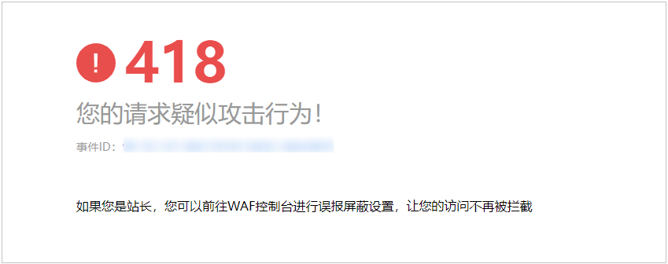

# 配置地理位置访问控制规则拦截/放行特定区域请求

网站接入Web应用防火墙后，您可以设置地理位置访问控制规则，WAF通过识别客户端访问请求的来源区域，一键封禁来自特定区域的访问或者允许特定区域的来源IP的访问，解决部分地区高发的恶意请求问题。可针对指定国家、地区的来源IP自定义访问控制。

如果您仅允许某一地区的来源IP访问防护网站，请参见[配置示例-仅允许某一地区来源IP访问请求](#section199411058152915)进行配置。

> **说明：** 
>如果您已开通企业项目，您需要在“企业项目“下拉列表中选择您所在的企业项目并确保已开通操作权限，才能为该企业项目下域名配置防护策略。

## 前提条件

已添加防护网站或已[新增防护策略](步骤一-（可选）新增防护策略.md)。

-   云模式的接入方式参见[网站接入WAF（云模式）](网站接入WAF（云模式）.md)章节。
-   独享模式的接入方式参见[网站接入WAF（独享模式）](网站接入WAF（独享模式）.md)章节。
-   ELB模式的接入方式参见  [网站接入WAF（ELB模式）](网站接入WAF（ELB模式）.md)章节。

## 约束条件

-   入门版不支持该功能。
-   同一个地区只能配置到一条地理位置访问控制规则中。例如，如果某个地理位置访问控制规则已设置了“上海“地区，那么“上海“地区不能再添加到其他地理位置访问控制规则。
-   添加或修改防护规则后，规则生效需要几分钟。规则生效后，您可以在“防护事件“页面查看防护效果。

## 操作步骤

1.  [登录管理控制台](https://console.huaweicloud.com/?locale=zh-cn)。
2.  单击管理控制台左上角的，选择区域或项目。
3.  单击页面左上方的，选择“安全与合规  \>  Web应用防火墙 WAF“。
4.  在左侧导航树中，选择“防护策略“，进入“防护策略“页面。
5.  单击目标策略名称，进入目标策略的防护配置页面。
6.  选择“地理位置访问控制“配置框，用户可根据自己的需要开启或关闭地理位置访问控制防护策略。
    -   ：开启状态。
    -   ：关闭状态。

7.  在“地理位置访问控制“配置列表的左上方，单击“添加规则“。
8.  在弹出的对话框中，添加地理位置访问控制规则，如[图1](#fig182512560219)所示，根据[表1](#table157961352154713)配置参数。

    **图 1**  添加地理位置访问控制规则  
    

    **表 1**  添加地理位置访问控制规则参数说明

    
    <table><thead align="left"><tr id="row879725218471"><th class="cellrowborder" valign="top" width="19%" id="mcps1.2.4.1.1">
参数

    </th>
    <th class="cellrowborder" valign="top" width="49%" id="mcps1.2.4.1.2">
参数说明

    </th>
    <th class="cellrowborder" valign="top" width="32%" id="mcps1.2.4.1.3">
取值样例

    </th>
    </tr>
    </thead>
    <tbody><tr id="row23431718114812"><td class="cellrowborder" valign="top" width="19%" headers="mcps1.2.4.1.1 ">
规则名称

    </td>
    <td class="cellrowborder" valign="top" width="49%" headers="mcps1.2.4.1.2 ">
用户自定义地理位置控制规则的名字。

    </td>
    <td class="cellrowborder" valign="top" width="32%" headers="mcps1.2.4.1.3 ">
dlfw

    </td>
    </tr>
    <tr id="row97711429164819"><td class="cellrowborder" valign="top" width="19%" headers="mcps1.2.4.1.1 ">
规则描述

    </td>
    <td class="cellrowborder" valign="top" width="49%" headers="mcps1.2.4.1.2 ">
可选参数，设置该规则的备注信息。

    </td>
    <td class="cellrowborder" valign="top" width="32%" headers="mcps1.2.4.1.3 ">
waf

    </td>
    </tr>
    <tr id="row19797155204714"><td class="cellrowborder" valign="top" width="19%" headers="mcps1.2.4.1.1 ">
地理位置

    </td>
    <td class="cellrowborder" valign="top" width="49%" headers="mcps1.2.4.1.2 ">
IP访问的地理范围，可以选择“中国境内”和“中国境外”地区。

    </td>
    <td class="cellrowborder" valign="top" width="32%" headers="mcps1.2.4.1.3 ">
-

    </td>
    </tr>
    <tr id="row879716524479"><td class="cellrowborder" valign="top" width="19%" headers="mcps1.2.4.1.1 ">
防护动作

    </td>
    <td class="cellrowborder" valign="top" width="49%" headers="mcps1.2.4.1.2 ">
可以根据需要选择“拦截”、“放行”或者“仅记录”。

    </td>
    <td class="cellrowborder" valign="top" width="32%" headers="mcps1.2.4.1.3 ">
“拦截”

    </td>
    </tr>
    </tbody>
    </table>

9.  单击“确认“，添加的地理位置访问控制规则展示在地理位置访问控制规则列表中。
    -   规则添加成功后，默认的“规则状态“为“已开启“，若您暂时不想使该规则生效，可在目标规则所在行的“操作“列，单击“关闭“。
    -   若需要修改添加的地理位置访问控制规则时，可单击待修改的地理位置访问控制规则所在行的“修改“，修改地理位置访问控制规则。
    -   若需要删除添加的地理位置访问控制规则时，可单击待删除的地理位置访问控制规则所在行的“删除“，删除地理位置访问控制规则。

## 配置示例-仅允许某一地区来源IP访问请求

假如防护域名“www.example.com“已接入WAF，当您只允许某一地区的IP可以访问防护域名，例如，只允许来源“上海“地区的IP可以访问防护域名，请参照以下步骤处理。

1.  添加一条地理位置访问控制规则，添加“上海“地区的“放行“防护动作。

    **图 2**  添加“放行“防护动作  
    

2.  开启地理位置访问控制。

    **图 3**  地理位置访问控制配置框  
    

3.  配置一条精准访问防护规则，拦截所有的请求。

    **图 4**  拦截所有访问请求  
    

    有关配置精准访问防护规则的详细介绍，请参见[配置精准访问防护规则定制化防护策略](配置精准访问防护规则定制化防护策略.md)。

4.  清理浏览器缓存，在浏览器中访问“http://www.example.com“页面。

    当非“上海“地区的源IP访问页面时，WAF将拦截该访问请求，拦截页面示例如[图5](#fig09461834621)所示。

    **图 5**  WAF拦截攻击请求  
    

5.  返回Web应用防火墙管理控制台，在左侧导航树中，单击“防护事件“，进入“防护事件“页面，您可以查看到非“上海“地区的源IP都被拦截。

## 配置示例-拦截某一地区来源IP访问请求

假如防护域名“www.example.com“已接入WAF，您需要拦截所有来源“北京“地区的IP访问防护域名，可以参照以下操作步骤验证防护效果。

1.  添加一条地理位置访问控制规则，设置“北京“地区“拦截“动作。

    **图 6**  拦截某一地区访问请求  
    

2.  开启地理位置访问控制。

    **图 7**  地理位置访问控制配置框  
    

3.  清理浏览器缓存，在浏览器中访问“http://www.example.com“页面。

    当“北京“地区的源IP访问页面时，WAF将拦截该访问请求，拦截页面示例如[图8](#fig11778435913)所示。

    **图 8**  WAF拦截攻击请求  
    

4.  返回Web应用防火墙管理控制台，在左侧导航树中，单击“防护事件“，进入“防护事件“页面，您可以查看该防护事件。

    **图 9**  查看防护事件-拦截某一地区IP访问请求  
    

## 防护效果

假如已添加域名“www.example.com“。可参照以下步骤验证防护效果：

1.  清理浏览器缓存，在浏览器中输入防护域名，测试网站域名是否能正常访问。
    -   不能正常访问，参照[网站设置](网站设置.md)章节重新完成域名接入。
    -   能正常访问，执行[2](#li885731953512)。

2.  参照[操作步骤](#section61533550183130)，将您的客户端IP来源地配置为拦截。
3.  清理浏览器缓存，在浏览器中访问“http://www.example.com“页面，正常情况下，WAF会阻断该来源地IP的访问请求，返回拦截页面。
4.  返回Web应用防火墙控制界面，在左侧导航树中，单击“防护事件“，进入“防护事件“页面，查看防护域名拦截日志，您也可以[下载防护事件数据](下载防护事件数据.md)。

