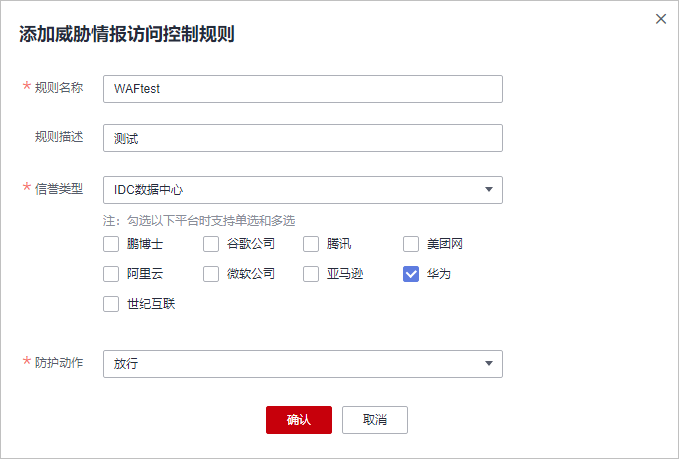

# 配置威胁情报访问控制拦截/放行指定目标IP库平台内的来源IP

基于互联网数据中心\(Internet Data Center, 简称IDC\)机房的IP库进行访问控制，可选择的IP库平台，包括：鹏博士、谷歌公司、腾讯、美团网等其他平台。配置后，当目标IP库平台内的来源IP向域名下任意路径发起访问请求时，将触发控制规则，即拦截、放行或者仅记录请求。

> **须知：** 
>威胁情报访问控制功能现处于公测阶段，如需使用请[提交工单](https://support.huaweicloud.com/usermanual-ticket/zh-cn_topic_0127038618.html)申请开通。

## 前提条件

已添加防护网站。

## 约束条件

-   “云模式“仅专业版和铂金版支持威胁情报访问控制规则。
-   独享模式仅2022年9月及之后的版本支持配置威胁情报访问控制规则，独享引擎版本详情请参见[独享引擎版本迭代](管理独享引擎.md#section7942164410131)。
-   ELB模式不支持配置威胁情报访问控制规则。

## 操作步骤

1.  [登录管理控制台](https://console.huaweicloud.com/?locale=zh-cn)。
2.  单击管理控制台左上角的，选择区域或项目。
3.  单击页面左上方的，选择“安全与合规  \>  Web应用防火墙 WAF“。
4.  在左侧导航树中，选择“防护策略“，进入“防护策略“页面。
5.  单击目标策略名称，进入目标策略的防护配置页面。
6.  选择“威胁情报访问控制“配置框，用户可根据自己的需要开启或关闭威胁情报访问控制防护策略。
    -   ：开启状态。
    -   ：关闭状态。

7.  在规则列表的左上方，单击“添加规则“。
8.  在弹出的对话框中，添加威胁情报访问控制规则，参数说明如[表1](#table831172911312)所示。

    **图 1**  添加威胁情报访问控制规则  
    

    **表 1**  参数说明

    
    <table><thead align="left"><tr id="row7311172918131"><th class="cellrowborder" valign="top" width="22.732273227322732%" id="mcps1.2.4.1.1">
参数

    </th>
    <th class="cellrowborder" valign="top" width="43.934393439343935%" id="mcps1.2.4.1.2">
参数说明

    </th>
    <th class="cellrowborder" valign="top" width="33.33333333333333%" id="mcps1.2.4.1.3">
取值样例

    </th>
    </tr>
    </thead>
    <tbody><tr id="row15312029131317"><td class="cellrowborder" valign="top" width="22.732273227322732%" headers="mcps1.2.4.1.1 ">
规则名称

    </td>
    <td class="cellrowborder" valign="top" width="43.934393439343935%" headers="mcps1.2.4.1.2 ">
自定义规则名称

    </td>
    <td class="cellrowborder" valign="top" width="33.33333333333333%" headers="mcps1.2.4.1.3 ">
WAFtest

    </td>
    </tr>
    <tr id="row153121629191311"><td class="cellrowborder" valign="top" width="22.732273227322732%" headers="mcps1.2.4.1.1 ">
规则描述

    </td>
    <td class="cellrowborder" valign="top" width="43.934393439343935%" headers="mcps1.2.4.1.2 ">
可选参数，设置该规则的备注信息。

    </td>
    <td class="cellrowborder" valign="top" width="33.33333333333333%" headers="mcps1.2.4.1.3 ">
--

    </td>
    </tr>
    <tr id="row23124296131"><td class="cellrowborder" valign="top" width="22.732273227322732%" headers="mcps1.2.4.1.1 ">
信息类型

    </td>
    <td class="cellrowborder" valign="top" width="43.934393439343935%" headers="mcps1.2.4.1.2 ">
在下拉框中选择“IDC数据中心”，并勾选IDC机房的IP库平台。

    
可勾选IDC机房的IP库平台，包括：鹏博士、谷歌公司、腾讯、美团网等其他平台。

    </td>
    <td class="cellrowborder" valign="top" width="33.33333333333333%" headers="mcps1.2.4.1.3 ">
IDC数据中心

    
华为

    </td>
    </tr>
    <tr id="row3312142971318"><td class="cellrowborder" valign="top" width="22.732273227322732%" headers="mcps1.2.4.1.1 ">
防护动作

    </td>
    <td class="cellrowborder" valign="top" width="43.934393439343935%" headers="mcps1.2.4.1.2 ">
可以根据需要选择“拦截”、“放行”或者“仅记录”。

    </td>
    <td class="cellrowborder" valign="top" width="33.33333333333333%" headers="mcps1.2.4.1.3 ">
放行

    </td>
    </tr>
    </tbody>
    </table>

9.  单击“确认“，添加的威胁情报访问控制规则将展示在规则列表中。
    -   规则添加成功后，默认的“规则状态“为“已开启“，若您暂时不想使该规则生效，可在目标规则所在行的“操作“列，单击“关闭“。
    -   若需要修改添加的威胁情报访问控制规则时，可单击待修改的威胁情报访问控制规则所在行的“修改“。
    -   若需要删除用户自行添加的威胁情报访问控制规则时，可单击待删除的威胁情报访问控制规则所在行的“删除“。

