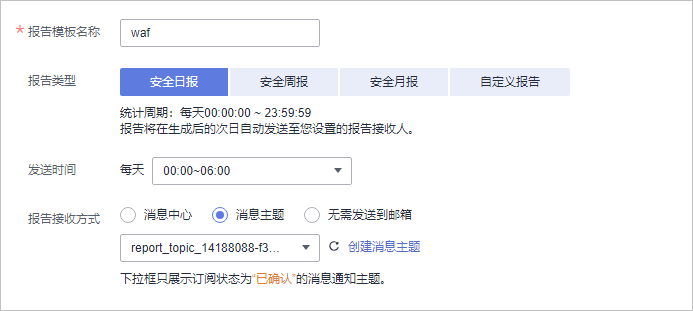
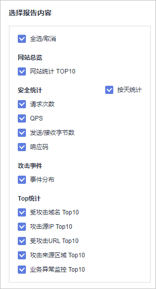

# 配置安全报告

WAF可根据您创建的日志报告模板，生成安全日报、周报、月报、或者自定义安全报告统计的时间范围内的报告，并将报告在您设置的报告发送时间段以您配置的接收方式发送给您。

## 前提条件

防护网站已接入WAF。

## 约束条件

-   WAF对创建安全报告模板的配额有限制。
    -   云模式专业版：10个
    -   云模式铂金版、独享模式：20个。
    -   云模式入门版、标准版：5个。

-   WAF仅保留6个月的安全报告，建议您定期下载，以满足等保测评以及审计的需要。

## 创建安全报告模板

1.  [登录管理控制台](https://console.huaweicloud.com/?locale=zh-cn)。
2.  单击管理控制台左上角的，选择区域或项目。
3.  单击页面左上方的，选择“安全与合规  \>  Web应用防火墙 WAF“。
4.  在左侧导航树中，选择“安全报告“，进入“安全报告“页面。
5.  在列表的左上角，单击“创建报告模板“，进入“创建报告模板“页面，参数说明如[表1](#table1131194016423)所示。

    **图 1**  创建报告模板  
    

    **表 1**  创建报告模板参数说明

    
    <table><thead align="left"><tr id="row19131740134214"><th class="cellrowborder" valign="top" width="32%" id="mcps1.2.3.1.1">
参数名称

    </th>
    <th class="cellrowborder" valign="top" width="68%" id="mcps1.2.3.1.2">
参数说明

    </th>
    </tr>
    </thead>
    <tbody><tr id="row1513234016423"><td class="cellrowborder" valign="top" width="32%" headers="mcps1.2.3.1.1 ">
报告模板名称

    </td>
    <td class="cellrowborder" valign="top" width="68%" headers="mcps1.2.3.1.2 ">
自定义安全报告模板名称。

    </td>
    </tr>
    <tr id="row1613210404423"><td class="cellrowborder" valign="top" width="32%" headers="mcps1.2.3.1.1 ">
报告类型

    </td>
    <td class="cellrowborder" valign="top" width="68%" headers="mcps1.2.3.1.2 "><ul id="ul39601344174416"><li>安全日报
统计周期：每天00:00:00 ~ 23:59:59

    
报告将在生成后的次日自动发送至您设置的报告接收人。

    </li><li>安全周报
统计周期：周一00:00:00 ~ 周日23:59:59

    
报告将在生成后的次周周一自动发送至您设置的报告接收人。

    </li><li>安全月报
统计周期：每月1日00:00:00 ~ 31日23:59:59

    
报告将在生成后的次月1日自动发送至您设置的报告接收人。

    </li><li>自定义报告
自定义日志统计周期。

    </li></ul>
    </td>
    </tr>
    <tr id="row2132440124219"><td class="cellrowborder" valign="top" width="32%" headers="mcps1.2.3.1.1 ">
统计周期

    </td>
    <td class="cellrowborder" valign="top" width="68%" headers="mcps1.2.3.1.2 ">
“报告类型”选择“自定义报告”时，需要配置日志统计周期。

    </td>
    </tr>
    <tr id="row221012418443"><td class="cellrowborder" valign="top" width="32%" headers="mcps1.2.3.1.1 ">
发送时间

    </td>
    <td class="cellrowborder" valign="top" width="68%" headers="mcps1.2.3.1.2 ">
设置日报发送时间段。

    <ul id="ul14451839175214"><li>安全日报、安全周报、安全月报：WAF分别在每日、每周一、每月一日的设置时间段内发送WAF防护的日志报告。</li><li>自定义报告：报告生成后自动发送。</li></ul>
    </td>
    </tr>
    <tr id="row1369914716487"><td class="cellrowborder" valign="top" width="32%" headers="mcps1.2.3.1.1 ">
报告接收文式

    </td>
    <td class="cellrowborder" valign="top" width="68%" headers="mcps1.2.3.1.2 ">
您可以选择以下三种方式接收报告：

    <ul id="ul445125810549"><li>“消息中心”：单击界面右上角的，进入消息中心，添加接收人信息。</li><li>“消息主题”：在下拉列表选择已创建的主题或者单击“创建消息主题”创建新的主题，用于配置接收安全报告的终端。</li></ul>
    </td>
    </tr>
    </tbody>
    </table>

6.  单击“下一步：设置报告内容“，选择要展示的安全报告内容。

    **图 2**  选择报告内容  
    

7.  单击“保存报告“，安全报告模板创建完成。

## 下载安全报告

WAF仅保留6个月的安全报告，建议您定期下载，以满足等保测评以及审计的需要。

1.  [登录管理控制台](https://console.huaweicloud.com/?locale=zh-cn)。
2.  单击管理控制台左上角的，选择区域或项目。
3.  单击页面左上方的，选择“安全与合规  \>  Web应用防火墙 WAF“。
4.  在左侧导航树中，选择“安全报告“，进入“安全报告“页面。
5.  在目标报告模板所在行的“操作“列，单击“下载最新报告“。

## 相关操作

-   安全报告模板创建完成后，默认为“已开启“状态，如果您暂时不想使用该模板，在目标报告模板所在行的“操作“列，单击“更多  \>  关闭“。
-   删除安全报告模板：在目标报告模板所在行的“操作“列，单击“更多  \>  删除“。
-   复制安全报告模板：在目标报告模板所在行的“操作“列，单击“更多  \>  复制“。
-   修改安全报告模板：在目标报告模板所在行的“操作“列，单击“编辑“。

