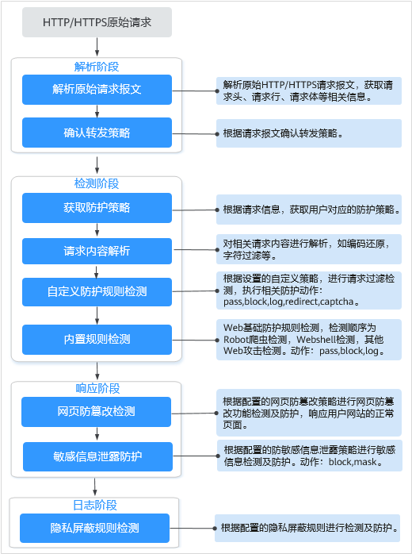

# 配置引导

## WAF引擎检测机制

Web应用防火墙内置的防护规则，可帮助您防范常见的Web应用攻击，包括XSS攻击、SQL注入、爬虫检测、Webshell检测等。同时，您也可以根据自己网站防护的需要，灵活配置防护规则，Web应用防火墙根据您配置的防护规则更好的防护您的网站业务。WAF引擎内置防护规则的检测流程如[图1](#fig1628214208241)所示，自定义规则的检测顺序如[图2](#fig2084820326445)所示。

**图 1**  WAF引擎检测图  

**图 2**  自定义防护规则的检测顺序  

**响应动作**：

-   pass：命中规则后无条件放行当前请求。
-   block：命中规则后拦截当前请求。
-   captcha：命中规则后执行人机验证动作。
-   redirect：命中规则后通知客户端执行重定向动作。
-   log：命中规则后仅记录攻击信息。
-   mask：命中规则后对相关敏感信息进行脱敏处理。

## 防护规则配置方式

为了简化您的配置过程，WAF提供了以下两种自定义防护规则的配置方式，请根据您的业务合理选择配置方式。

**方式一：单个域名配置防护规则**

此种方式适合域名业务较少或者域名业务适用的配置规则不相同的用户。

> **说明：** 
>域名添加到WAF后，WAF会自动为该域名绑定一个防护策略，为域名配置的防护规则默认也添加到绑定该域名的防护策略。如果以后有适用于该防护策略的域名，可直接通过该策略添加防护域名，具体的操作请参见[添加策略适用的防护域名](添加策略适用的防护域名.md)。

-   入口

    **图 3**  防护策略配置入口  
    

    1.  在目标域名所在行的“防护策略“栏中，单击“配置防护策略“。

-   进入规则配置页面可配置的防护规则

    **表 1**  可配置的防护规则

    
    <table><thead align="left"><tr id="row387516548205"><th class="cellrowborder" valign="top" width="29.330000000000002%" id="mcps1.2.4.1.1">
防护规则

    </th>
    <th class="cellrowborder" valign="top" width="37.01%" id="mcps1.2.4.1.2">
说明

    </th>
    <th class="cellrowborder" valign="top" width="33.660000000000004%" id="mcps1.2.4.1.3">
参考文档

    </th>
    </tr>
    </thead>
    <tbody><tr id="row187565419201"><td class="cellrowborder" valign="top" width="29.330000000000002%" headers="mcps1.2.4.1.1 ">
Web基础防护规则

    </td>
    <td class="cellrowborder" valign="top" width="37.01%" headers="mcps1.2.4.1.2 ">
覆盖OWASP（Open Web Application Security Project，简称OWASP）TOP 10中常见安全威胁，通过预置丰富的信誉库，对恶意扫描器、IP、网马等威胁进行检测和拦截。

    </td>
    <td class="cellrowborder" valign="top" width="33.660000000000004%" headers="mcps1.2.4.1.3 ">
<a href="配置Web基础防护规则.md">配置Web基础防护规则</a>

    </td>
    </tr>
    <tr id="row148751545201"><td class="cellrowborder" valign="top" width="29.330000000000002%" headers="mcps1.2.4.1.1 ">
CC攻击防护规则

    </td>
    <td class="cellrowborder" valign="top" width="37.01%" headers="mcps1.2.4.1.2 ">
可以自定义CC防护规则，限制单个IP/Cookie/Referer访问者对您的网站上特定路径（URL）的访问频率，WAF会根据您配置的规则，精准识别CC攻击以及有效缓解CC攻击。

    </td>
    <td class="cellrowborder" valign="top" width="33.660000000000004%" headers="mcps1.2.4.1.3 ">
<a href="配置CC攻击防护规则.md">配置CC攻击防护规则</a>

    </td>
    </tr>
    <tr id="row1387525413206"><td class="cellrowborder" valign="top" width="29.330000000000002%" headers="mcps1.2.4.1.1 ">
精准访问防护规则

    </td>
    <td class="cellrowborder" valign="top" width="37.01%" headers="mcps1.2.4.1.2 ">
精准访问防护策略可对HTTP首部、Cookie、访问URL、请求参数或者客户端IP进行条件组合，定制化防护策略，为您的网站带来更精准的防护。

    </td>
    <td class="cellrowborder" valign="top" width="33.660000000000004%" headers="mcps1.2.4.1.3 ">
<a href="配置精准访问防护规则.md">配置精准访问防护规则</a>

    </td>
    </tr>
    <tr id="row18875115412200"><td class="cellrowborder" valign="top" width="29.330000000000002%" headers="mcps1.2.4.1.1 ">
黑白名单规则

    </td>
    <td class="cellrowborder" valign="top" width="37.01%" headers="mcps1.2.4.1.2 ">
配置黑白名单规则，阻断、仅记录或放行指定IP的访问请求，即设置IP黑/白名单。

    </td>
    <td class="cellrowborder" valign="top" width="33.660000000000004%" headers="mcps1.2.4.1.3 ">
<a href="配置黑白名单规则.md">配置黑白名单规则</a>

    </td>
    </tr>
    <tr id="row10875105492011"><td class="cellrowborder" valign="top" width="29.330000000000002%" headers="mcps1.2.4.1.1 ">
地理位置访问控制规则

    </td>
    <td class="cellrowborder" valign="top" width="37.01%" headers="mcps1.2.4.1.2 ">
针对指定国家、地区的来源IP自定义访问控制。

    </td>
    <td class="cellrowborder" valign="top" width="33.660000000000004%" headers="mcps1.2.4.1.3 ">
<a href="配置地理位置访问控制规则.md">配置地理位置访问控制规则</a>

    </td>
    </tr>
    <tr id="row38751454192010"><td class="cellrowborder" valign="top" width="29.330000000000002%" headers="mcps1.2.4.1.1 ">
网页防篡改规则

    </td>
    <td class="cellrowborder" valign="top" width="37.01%" headers="mcps1.2.4.1.2 ">
当用户需要防护静态页面被篡改时，可配置网页防篡改规则。

    </td>
    <td class="cellrowborder" valign="top" width="33.660000000000004%" headers="mcps1.2.4.1.3 ">
<a href="配置网页防篡改规则.md">配置网页防篡改规则</a>

    </td>
    </tr>
    <tr id="row0699639122212"><td class="cellrowborder" valign="top" width="29.330000000000002%" headers="mcps1.2.4.1.1 ">
网站反爬虫规则

    </td>
    <td class="cellrowborder" valign="top" width="37.01%" headers="mcps1.2.4.1.2 ">
动态分析网站业务模型，结合人机识别技术和数据风控手段，精准识别爬虫行为。

    </td>
    <td class="cellrowborder" valign="top" width="33.660000000000004%" headers="mcps1.2.4.1.3 ">
<a href="开启网站反爬虫.md">开启网站反爬虫</a>

    </td>
    </tr>
    <tr id="row569919395228"><td class="cellrowborder" valign="top" width="29.330000000000002%" headers="mcps1.2.4.1.1 ">
防敏感信息泄露规则

    </td>
    <td class="cellrowborder" valign="top" width="37.01%" headers="mcps1.2.4.1.2 ">
该规则可添加两种类型的防敏感信息泄露规则：

    <ul id="ul171121523162819"><li>敏感信息过滤。配置后可对返回页面中包含的敏感信息做屏蔽处理，防止用户的敏感信息（例如：身份证号、电话号码、电子邮箱等）泄露。</li><li>响应码拦截。配置后可拦截指定的HTTP响应码页面。</li></ul>
    </td>
    <td class="cellrowborder" valign="top" width="33.660000000000004%" headers="mcps1.2.4.1.3 ">
<a href="配置防敏感信息泄露规则.md">配置防敏感信息泄露规则</a>

    </td>
    </tr>
    <tr id="row8699133972219"><td class="cellrowborder" valign="top" width="29.330000000000002%" headers="mcps1.2.4.1.1 ">
误报屏蔽规则

    </td>
    <td class="cellrowborder" valign="top" width="37.01%" headers="mcps1.2.4.1.2 ">
针对特定请求忽略某些攻击检测规则，用于处理误报事件。

    </td>
    <td class="cellrowborder" valign="top" width="33.660000000000004%" headers="mcps1.2.4.1.3 ">
<a href="配置误报屏蔽规则.md">配置误报屏蔽规则</a>

    </td>
    </tr>
    <tr id="row12341732172215"><td class="cellrowborder" valign="top" width="29.330000000000002%" headers="mcps1.2.4.1.1 ">
隐私屏蔽规则

    </td>
    <td class="cellrowborder" valign="top" width="37.01%" headers="mcps1.2.4.1.2 ">
隐私信息屏蔽，避免用户的密码等信息出现在事件日志中。

    </td>
    <td class="cellrowborder" valign="top" width="33.660000000000004%" headers="mcps1.2.4.1.3 ">
<a href="配置隐私屏蔽规则.md">配置隐私屏蔽规则</a>

    </td>
    </tr>
    </tbody>
    </table>

**方式二：批量配置防护规则**

此种方式适用于域名业务较多且多个域名需要防护的策略配置相同的用户。该方式可大大减少用户相同重复的配置工作，增强防护的效率性。

-   入口

    **图 4**  防护策略入口  
    

-   操作步骤：
    1.  新建策略。具体的操作请参见[添加防护策略](添加防护策略.md)。
    2.  配置防护规则。具体的操作请参见[批量添加防护规则](批量添加防护规则.md)。
    3.  批量添加策略适用的防护域名。具体操作请参见[添加策略适用的防护域名](添加策略适用的防护域名.md)。

