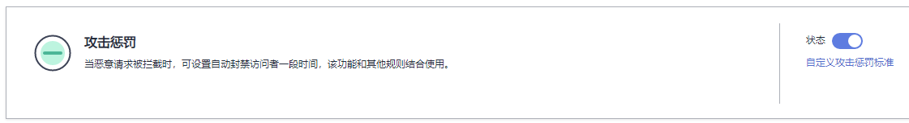
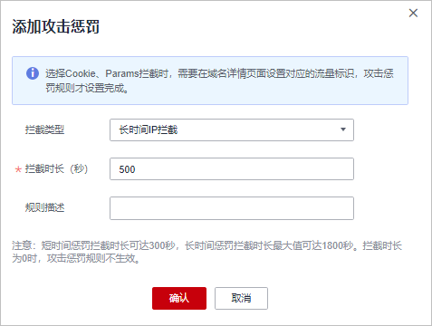
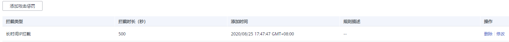
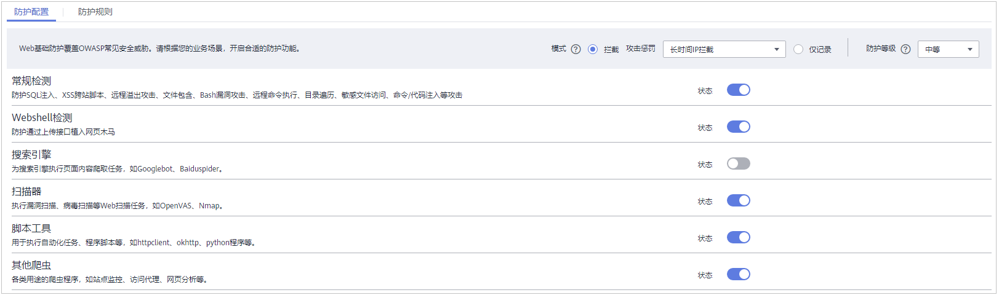
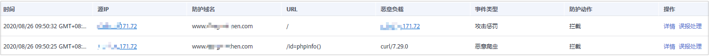

# 配置攻击惩罚标准

当访问者的IP、Cookie或Params恶意请求被WAF拦截时，您可以通过配置攻击惩罚，使WAF按配置的攻击惩罚时长来自动封禁访问者。例如，访问者的源IP（192.168.1.1）为恶意请求，如果您配置了IP攻击惩罚拦截时长为500秒，该攻击惩罚生效后，则该IP被WAF拦截时，WAF将封禁该IP，时长为500秒。

> **说明：** 
>如果您已开通企业项目，您需要在“企业项目“下拉列表中选择您所在的企业项目并确保已开通操作权限，才能为该企业项目下域名配置防护策略。

## 前提条件

已添加防护网站。

## 规格限制

-   WAF支持设置6条攻击惩罚标准，每个拦截类型只能设置1条攻击惩罚标准。
-   最大拦截时长为30分钟。

## 约束条件

-   Web基础防护、精准访问防护和黑白名单设置支持攻击惩罚功能，当攻击惩罚标准配置完成后，您还需要在Web基础防护、精准访问防护或黑白名单规则中选择攻击惩罚，该功能才能生效。
-   添加或修改防护规则后，规则生效需要等待几分钟。规则生效后，您可以在“防护事件“页面查看防护效果。
-   在配置Cookie或Params恶意请求的攻击惩罚标准前，您需要在域名详情页面设置对应的流量标识。相关操作请参见[配置攻击惩罚的流量标识](配置攻击惩罚的流量标识.md)。

## 操作步骤

1.  [登录管理控制台](https://console.huaweicloud.com/?locale=zh-cn)。
2.  进入防护策略配置入口，如[图1](#waf_01_0008_fig089771664710)所示。

    **图 1**  防护策略配置入口  
    

3.  在“攻击惩罚“配置框中，用户可根据自己的需要更改“状态“，单击“自定义攻击惩罚标准“，进入攻击惩罚标准页面，如[图2](#fig0358162863015)所示。

    **图 2**  攻击惩罚配置框  
    

4.  在攻击惩罚标准的列表左上角，单击“添加攻击惩罚“。
5.  在弹出的对话框中，添加攻击惩罚标准，如[图3](#fig16699125187)所示，参数说明如[表1](#table147241231818)所示。

    **图 3**  添加攻击惩罚  
    

    **表 1**  攻击惩罚参数说明

    
    <table><thead align="left"><tr id="row167071221814"><th class="cellrowborder" valign="top" width="24.222422242224223%" id="mcps1.2.4.1.1">
参数

    </th>
    <th class="cellrowborder" valign="top" width="43.81438143814381%" id="mcps1.2.4.1.2">
参数说明

    </th>
    <th class="cellrowborder" valign="top" width="31.963196319631965%" id="mcps1.2.4.1.3">
取值样例

    </th>
    </tr>
    </thead>
    <tbody><tr id="row671212161816"><td class="cellrowborder" valign="top" width="24.222422242224223%" headers="mcps1.2.4.1.1 ">
拦截类型

    </td>
    <td class="cellrowborder" valign="top" width="43.81438143814381%" headers="mcps1.2.4.1.2 ">
支持以下拦截方式：

    <ul id="ul16332155911817"><li>长时间IP拦截</li><li>短时间IP拦截</li><li>长时间Cookie拦截</li><li>短时间Cookie拦截</li><li>长时间Params拦截</li><li>短时间Params拦截</li></ul>
    </td>
    <td class="cellrowborder" valign="top" width="31.963196319631965%" headers="mcps1.2.4.1.3 ">
长时间IP拦截

    </td>
    </tr>
    <tr id="row13988143320408"><td class="cellrowborder" valign="top" width="24.222422242224223%" headers="mcps1.2.4.1.1 ">
拦截时长（秒）

    </td>
    <td class="cellrowborder" valign="top" width="43.81438143814381%" headers="mcps1.2.4.1.2 ">
拦截时长需要设置为整数，且设置范围为：

    <ul id="ul716019222444"><li>300&lt;长时间拦截时长≤1800</li><li>短时间拦截时长≤300</li></ul>
    </td>
    <td class="cellrowborder" valign="top" width="31.963196319631965%" headers="mcps1.2.4.1.3 ">
500

    </td>
    </tr>
    <tr id="row147241221818"><td class="cellrowborder" valign="top" width="24.222422242224223%" headers="mcps1.2.4.1.1 ">
规则描述

    </td>
    <td class="cellrowborder" valign="top" width="43.81438143814381%" headers="mcps1.2.4.1.2 ">
可选参数，设置该规则的备注信息。

    </td>
    <td class="cellrowborder" valign="top" width="31.963196319631965%" headers="mcps1.2.4.1.3 ">
-

    </td>
    </tr>
    </tbody>
    </table>

6.  输入完成后，单击“确定“，添加的攻击惩罚标准展示在列表中。

    **图 4**  攻击惩罚标准列表  
    

## 相关操作

-   若需要修改添加的攻击惩罚标准，可单击待修改的攻击惩罚标准所在行的“修改“，修改该标准的拦截时长。
-   若需要删除添加的攻击惩罚标准，可单击待删除的攻击惩罚标准所在行的“删除“，删除该标准。

## 配置示例

假如您配置了1条拦截时长为500秒的“长时间IP拦截“的攻击惩罚标准。

**图 5**  添加攻击惩罚  

## 防护效果

假如已添加域名“www.example.com“。可参照以下步骤验证防护效果：

1.  清理浏览器缓存，在浏览器中输入防护域名，测试网站域名是否能正常访问。
    -   不能正常访问，参照[步骤三：域名接入配置](步骤三-域名接入配置.md)章节重新完成域名接入。
    -   能正常访问，执行[2](#li885731953512)。

2.  参照[配置Web基础防护规则](配置Web基础防护规则.md)，将“模式“设置为“拦截“，并选择“长时间IP拦截“攻击惩罚。

    **图 6**  选择攻击惩罚  
    

3.  清理浏览器缓存，如果“http://www.example.com“页面有恶意爬虫，正常情况下，WAF会拦截恶意爬虫，且WAF将封禁发送该恶意爬虫的客户端IP，时长为500秒。

    在左侧导航树中，选择“防护事件“，在“防护事件“页面，您可以查看对应的防护记录。

    **图 7**  查看攻击惩罚防护事件  
    

