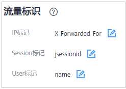

# 配置攻击惩罚的流量标识

WAF根据配置的流量标识识别客户端IP、Session或User标记，以分别实现IP、Cookie或Params恶意请求的攻击惩罚功能。

> **说明：** 
>如果您已开通企业项目，您需要在“企业项目“下拉列表中选择您所在的企业项目并确保已开通操作权限，才能为该企业项目下的域名配置攻击惩罚的流量标识。

## 前提条件

已添加防护网站。

## 约束条件

-   如果配置了IP标记，为了确保IP标记生效，请您确认防护网站在接入WAF前已使用了7层代理，且防护网站的“是否已使用代理“为“是“。

    如果未配置IP标记，WAF默认通过客户端IP进行识别。

-   使用Cookie或Params恶意请求的攻击惩罚功能前，您需要分别配置对应域名的Session标记或User标记。

## 操作步骤

1.  [登录管理控制台](https://console.huaweicloud.com/?locale=zh-cn)。
2.  单击管理控制台左上角的，选择区域或项目。
3.  单击页面左上方的，选择“安全与合规  \>  Web应用防火墙 WAF“。
4.  在左侧导航树中，选择“网站设置“，进入“网站设置“页面。
5.  在目标网站所在行的“域名“列中，单击目标网站，进入网站基本信息页面。
6.  在“流量标识“栏中，单击“IP标记“、“Session标记“或“User标记“后的，分别设置流量标记，相关参数说明如[表1](#table17733717165019)所示。

    **图 1**  流量标识  
    

    **表 1**  流量标识参数说明

    
    <table><thead align="left"><tr id="row1487913215612"><th class="cellrowborder" valign="top" width="22.52%" id="mcps1.2.4.1.1">
标识

    </th>
    <th class="cellrowborder" valign="top" width="46.57%" id="mcps1.2.4.1.2">
说明

    </th>
    <th class="cellrowborder" valign="top" width="30.91%" id="mcps1.2.4.1.3">
配置样例

    </th>
    </tr>
    </thead>
    <tbody><tr id="row1687918217567"><td class="cellrowborder" valign="top" width="22.52%" headers="mcps1.2.4.1.1 ">
IP标记

    </td>
    <td class="cellrowborder" valign="top" width="46.57%" headers="mcps1.2.4.1.2 ">
客户端最原始的IP地址的HTTP请求头字段。

    
如果配置该标识，请确保网站在接入WAF前已使用了7层代理，且防护网站的“是否已使用代理”为“是”，IP标记功能才能生效。

    
开启了代理后，WAF获取客户端的策略如下，详见<a href="https://support.huaweicloud.com/waf_faq/waf_01_4139.html" target="_blank" rel="noopener noreferrer">WAF获取真实IP是从报文中哪个字段获取到的?</a>。

    
该字段用于保存客户端的真实IP地址，可自定义字段名且支持配置多个字段（多个字段名以英文逗号隔开），配置后，WAF优先从配置的字段中获取客户端真实IP（配置多个字段时，WAF从左到右依次读取）。
 须知： 
<ul id="ul1745124417423"><li>如果想以TCP连接IP作为客户端IP，“IP标记”应配置为“$remote_addr”。</li><li>如果从自定义字段中未获取到客户端真实IP，WAF将依次从cdn-src-ip，x-real-ip，x-forwarded-for，$remote_addr"字段获取客户端IP。</li></ul>
    

    

    </td>
    <td class="cellrowborder" valign="top" width="30.91%" headers="mcps1.2.4.1.3 ">
X-Forwarded-For

    </td>
    </tr>
    <tr id="row108791825563"><td class="cellrowborder" valign="top" width="22.52%" headers="mcps1.2.4.1.1 ">
Session标记

    </td>
    <td class="cellrowborder" valign="top" width="46.57%" headers="mcps1.2.4.1.2 ">
用于Cookie恶意请求的攻击惩罚功能。在选择Cookie拦截的攻击惩罚功能前，必须配置该标识。

    </td>
    <td class="cellrowborder" valign="top" width="30.91%" headers="mcps1.2.4.1.3 ">
jssessionid

    </td>
    </tr>
    <tr id="row134001337195610"><td class="cellrowborder" valign="top" width="22.52%" headers="mcps1.2.4.1.1 ">
User标记

    </td>
    <td class="cellrowborder" valign="top" width="46.57%" headers="mcps1.2.4.1.2 ">
用于Params恶意请求的攻击惩罚功能。在选择Params拦截的攻击惩罚功能前，必须配置该标识。

    </td>
    <td class="cellrowborder" valign="top" width="30.91%" headers="mcps1.2.4.1.3 ">
name

    </td>
    </tr>
    </tbody>
    </table>

7.  单击“确认“，完成标记信息配置。

## 相关操作

[配置攻击惩罚标准自动封禁访问者指定时长](配置攻击惩罚标准自动封禁访问者指定时长.md)

