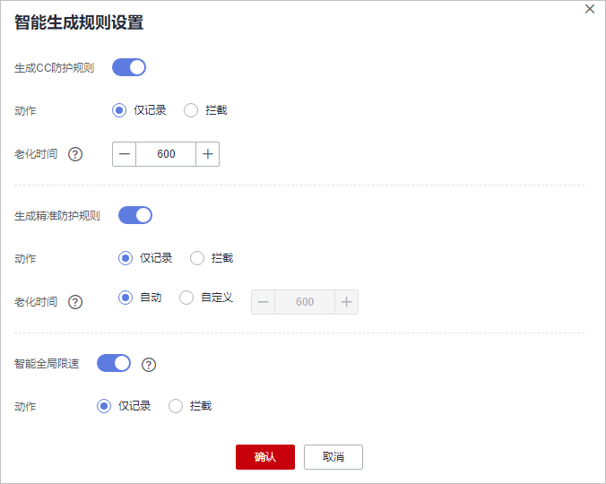

# 配置智能访问控制规则精准智能防御CC攻击

开启智能访问控制规则后，WAF中的压力学习模型会根据源站返回的HTTP状态码和时延等来实时地感知源站的压力，从而识别源站是否被CC攻击了，WAF再根据异常检测模型实时地检测源站在HTTP协议上的特征的异常行为，然后基于这些异常特征，使用AI算法生成精准防护规则和CC防护规则，来防御CC攻击，保护您的网站安全。

> **须知：** 
>智能访问控制功能现处于公测阶段，如需使用请[提交工单](https://support.huaweicloud.com/usermanual-ticket/zh-cn_topic_0127038618.html)申请开通智能访问控制功能。

## 前提条件

已添加防护网站或已[新增防护策略](步骤一-（可选）新增防护策略.md)。

-   云模式的接入方式参见[网站接入WAF（云模式）](网站接入WAF（云模式）.md)章节。
-   独享模式的接入方式参见[网站接入WAF（独享模式）](网站接入WAF（独享模式）.md)章节。
-   ELB模式的接入方式参见  [网站接入WAF（ELB模式）](网站接入WAF（ELB模式）.md)章节。

## 约束条件

-   “云模式“仅标准版、专业版和铂金版支持智能访问控制规则。
-   仅“华北“区域支持智能访问控制规则。

## 操作步骤

1.  [登录管理控制台](https://console.huaweicloud.com/?locale=zh-cn)。
2.  单击管理控制台左上角的，选择区域或项目。
3.  单击页面左上方的，选择“安全与合规  \>  Web应用防火墙 WAF“。
4.  在左侧导航树中，选择“防护策略“，进入“防护策略“页面。
5.  单击目标策略名称，进入目标策略的防护配置页面。
6.  选择“智能访问控制“配置框，用户可根据自己的需要开启或关闭智能访问控制策略。
    -   ：开启状态。
    -   ：关闭状态。

7.  单击“智能生成规则设置“，进入“智能生成规则设置“页面。

    “生成CC防护规则“/“生成精准防护规则“：开启后，需要配置“动作“和“老化时间“。

    -   “动作“：选择“仅记录“或“拦截“。
    -   “老化时间“：当WAF未检测到CC攻击流量时，达到设定的时间后，该规则失效。

    **图 1**  智能生成规则设置  
    

8.  单击“确认“，规则配置完成。

    单击“查看智能生成规则“，可查看WAF检测到CC攻击后自动生成的防护策略。

