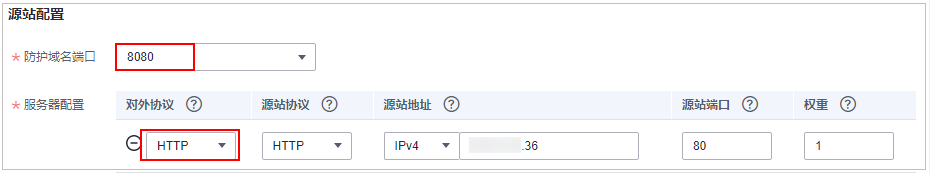
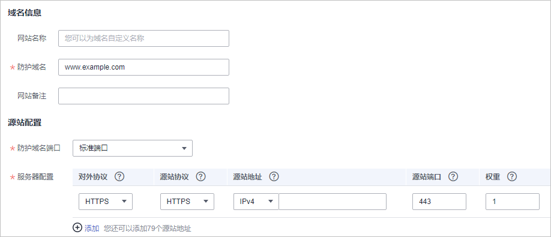
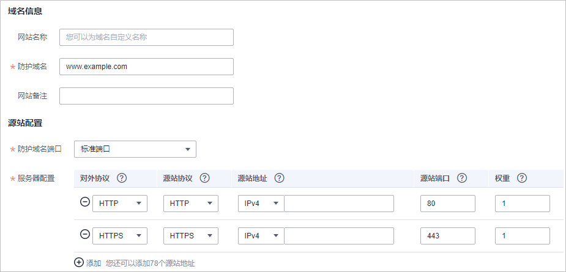

# 配置示例：添加防护域名

添加防护域名时，可根据您的业务场景参考以下示例进行配置。

-   [示例一：防护同一端口的不同源站IP的标准端口业务](#section296614581326)
-   [示例二：防护同一端口的不同源站IP的非标准端口业务](#section1882010113419)
-   [示例三：防护不同的业务端口](#section2074265815416)
-   [示例四：不同访问模式的协议配置规则](#section1420718546612)

## 示例一：防护同一端口的不同源站IP的标准端口业务

1.  在“防护域名端口“下拉框中，选择“标准端口“。
2.  “对外协议“统一选择“HTTP“或者“HTTPS“。HTTP标准端口防护配置如[图1](#fig15777310276)所示，HTTPS标准端口防护配置如[图2](#fig1830919526272)所示。

    **图 1**  80端口业务  
    

    **图 2**  443端口业务  
    

    > **说明：** 
    >“对外协议“选择“HTTPS“时，需要配置证书。

3.  访问网站时，域名后可以不加端口号进行访问。例如，在浏览器中直接输入“http://www.example.com“访问网站。

## 示例二：防护同一端口的不同源站IP的非标准端口业务

1.  在“防护域名端口“下拉框中，选择需要防护的非标准端口。
2.  “对外协议“全部选择“HTTP“或者“HTTPS“。HTTP协议的非标准端口的配置如[图3](#fig12630226124114)，HTTPS协议的非标准端口的配置如[图4](#fig10484211104214)。

    **图 3**  除80端口的其他HTTP协议端口的业务  
    

    **图 4**  除443端口的其他HTTPS协议端口的业务  
    

    > **说明：** 
    >“对外协议“选择“HTTPS“时，需要配置证书。

3.  访问网站时，域名后必须加上配置的非标准端口，否则会报404错误。假如配置的非标准端口为8080，则在浏览器中直接输入的地址为“http://www.example.com:8080“。

## 示例三：防护不同的业务端口

如果防护的业务端口不一样，则需要分别添加域名进行配置，如：域名www.example.com需要同时防护8080端口和6443端口，配置如[图5](#fig1492713211584)和[图6](#fig88015455919)所示。

**图 5**  8080端口  

**图 6**  6443端口  

## 示例四：不同访问模式的协议配置规则

根据您的业务场景的不同，WAF提供灵活的协议类型配置。假设您的网站为www.example.com，WAF可配置如下四种访问模式：

-   HTTP访问模式，如[图7](#fig53041342142615)所示。

    **图 7**  HTTP协议访问模式  
    

    > **须知：** 
    >此种配置表示用户只能通过http://www.example.com访问网站，如果用户通过https://www.example.com访问网站，会收到302跳转响应，浏览器跳转到http://www.example.com。

-   HTTPS访问模式，客户端协议全部配置为HTTPS时，当使用HTTP协议访问服务器时，会强制跳转为HTTPS协议，如[图8](#fig7444410153315)所示。

    **图 8**  HTTPS协议访问强制跳转模式  
    

    > **须知：** 
    >-   用户直接通过https://www.example.com访问网站，网站返回正常内容。
    >-   用户通过http://www.example.com访问网站，用户会收到302跳转响应，浏览器跳转到https://www.example.com。

-   HTTP/HTTPS分别转发模式，如[图9](#fig3389134713400)所示。

    **图 9**  HTTP/HTTPS分别转发模式  
    

    > **须知：** 
    >-   用户通过http://www.example.com访问网站，网站返回正常内容，没有跳转，网站内容不加密传输。
    >-   用户通过https://www.example.com访问网站，网站返回正常内容，没有跳转，网站内容加密传输。

-   使用WAF做HTTPS卸载模式，如[图10](#fig1617195061810)所示。

    **图 10**  使用WAF做HTTPS卸载模式  
    

    > **须知：** 
    >用户通过https://www.example.com访问网站，但是WAF到源站依然使用HTTP协议。

