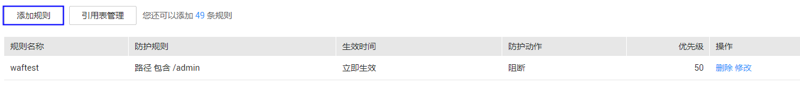

# 配置精准访问防护规则

该任务指导用户通过Web应用防火墙服务配置精准访问防护规则。

精准访问防护策略可对HTTP首部、Cookie、访问URL、请求参数或者IP进行条件组合，定制化防护策略，为用户的网站带来更精准的防护。

## 前提条件

-   已获取管理控制台的帐号和密码。
-   已添加防护域名。

## 操作步骤

1.  登录管理控制台（https://console.huaweicloud.com/）。
2.  单击管理控制台左上角的，选择区域或项目。
3.  单击页面上方的“服务列表“，选择“安全  \>  Web应用防火墙“，在左侧导航树中选择“域名配置“，进入“域名配置“页面，如[图1](#waf_01_0008_fig164792010154510)所示。

    **图 1**  域名配置页面  
    

4.  在目标域名所在行的“防护策略“栏中，单击“配置防护策略“，进入“防护配置“页面。
5.  在“精准访问防护“配置框中，设置“状态“为开启状态，单击“自定义精准访问防护规则“，进入精准访问防护规则配置页面，如[图2](#fig275911394277)所示。

    **图 2**  精准访问防护配置框  
    

6.  在“精准访问防护配置“页面，设置“检测模式“，如[图3](#fig1818193165213)所示。

    精准访问防护规则提供了两种检测模式。

    -   短路检测：当用户的请求符合精准防护中的拦截条件时，便立刻终止检测，进行拦截。
    -   全检测：当用户的请求符合精准防护中的拦截条件时，不会立即拦截，它会继续执行其他防护的检测，待其他防护的检测完成后进行拦截。

    **图 3**  检测模式  
    

7.  在“精准访问防护配置“页面左上角，单击“添加规则“，如[图4](#fig124514224012)所示。

    **图 4**  添加规则  
    

8.  在弹出的对话框中，添加精准访问防护规则，如[图5](#fig39459217174738)所示，参数说明如[表1](#table2299936310457)所示。

    **图 5**  添加精准访问防护规则  
    

    **表 1**  规则参数说明

    
    <table><thead align="left"><tr id="row6587906910457"><th class="cellrowborder" valign="top" width="14.31%" id="mcps1.2.4.1.1">
参数

    </th>
    <th class="cellrowborder" valign="top" width="51.24999999999999%" id="mcps1.2.4.1.2">
参数说明

    </th>
    <th class="cellrowborder" valign="top" width="34.44%" id="mcps1.2.4.1.3">
取值样例

    </th>
    </tr>
    </thead>
    <tbody><tr id="row135917531044"><td class="cellrowborder" valign="top" width="14.31%" headers="mcps1.2.4.1.1 ">
规则名称

    </td>
    <td class="cellrowborder" valign="top" width="51.24999999999999%" headers="mcps1.2.4.1.2 ">
用户自定义为规则的名字。

    </td>
    <td class="cellrowborder" valign="top" width="34.44%" headers="mcps1.2.4.1.3 ">
test-gz1

    </td>
    </tr>
    <tr id="row985919110457"><td class="cellrowborder" valign="top" width="14.31%" headers="mcps1.2.4.1.1 ">
防护动作

    </td>
    <td class="cellrowborder" valign="top" width="51.24999999999999%" headers="mcps1.2.4.1.2 ">
可选择“阻断”或者“放行”。默认为“阻断”。

    </td>
    <td class="cellrowborder" valign="top" width="34.44%" headers="mcps1.2.4.1.3 ">
“阻断”

    </td>
    </tr>
    <tr id="row67041622103812"><td class="cellrowborder" valign="top" width="14.31%" headers="mcps1.2.4.1.1 ">
生效时间

    </td>
    <td class="cellrowborder" valign="top" width="51.24999999999999%" headers="mcps1.2.4.1.2 ">
用户可以选择“立即生效”或者自定义设置生效时间段。

    
自定义设置的时间只能为将来的某一时间段。

    </td>
    <td class="cellrowborder" valign="top" width="34.44%" headers="mcps1.2.4.1.3 ">
“立即生效”

    </td>
    </tr>
    <tr id="row601487010457"><td class="cellrowborder" valign="top" width="14.31%" headers="mcps1.2.4.1.1 ">
条件列表

    </td>
    <td class="cellrowborder" valign="top" width="51.24999999999999%" headers="mcps1.2.4.1.2 ">
单击“添加”增加新的条件，一个防护规则至少包含一项条件，最多可添加3项条件，多个条件同时满足时，本条规则才生效。<ul id="ul61829843104748"><li>字段</li><li>子字段：当字段选择“Params”、“Cookie”或者“Header”时，请根据实际使用需求配置子字段。
 注意： 

子字段的长度不能超过2048字节，且只能由数字、字母、下划线和中划线组成。

    

    </li><li>逻辑：在“逻辑”下拉列表中选择需要的逻辑关系。
 说明： 

当“逻辑”关系选择“包含任意一个”、“不包含所有”、“等于任意一个”、“不等于所有”、“前缀为任意一个”、“前缀不为所有”、“后缀为任意一个”或者“后缀不为所有”时，需要选择引用表，创建引用表的详细操作请参见<a href="创建引用表.md">创建引用表</a>。

    

    </li><li>内容：输入或者选择条件匹配的内容。</li></ul>
    

    
 说明： 

具体的配置请参见<a href="#table13543174312394">表2</a>。

    

    </td>
    <td class="cellrowborder" valign="top" width="34.44%" headers="mcps1.2.4.1.3 "><ul id="ul13199878104428"><li>“路径”包含“/admin”</li><li>“User Agent”前缀不为“mozilla/5.0”</li><li>“IP”等于“192.168.2.3”</li><li>“Cookie[key1]”前缀不为“Nessus”</li></ul>
    </td>
    </tr>
    <tr id="row1662111271019"><td class="cellrowborder" valign="top" width="14.31%" headers="mcps1.2.4.1.1 ">
优先级

    </td>
    <td class="cellrowborder" valign="top" width="51.24999999999999%" headers="mcps1.2.4.1.2 ">
设置该条件规则检测的顺序值。

    
值越小，优先级越高；值相同时，规则创建时间越早，优先级越高。

    </td>
    <td class="cellrowborder" valign="top" width="34.44%" headers="mcps1.2.4.1.3 ">
5

    </td>
    </tr>
    </tbody>
    </table>

    **表 2**  条件列表配置

    
    <table><thead align="left"><tr id="row4545174315393"><th class="cellrowborder" valign="top" width="20.71792820717928%" id="mcps1.2.5.1.1">
字段

    </th>
    <th class="cellrowborder" valign="top" width="25.35746425357464%" id="mcps1.2.5.1.2">
子字段（举例）

    </th>
    <th class="cellrowborder" valign="top" width="28.947105289471054%" id="mcps1.2.5.1.3">
逻辑

    </th>
    <th class="cellrowborder" valign="top" width="24.97750224977502%" id="mcps1.2.5.1.4">
内容（举例）

    </th>
    </tr>
    </thead>
    <tbody><tr id="row1545114318391"><td class="cellrowborder" valign="top" width="20.71792820717928%" headers="mcps1.2.5.1.1 ">
路径：设置的防护路径，不包含域名，仅支持精准匹配（需要防护的路径需要与此处填写的路径完全相等。例如，需要防护的路径为“/admin”，该规则必须填写为“/admin”）

    </td>
    <td class="cellrowborder" valign="top" width="25.35746425357464%" headers="mcps1.2.5.1.2 ">
--

    </td>
    <td class="cellrowborder" valign="top" width="28.947105289471054%" headers="mcps1.2.5.1.3 ">
“包含”、“不包含”、“等于”、“不等于”、“前缀为”、“前缀不为”、“后缀为”、“后缀不为”。

    </td>
    <td class="cellrowborder" valign="top" width="24.97750224977502%" headers="mcps1.2.5.1.4 ">
/buy/phone/

    </td>
    </tr>
    <tr id="row362081410432"><td class="cellrowborder" valign="top" width="20.71792820717928%" headers="mcps1.2.5.1.1 ">
User Agent：设置为需要防护的扫描器的用户代理。

    </td>
    <td class="cellrowborder" valign="top" width="25.35746425357464%" headers="mcps1.2.5.1.2 ">
--

    </td>
    <td class="cellrowborder" valign="top" width="28.947105289471054%" headers="mcps1.2.5.1.3 ">
“包含”、“不包含”、“等于”、“不等于”、“前缀为”、“前缀不为”、“后缀为”、“后缀不为”。

    </td>
    <td class="cellrowborder" valign="top" width="24.97750224977502%" headers="mcps1.2.5.1.4 ">
Mozilla/5.0 (Windows NT 6.1)

    </td>
    </tr>
    <tr id="row323411238439"><td class="cellrowborder" valign="top" width="20.71792820717928%" headers="mcps1.2.5.1.1 ">
IP：设置为需要防护的访问者IP地址。

    </td>
    <td class="cellrowborder" valign="top" width="25.35746425357464%" headers="mcps1.2.5.1.2 ">
--

    </td>
    <td class="cellrowborder" valign="top" width="28.947105289471054%" headers="mcps1.2.5.1.3 ">
“等于”、“不等于”。

    </td>
    <td class="cellrowborder" valign="top" width="24.97750224977502%" headers="mcps1.2.5.1.4 ">
192.168.2.3

    </td>
    </tr>
    <tr id="row17545184303914"><td class="cellrowborder" valign="top" width="20.71792820717928%" headers="mcps1.2.5.1.1 ">
Params：设置为需要防护的请求参数。

    </td>
    <td class="cellrowborder" valign="top" width="25.35746425357464%" headers="mcps1.2.5.1.2 ">
sttl

    </td>
    <td class="cellrowborder" valign="top" width="28.947105289471054%" headers="mcps1.2.5.1.3 ">
“包含”、“不包含”、“等于”、“不等于”、“前缀为”、“前缀不为”、“后缀为”、“后缀不为”。

    </td>
    <td class="cellrowborder" valign="top" width="24.97750224977502%" headers="mcps1.2.5.1.4 ">
201901150929

    </td>
    </tr>
    <tr id="row15281420164313"><td class="cellrowborder" valign="top" width="20.71792820717928%" headers="mcps1.2.5.1.1 ">
Cookie：根据Cookie区分的Web访问者。

    </td>
    <td class="cellrowborder" valign="top" width="25.35746425357464%" headers="mcps1.2.5.1.2 ">
name

    </td>
    <td class="cellrowborder" valign="top" width="28.947105289471054%" headers="mcps1.2.5.1.3 ">
“包含”、“不包含”、“等于”、“不等于”、“前缀为”、“前缀不为”、“后缀为”、“后缀不为”。

    </td>
    <td class="cellrowborder" valign="top" width="24.97750224977502%" headers="mcps1.2.5.1.4 ">
Nessus

    </td>
    </tr>
    <tr id="row4281142015438"><td class="cellrowborder" valign="top" width="20.71792820717928%" headers="mcps1.2.5.1.1 ">
Referer：设置为需要防护的自定义请求访问的来源。

    
例如：防护路径设置为“/admin/xxx”，若用户不希望访问者从“www.test.com”访问该页面，则“Referer”对应的“内容”设置为“http://www.test.com”。

    </td>
    <td class="cellrowborder" valign="top" width="25.35746425357464%" headers="mcps1.2.5.1.2 ">
--

    </td>
    <td class="cellrowborder" valign="top" width="28.947105289471054%" headers="mcps1.2.5.1.3 ">
“包含”、“不包含”、“等于”、“不等于”、“前缀为”、“前缀不为”、“后缀为”、“后缀不为”。

    </td>
    <td class="cellrowborder" valign="top" width="24.97750224977502%" headers="mcps1.2.5.1.4 ">
http://www.test.com

    </td>
    </tr>
    <tr id="row22811220114314"><td class="cellrowborder" valign="top" width="20.71792820717928%" headers="mcps1.2.5.1.1 ">
Header：设置为需要防护的自定义HTTP首部。

    </td>
    <td class="cellrowborder" valign="top" width="25.35746425357464%" headers="mcps1.2.5.1.2 ">
Accept

    </td>
    <td class="cellrowborder" valign="top" width="28.947105289471054%" headers="mcps1.2.5.1.3 ">
“包含”、“不包含”、“等于”、“不等于”、“前缀为”、“前缀不为”、“后缀为”、“后缀不为”。

    </td>
    <td class="cellrowborder" valign="top" width="24.97750224977502%" headers="mcps1.2.5.1.4 ">
text/html,application/xhtml+xml,application/xml;q=0.9,image/webp,image/apng,*/*;q=0.8

    </td>
    </tr>
    </tbody>
    </table>

9.  单击“确定“，在页面右上角弹出“创建规则成功“，则说明添加精准访问防护规则成功。
    -   若需要修改添加的精准访问防护规则时，可单击待修改的精准访问防护规则所在行的“修改“，修改精准访问防护规则。
    -   若需要删除添加的精准访问防护规则时，可单击待删除的精准访问防护规则所在行的“删除“，删除精准访问防护规则。

