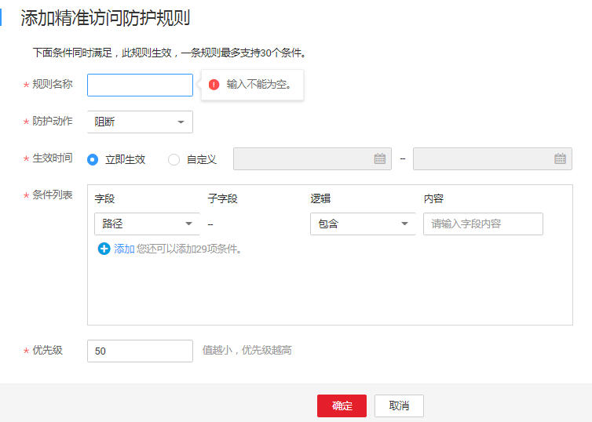

# 配置精准访问防护规则

该任务指导用户通过Web应用防火墙服务配置精准访问防护规则。

精准访问防护策略可对HTTP首部、Cookie、访问URL、请求参数或者IP进行条件组合，定制化防护策略，为用户的网站带来更精准的防护。

## 前提条件

-   已获取管理控制台的帐号和密码。
-   已添加防护域名。

## 操作步骤

1.  登录管理控制台（https://console.huaweicloud.com/）。
2.  单击页面上方的“服务列表“，选择“安全  \>  Web应用防火墙“，在左侧导航树中选择“域名配置“，进入“域名配置“页面。
3.  在目标域名所在行的“防护策略“栏中，单击策略名称，进入防护配置页面，如[图1](#waf_01_0008_fig164792010154510)所示。

    **图 1**  防护策略  
    

4.  在“精准访问防护“配置框中，单击“自定义精准访问防护规则“，进入精准访问防护规则配置页面，如[图2](#fig275911394277)所示。

    单击，开启防护检测。

    **图 2**  精准访问防护配置框  
    

    > **说明：**   
    >在配置页面的列表左上角，可以设置检测模式，精准访问防护规则提供了两种检测模式：  
    >-   短路检测：当用户的请求符合精准防护中的拦截条件时，便立刻终止检测，进行拦截。  
    >-   全检测：当用户的请求符合精准防护中的拦截条件时，不会立即拦截，它会继续执行其他防护的检测，待其他防护的检测完成后进行拦截。  

5.  在“精准防护配置“页面左上角，单击“添加规则“，添加精准访问防护规则，如[图3](#fig39459217174738)所示，参数说明如[表1](#table2299936310457)所示。

    **图 3**  添加精准访问防护规则  
    

    **表 1**  规则参数说明

    
    <table><thead align="left"><tr id="row6587906910457"><th class="cellrowborder" valign="top" width="14.31%" id="mcps1.2.4.1.1">
参数

    </th>
    <th class="cellrowborder" valign="top" width="42.120000000000005%" id="mcps1.2.4.1.2">
参数说明

    </th>
    <th class="cellrowborder" valign="top" width="43.57%" id="mcps1.2.4.1.3">
取值样例

    </th>
    </tr>
    </thead>
    <tbody><tr id="row135917531044"><td class="cellrowborder" valign="top" width="14.31%" headers="mcps1.2.4.1.1 ">
规则名称

    </td>
    <td class="cellrowborder" valign="top" width="42.120000000000005%" headers="mcps1.2.4.1.2 ">
用户自定义为规则取的名字。

    </td>
    <td class="cellrowborder" valign="top" width="43.57%" headers="mcps1.2.4.1.3 ">
test-gz1

    </td>
    </tr>
    <tr id="row985919110457"><td class="cellrowborder" valign="top" width="14.31%" headers="mcps1.2.4.1.1 ">
防护动作

    </td>
    <td class="cellrowborder" valign="top" width="42.120000000000005%" headers="mcps1.2.4.1.2 ">
可选择“阻断”或者“放行”。

    </td>
    <td class="cellrowborder" valign="top" width="43.57%" headers="mcps1.2.4.1.3 ">
“阻断”

    </td>
    </tr>
    <tr id="row67041622103812"><td class="cellrowborder" valign="top" width="14.31%" headers="mcps1.2.4.1.1 ">
生效时间

    </td>
    <td class="cellrowborder" valign="top" width="42.120000000000005%" headers="mcps1.2.4.1.2 ">
用户可以选择“立即生效”或者自定义设置生效时间段。

    </td>
    <td class="cellrowborder" valign="top" width="43.57%" headers="mcps1.2.4.1.3 ">
“立即生效”

    </td>
    </tr>
    <tr id="row601487010457"><td class="cellrowborder" valign="top" width="14.31%" headers="mcps1.2.4.1.1 ">
条件列表

    </td>
    <td class="cellrowborder" valign="top" width="42.120000000000005%" headers="mcps1.2.4.1.2 ">
单击“添加”增加新的条件，一个防护规则至少包含一项条件，最多可添加3项条件，多个条件同时满足时，本条规则才生效。<ul id="ul61829843104748"><li>字段<ul id="ul16778520183811"><li>路径：设置为“阻断”或者“放行”的路径，不包含域名。</li><li>User Agent：设置为“阻断”或者“放行”的扫描器的用户代理。</li><li>IP：设置为“阻断”或者“放行”的访问者IP地址。</li><li>Params：设置为“阻断”或者“放行”的请求参数。</li><li>Cookie：设置为“阻断”或者“放行”的根据Cookie区分的Web访问者。</li><li>Referer：设置为“阻断”或者“放行”的自定义请求访问的来源。
例如：防护路径设置为“/admin/xxx”，若用户不希望访问者从“www.test.com”访问该页面，则“Referer”设置为“http://www.test.com”。

    </li><li>Header：设置为“阻断”或者“放行”的自定义HTTP首部。
例如：Accept（设置接受的内容类型）、Accept-Charset（设置接受的字符编码）、Accept-Encoding（设置接受编码的格式）等。

    </li></ul>
    </li><li>子字段：当字段选择“Params”、“Cookie”或者“Header”时，可配置子字段。</li><li>逻辑：在“逻辑”下拉列表中选择需要的逻辑关系。
 说明： 

当“逻辑”关系选择“包含任意一个”、“不包含所有”、“等于任意一个”、“不等于所有”、“前缀为任意一个”、“前缀不为所有”、“后缀为任意一个”或者“后缀不为所有”时，需要选择引用表，创建引用表的详细操作请参见<a href="创建引用表.md">创建引用表</a>。

    

    </li><li>内容：输入或者选择条件匹配的内容。</li></ul>
    

    </td>
    <td class="cellrowborder" valign="top" width="43.57%" headers="mcps1.2.4.1.3 "><ul id="ul13199878104428"><li>“路径”等于“/buy/phone/”</li><li>“User Agent”前缀不为“mozilla/5.0”</li><li>“Cookie[key1]”前缀不为“Nessus”</li></ul>
    </td>
    </tr>
    <tr id="row1662111271019"><td class="cellrowborder" valign="top" width="14.31%" headers="mcps1.2.4.1.1 ">
优先级

    </td>
    <td class="cellrowborder" valign="top" width="42.120000000000005%" headers="mcps1.2.4.1.2 ">
设置该条件规则检测的顺序值。

    
值越小，优先级越高。

    </td>
    <td class="cellrowborder" valign="top" width="43.57%" headers="mcps1.2.4.1.3 ">
5

    </td>
    </tr>
    </tbody>
    </table>

6.  单击“确定“，在页面右上角弹出“创建规则成功“，则说明添加精准访问防护规则成功。

    > **说明：**   
    >-   若需要修改添加的精准访问防护规则时，可单击待修改的精准访问防护规则所在行的“修改“，修改精准访问防护规则。  
    >-   若需要删除添加的精准访问防护规则时，可单击待删除的精准访问防护规则所在行的“删除“，删除精准访问防护规则。  

