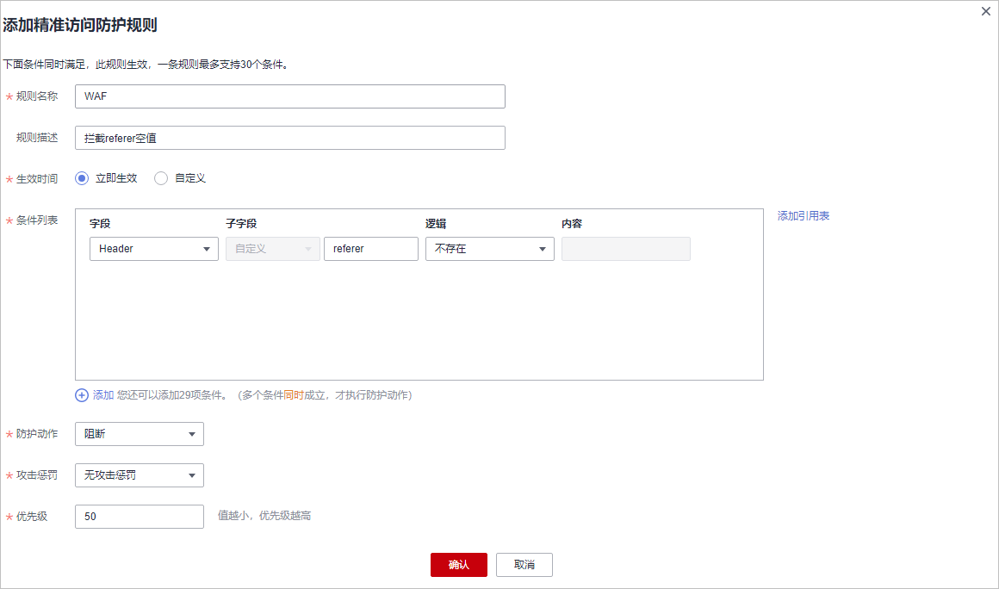
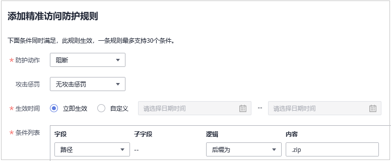

# 配置精准访问防护规则定制化防护策略

精准访问防护策略可对HTTP首部、Cookie、访问URL、请求参数或者客户端IP进行条件组合，定制化防护策略，为您的网站带来更精准的防护。

精准访问防护规则允许您设置访问防护规则，对常见的HTTP字段（如IP、路径、Referer、User Agent、Params等）进行条件组合，用来筛选访问请求，并对命中条件的请求设置仅记录、放行或阻断操作。

精准访问防护规则可以添加引用表，引用表防护规则对所有防护域名都生效，即所有防护域名都可以使用精准防护规则的引用表。

> **说明：** 
>如果您已开通企业项目，您需要在“企业项目“下拉列表中选择您所在的企业项目并确保已开通操作权限，才能为该企业项目下域名配置防护策略。

## 前提条件

已添加防护网站或已[新增防护策略](步骤一-（可选）新增防护策略.md)。

-   云模式的接入方式参见[网站接入WAF（云模式）](网站接入WAF（云模式）.md)章节。
-   独享模式的接入方式参见[网站接入WAF（独享模式）](网站接入WAF（独享模式）.md)章节。
-   ELB模式的接入方式参见  [网站接入WAF（ELB模式）](网站接入WAF（ELB模式）.md)章节。

## 约束条件

-   入门版不支持该功能。
-   标准版不支持“全检测“检测模式。
-   标准版不支持引用表管理功能。

-   添加或修改防护规则后，规则生效需要等待几分钟。规则生效后，您可以在“防护事件“页面查看防护效果。
-   当精准访问防护规则的“防护动作“设置为“阻断“时，您可以[配置攻击惩罚标准自动封禁访问者指定时长](配置攻击惩罚标准自动封禁访问者指定时长.md)。配置攻击惩罚后，如果访问者的IP、Cookie或Params恶意请求被拦截时，WAF将根据攻击惩罚设置的拦截时长来封禁访问者。
-   配置的“路径“的“内容“不能包含特殊字符（' "<\>&\*\#%\\?）。

## 应用场景

精准访问防护支持业务场景定制化的防护策略，可用于盗链防护、网站管理后台保护等场景。

## 操作步骤

1.  [登录管理控制台](https://console.huaweicloud.com/?locale=zh-cn)。
2.  单击管理控制台左上角的，选择区域或项目。
3.  单击页面左上方的，选择“安全与合规  \>  Web应用防火墙 WAF“。
4.  在左侧导航树中，选择“防护策略“，进入“防护策略“页面。
5.  单击目标策略名称，进入目标策略的防护配置页面。
6.  选择“精准访问防护“配置框，用户可根据自己的需要开启或关闭精准访问防护策略。
    -   ：开启状态。
    -   ：关闭状态。

7.  在“精准访问防护配置“页面，设置“检测模式“。

    精准访问防护规则提供了两种检测模式：

    -   短路检测：当用户的请求符合精准防护中的拦截条件时，便立刻终止检测，进行拦截。
    -   全检测：当用户的请求符合精准防护中的拦截条件时，不会立即拦截，它会继续执行其他防护的检测，待其他防护的检测完成后进行拦截。

        **图 1**  检测模式  
        

8.  在“精准访问防护“规则配置列表左上方，单击“添加规则“。
9.  在弹出的对话框中，根据[表1](#table2299936310457)添加精准访问防护规则。

    以[图2](#fig39459217174738)的配置为例，其含义为：当用户访问目标域名下包含“/admin“的URL地址时，WAF将阻断该用户访问目标URL地址。

    > **须知：** 
    >如果不确定配置的精准访问防护规则是否会使WAF误拦截正常的访问请求，您可以先将精准访问防护规则的“防护动作“设置为“仅记录“，在“防护事件“页面查看防护事件，确认WAF不会误拦截正常的访问请求后，再将该精准访问防护规则的“防护动作“设置为“阻断“。

    **图 2**  添加精准访问防护规则  
    

    **表 1**  规则参数说明

    
    <table><thead align="left"><tr id="row6587906910457"><th class="cellrowborder" valign="top" width="14.34%" id="mcps1.2.4.1.1">
参数

    </th>
    <th class="cellrowborder" valign="top" width="51.22%" id="mcps1.2.4.1.2">
参数说明

    </th>
    <th class="cellrowborder" valign="top" width="34.44%" id="mcps1.2.4.1.3">
取值样例

    </th>
    </tr>
    </thead>
    <tbody><tr id="row1494915614317"><td class="cellrowborder" valign="top" width="14.34%" headers="mcps1.2.4.1.1 ">
规则描述

    </td>
    <td class="cellrowborder" valign="top" width="51.22%" headers="mcps1.2.4.1.2 ">
可选参数，设置该规则的备注信息。

    </td>
    <td class="cellrowborder" valign="top" width="34.44%" headers="mcps1.2.4.1.3 ">
--

    </td>
    </tr>
    <tr id="row601487010457"><td class="cellrowborder" valign="top" width="14.34%" headers="mcps1.2.4.1.1 ">
条件列表

    </td>
    <td class="cellrowborder" valign="top" width="51.22%" headers="mcps1.2.4.1.2 ">
单击“添加”增加新的条件，一个防护规则至少包含一项条件，最多可添加30项条件，多个条件同时满足时，本条规则才生效。

    
条件设置参数说明如下：<ul id="ul61829843104748"><li>字段</li><li>子字段：当字段选择“IP”、“Params”、“Cookie”或者“Header”时，请根据实际使用需求配置子字段。
 须知： 

子字段的长度不能超过2048字节，且只能由数字、字母、下划线和中划线组成。

    

    </li><li>逻辑：在“逻辑”下拉列表中选择需要的逻辑关系。
 说明： 
<ul id="ul103946551112"><li>选择“包含任意一个”、“不包含所有”、“等于任意一个”、“不等于所有”、“前缀为任意一个”、“前缀不为所有”、“后缀为任意一个”或者“后缀不为所有”时，“内容”需要选择引用表名称，创建引用表的详细操作请参见<a href="创建引用表对防护指标进行批量配置.md">创建引用表对防护指标进行批量配置</a>。</li><li>“不包含所有”、“不等于所有”、“前缀不为所有”、“后缀不为所有”是指当访问请求中字段不包含、不等于、前/后缀不为引用表中设置的任何一个值时，WAF将进行防护动作（阻断、放行或仅记录）。例如，设置“路径”字段的逻辑为“不包含所有”，选择了“test”引用表，如果“test”引用表中设置的值为test1、test2和test3，则当访问请求的路径不包含test1、test2或test3时，WAF将进行防护动作。</li></ul>
    

    </li><li>内容：输入或者选择条件匹配的内容。</li></ul>
    

    
 说明： 

具体的配置请参见<a href="条件字段说明.md#table13543174312394">表1</a>。

    

    </td>
    <td class="cellrowborder" valign="top" width="34.44%" headers="mcps1.2.4.1.3 "><ul id="ul13199878104428"><li>“路径”包含“/admin/”</li><li>“User Agent”前缀不为“mozilla/5.0”</li><li>“IP”等于“192.168.2.3”</li><li>“Cookie[key1]”前缀不为“jsessionid”</li></ul>
    </td>
    </tr>
    <tr id="row597672763311"><td class="cellrowborder" valign="top" width="14.34%" headers="mcps1.2.4.1.1 ">
防护动作

    </td>
    <td class="cellrowborder" valign="top" width="51.22%" headers="mcps1.2.4.1.2 ">
可选择“阻断”、“放行”或者“仅记录”。默认为“阻断”。

    </td>
    <td class="cellrowborder" valign="top" width="34.44%" headers="mcps1.2.4.1.3 ">
“阻断”

    </td>
    </tr>
    <tr id="row1525752512334"><td class="cellrowborder" valign="top" width="14.34%" headers="mcps1.2.4.1.1 ">
攻击惩罚

    </td>
    <td class="cellrowborder" valign="top" width="51.22%" headers="mcps1.2.4.1.2 ">
当“防护动作”设置为“阻断”时，您可以设置攻击惩罚标准。设置攻击惩罚后，当访问者的IP、Cookie或Params恶意请求被拦截时，WAF将根据惩罚标准设置的拦截时长来封禁访问者。

    </td>
    <td class="cellrowborder" valign="top" width="34.44%" headers="mcps1.2.4.1.3 ">
长时间IP拦截

    </td>
    </tr>
    <tr id="row1662111271019"><td class="cellrowborder" valign="top" width="14.34%" headers="mcps1.2.4.1.1 ">
优先级

    </td>
    <td class="cellrowborder" valign="top" width="51.22%" headers="mcps1.2.4.1.2 ">
设置该条件规则检测的顺序值。如果您设置了多条规则，则多条规则间有先后匹配顺序，即访问请求将根据您设定的精准访问控制规则优先级依次进行匹配，优先级较小的精准访问控制规则优先匹配。

    
您可以通过优先级功能对所有精准访问控制规则进行排序，以获得最优的防护效果。

    
 须知： 

如果多条精准访问控制规则的优先级取值相同，则WAF将根据添加防护规则的先后顺序进行排序匹配。

    

    </td>
    <td class="cellrowborder" valign="top" width="34.44%" headers="mcps1.2.4.1.3 ">
5

    </td>
    </tr>
    <tr id="row1749220184218"><td class="cellrowborder" valign="top" width="14.34%" headers="mcps1.2.4.1.1 ">
生效时间

    </td>
    <td class="cellrowborder" valign="top" width="51.22%" headers="mcps1.2.4.1.2 ">
用户可以选择“立即生效”或者自定义设置生效时间段。

    
自定义设置的时间只能为将来的某一时间段。

    </td>
    <td class="cellrowborder" valign="top" width="34.44%" headers="mcps1.2.4.1.3 ">
“立即生效”

    </td>
    </tr>
    </tbody>
    </table>

10. 单击“确认“，添加的精准访问防护规则展示在精准访问防护规则列表中。
    -   规则添加成功后，默认的“规则状态“为“已开启“，若您暂时不想使该规则生效，可在目标规则所在行的“操作“列，单击“关闭“。
    -   若需要修改添加的精准访问防护规则时，可单击待修改的精准访问防护规则所在行的“修改“，修改精准访问防护规则。
    -   若需要删除添加的精准访问防护规则时，可单击待删除的精准访问防护规则所在行的“删除“，删除精准访问防护规则。

## 防护效果

假如已添加域名“www.example.com“，且配置了如[图2](#fig39459217174738)所示的精准访问防护规则。可参照以下步骤验证防护效果：

1.  清理浏览器缓存，在浏览器中输入防护域名，测试网站域名是否能正常访问。
    -   不能正常访问，参照[网站设置](网站设置.md)章节重新完成域名接入。
    -   能正常访问，执行[2](#li1160182620213)。

2.  清理浏览器缓存，在浏览器中访问“http://www.example.com/admin“页面或者包含/admin的任意页面，正常情况下，WAF会阻断满足条件的访问请求，返回拦截页面。
3.  返回Web应用防火墙控制界面，在左侧导航树中，单击“防护事件“，进入“防护事件“页面，查看防护域名拦截日志，您也可以[下载防护事件数据](下载防护事件数据.md)。

## 配置示例-拦截特定的攻击请求

通过分析某类特定的WordPress反弹攻击，发现其特征是User-Agent字段都包含WordPress，如[图3](#fig16451834185616)所示。

**图 3**  WordPress反弹攻击  

因此，可以设置精准访问控制规则，拦截该类WordPress反弹攻击请求。

**图 4** **User Agent配置**  

## 配置示例-拦截特定的URL请求

如果您遇到有大量IP在访问某个特定且不存在的URL，您可以通过配置以下精准访问防护规则直接阻断所有该类请求，降低源站服务器的资源消耗，如[图5](#fig169721525916)所示。

**图 5**  特定的URL拦截  

## 配置示例-拦截字段为空值的请求

如果您需要拦截某个为空值的字段，您可以通过配置精准访问防护规则直接阻断该类请求，如[图6](#fig6135111553516)所示。

**图 6**  Referer空值拦截  

## 配置示例-拦截指定文件类型（zip、tar、docx等）

通过配置路径字段匹配的文件类型，您可以阻断特定的文件类型。例如，您需要拦截“.zip“格式文件，您可以配置精准防护规则阻断“.zip“文件类型访问请求，如[图7](#fig1599818616112)所示。

**图 7**  阻断特定文件类型请求  

## 配置示例-防盗链

通过配置Referer匹配字段的访问控制规则，您可以阻断特定网站的盗链。例如，您发现“https://abc.blog.com“大量盗用本站的图片，您可以配置精准访问防护规则阻断相关访问请求。

**图 8**  防盗链  

## 配置示例-单独放行指定IP的访问

配置两条精准访问防护规则，一条拦截所有的请求，如[图9](#fig11661145013158)所示，一条单独放行指定IP的访问，如[图10](#fig866195019151)所示。

**图 9**  阻断所有的请求  

**图 10**  放行指定IP  

## 配置示例-放行指定IP的特定URL请求

通过配置多条“条件列表“，当访问请求同时满足条件列表时，可以实现放行指定IP的特定URL请求，如[图11](#fig1976618419256)所示。

**图 11**  放行指定IP访问特定路径  

