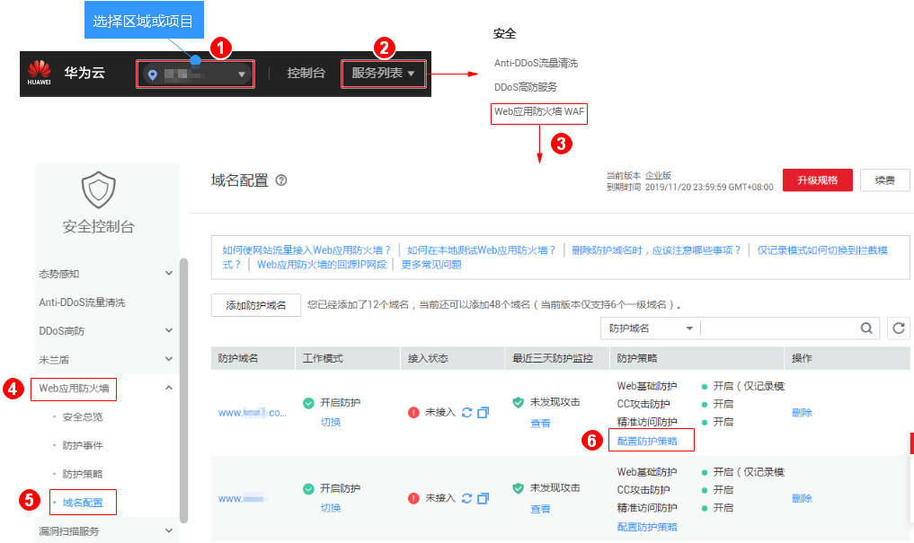
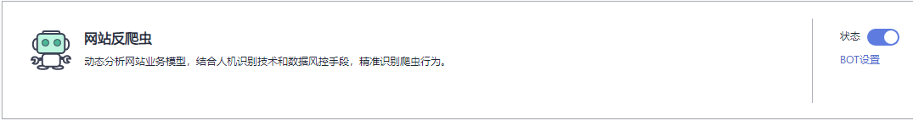

# 配置网站反爬虫规则

您可以通过Web应用防火墙服务设置网站反爬虫规则。

> **说明：**   
>只有WAF企业版和旗舰版才支持该规则。如果您是专业版用户，建议您升级服务版本。  

## 前提条件

-   已获取管理控制台的账号和密码。
-   已添加防护域名。

## 操作步骤

1.  [登录管理控制台](https://console.huaweicloud.com/?locale=zh-cn)。
2.  进入防护配置入口，如[图1](#zh-cn_topic_0110861309_fig089771664710)所示。

    **图 1**  防护配置入口  
    

3.  用户可以根据需要设置“网站反爬虫“的“状态“，默认为关闭状态，单击开启检测，如[图2](#fig177217811514)所示。

    **图 2**  网站反爬虫配置框  
    

    > **须知：**   
    >如果当前业务接入CDN等类型的服务时，同时开启了“网站反爬虫“防护，则可能造成访问异常，此情况取决于CDN等服务的加速配置。由此给您带来的不便，敬请谅解。  

