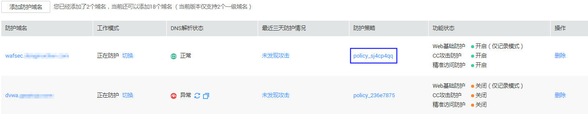

# 配置网站反爬虫规则

该任务指导用户通过Web应用防火墙服务设置网站反爬虫规则。

## 前提条件

-   已获取管理控制台的帐号和密码。
-   已添加防护域名。

## 操作步骤

1.  登录管理控制台（https://console.huaweicloud.com/）。
2.  单击页面上方的“服务列表“，选择“安全  \>  Web应用防火墙“，在左侧导航树中选择“域名配置“，进入“域名配置“页面。
3.  在目标域名所在行的“防护策略“栏中，单击策略名称，进入防护配置页面，如[图1](#waf_01_0008_fig164792010154510)所示。

    **图 1**  防护策略  
    

4.  用户可以根据需要设置“网站反爬虫“的“状态“，默认为，如[图2](#fig177217811514)所示。

    用户可单击开启检测，开启检测后，页面右上角弹出“开启成功“，变更为则说明检测项开启成功。

    **图 2**  网站反爬虫配置框  
    

    > **注意：**   
    >如果当前业务接入加速乐、CDN等类型的服务时，同时开启了“网站反爬虫“防护，则可能造成访问异常，此情况取决于CDN等服务的加速配置。由此给您带来的不便，敬请谅解。  

