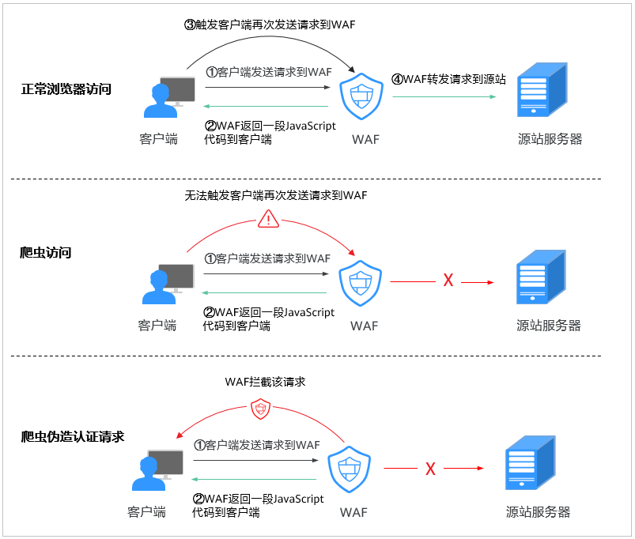
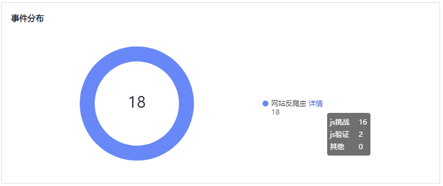
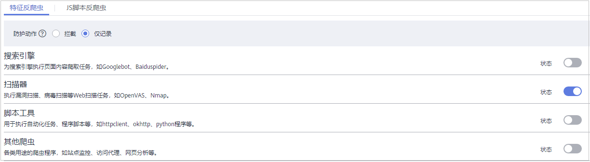
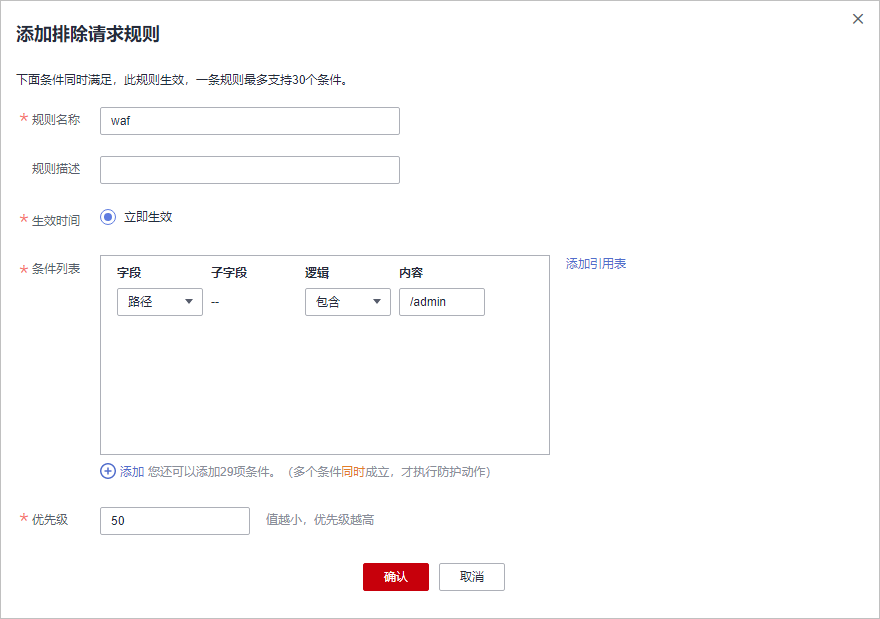
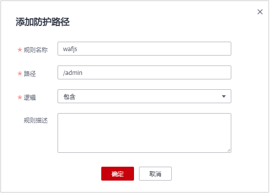
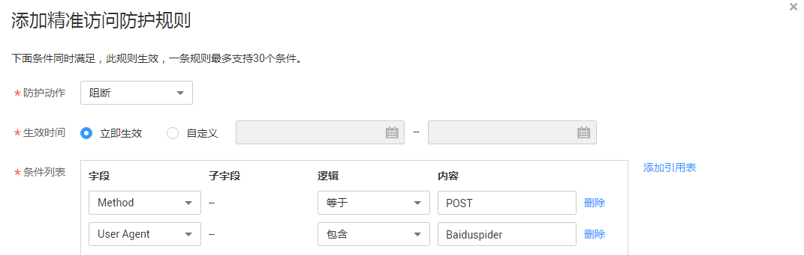

# 配置网站反爬虫防护规则

您可以通过配置网站反爬虫防护规则，防护搜索引擎、扫描器、脚本工具、其它爬虫等爬虫，以及自定义JS脚本反爬虫防护规则。

> **说明：** 
>如果您已开通企业项目，您可以在“企业项目“下拉列表中选择您所在的企业项目，为该企业项目下域名配置防护策略。

## 前提条件

已添加防护网站。

## 约束条件

-   JS脚本反爬虫依赖浏览器的Cookie机制、JavaScript解析能力，如果客户端浏览器不支持Cookie，此功能无法使用。
-   如果您的业务接入了CDN服务，请谨慎使用JS脚本反爬虫。

    由于CDN缓存机制的影响，JS脚本反爬虫特性将无法达到预期效果，并且有可能造成页面访问异常。

-   检测版和专业版不支持JS脚本反爬虫功能。
-   防护网站部署模式为“ELB模式“时，不支持JS脚本反爬虫功能。

## JS脚本反爬虫检测机制

JS脚本检测流程如[图1](#fig0891191071116)所示，其中，①和②称为“js挑战”，③称为“js验证”。

**图 1**  JS脚本检测流程说明  

开启JS脚本反爬虫后，当客户端发送请求时，WAF会返回一段JavaScript代码到客户端。

-   如果客户端是正常浏览器访问，就可以触发这段JavaScript代码再发送一次请求到WAF，即WAF完成js验证，并将该请求转发给源站。
-   如果客户端是爬虫访问，就无法触发这段JavaScript代码再发送一次请求到WAF，即WAF无法完成js验证。
-   如果客户端爬虫伪造了WAF的认证请求，发送到WAF时，WAF将拦截该请求，js验证失败。

通过统计“js挑战”和“js验证”，就可以汇总出JS脚本反爬虫防御的请求次数。例如，[图2](#fig10806185634312)中JS脚本反爬虫共记录了18次事件，其中，“js挑战”（WAF返回JS代码）为16次，“js验证”（WAF完成JS验证）为2次，“其他”（即爬虫伪造WAF认证请求）为0次。

**图 2**  JS脚本反爬虫防护数据  

> **须知：** 
>“js挑战”和“js验证”的防护动作为仅记录，WAF不支持配置“js挑战”和“js验证”的防护动作。

## 操作步骤

1.  [登录管理控制台](https://console.huaweicloud.com/?locale=zh-cn)。
2.  进入防护策略配置入口，如[图3](#waf_01_0008_fig089771664710)所示。

    **图 3**  防护策略配置入口  
    

3.  在“网站反爬虫“配置框中，用户可根据自己的需要参照[图4](#fig193788379)更改网站反爬虫的“状态“，单击“BOT设置“，进入网站反爬虫规则配置页面。

    **图 4**  网站反爬虫配置框  
    

4.  选择“特征反爬虫“页签，根据您的业务场景，开启合适的防护功能，如[图5](#fig127337271541)所示，检测项说明如[表1](#table173611272418)所示。

    特征反爬虫规则提供了两种防护动作：

    -   拦截

        发现攻击行为后立即阻断并记录。

    -   仅记录

        默认防护动作，发现攻击行为后只记录不阻断攻击。

    默认开启“扫描器“防护检测，用户可根据业务需要，配置防护动作并开启其他需要防护的检测类型。

    **图 5**  特征反爬虫防护  
    

    **表 1**  特征反爬虫检测项说明

    
    <table><thead align="left"><tr id="row13734927449"><th class="cellrowborder" valign="top" width="25.28%" id="mcps1.2.3.1.1">
检测项

    </th>
    <th class="cellrowborder" valign="top" width="74.72%" id="mcps1.2.3.1.2">
说明

    </th>
    </tr>
    </thead>
    <tbody><tr id="row473452713417"><td class="cellrowborder" valign="top" width="25.28%" headers="mcps1.2.3.1.1 ">
搜索引擎

    </td>
    <td class="cellrowborder" valign="top" width="74.72%" headers="mcps1.2.3.1.2 ">
搜索引擎执行页面内容爬取任务，如Googlebot、Baiduspider。

    
 说明： 

如果不开启“搜索引擎”，WAF针对谷歌和百度爬虫不会拦截，如果您希望拦截百度爬虫的POST请求，可参照<a href="#section127482396262">配置示例</a>进行配置。

    

    </td>
    </tr>
    <tr id="row77358273420"><td class="cellrowborder" valign="top" width="25.28%" headers="mcps1.2.3.1.1 ">
扫描器

    </td>
    <td class="cellrowborder" valign="top" width="74.72%" headers="mcps1.2.3.1.2 ">
执行漏洞扫描、病毒扫描等Web扫描任务，如OpenVAS、Nmap。

    
 说明： 

开启“扫描器”后，WAF将对扫描器爬虫，如OpenVAS、Nmap等进行检测。

    

    </td>
    </tr>
    <tr id="row7735927945"><td class="cellrowborder" valign="top" width="25.28%" headers="mcps1.2.3.1.1 ">
脚本工具

    </td>
    <td class="cellrowborder" valign="top" width="74.72%" headers="mcps1.2.3.1.2 ">
用于执行自动化任务、程序脚本等，如httpclient、okhttp、python程序等。

    
 说明： 

如果您的应用程序中使用了httpclient、okhttp、python程序等脚本工具，建议您关闭“脚本工具”，否则，WAF会将使用了httpclient、okhttp、python程序等脚本工具当成恶意爬虫，拦截该应用程序。

    

    </td>
    </tr>
    <tr id="row197350271414"><td class="cellrowborder" valign="top" width="25.28%" headers="mcps1.2.3.1.1 ">
其他爬虫

    </td>
    <td class="cellrowborder" valign="top" width="74.72%" headers="mcps1.2.3.1.2 ">
各类用途的爬虫程序，如站点监控、访问代理、网页分析等。

    
 说明： 
<ul id="ul14291142616402"><li>开启“其他爬虫”后，WAF将对各类用途的爬虫程序进行检测。</li><li>“访问代理”是指当网站接入WAF后，为避免爬虫被WAF拦截，爬虫者使用大量IP代理实现爬虫的一种技术手段。</li></ul>
    

    </td>
    </tr>
    </tbody>
    </table>

5.  选择“JS脚本反爬虫“页签，用户可根据业务需求更改JS脚本反爬虫的“状态“和“防护模式“。

    默认关闭JS脚本反爬虫，单击，在弹出的“警告“提示框中，单击“确定“，开启JS脚本反爬虫。

    > **须知：** 
    >-   JS脚本反爬虫依赖浏览器的Cookie机制、JavaScript解析能力，如果客户端浏览器不支持Cookie，此功能无法使用。
    >-   如果您的业务接入了CDN服务，请谨慎使用JS脚本反爬虫。
    >    由于CDN缓存机制的影响，JS脚本反爬虫特性将无法达到预期效果，并且有可能造成页面访问异常。

6.  根据业务配置JS脚本反爬虫规则，相关参数说明如[表2](#table888894565019)所示。

    JS脚本反爬虫规则提供了“防护所有路径“和“防护指定路径“两种防护动作。

    -   除了指定路径以外，防护其他所有路径

        选择“防护所有路径“，在JS脚本反爬虫规则的配置页面左上角，单击“添加排除防护路径“，配置防护路径后，单击“确定“。

        **图 6**  添加排除防护路径  
        

    -   只防护指定路径时

        选择“防护指定路径“，在JS脚本反爬虫规则的配置页面左上角，单击“添加防护路径“，配置防护路径后，单击“确定“。

        **图 7**  添加指定防护路径  
        

    **表 2**  JS脚本反爬虫防护规则参数说明

    
    <table><thead align="left"><tr id="row98881645175019"><th class="cellrowborder" valign="top" width="33.33333333333333%" id="mcps1.2.4.1.1">
参数

    </th>
    <th class="cellrowborder" valign="top" width="33.33333333333333%" id="mcps1.2.4.1.2">
参数说明

    </th>
    <th class="cellrowborder" valign="top" width="33.33333333333333%" id="mcps1.2.4.1.3">
示例

    </th>
    </tr>
    </thead>
    <tbody><tr id="row1888817459503"><td class="cellrowborder" valign="top" width="33.33333333333333%" headers="mcps1.2.4.1.1 ">
规则名称

    </td>
    <td class="cellrowborder" valign="top" width="33.33333333333333%" headers="mcps1.2.4.1.2 ">
自定义规则名称。

    </td>
    <td class="cellrowborder" valign="top" width="33.33333333333333%" headers="mcps1.2.4.1.3 ">
wafjs

    </td>
    </tr>
    <tr id="row16382122543"><td class="cellrowborder" valign="top" width="33.33333333333333%" headers="mcps1.2.4.1.1 ">
路径

    </td>
    <td class="cellrowborder" valign="top" width="33.33333333333333%" headers="mcps1.2.4.1.2 ">
设置JS脚本反爬虫的URL链接中的路径（不包含域名）。

    
URL用来定义网页的地址。基本的URL格式如下：

    
协议名://域名或IP地址[:端口号]/[路径名/…/文件名]。

    
例如，URL为“http://www.example.com/admin”，则“路径”设置为“/admin”。

    
 说明： 
<ul id="ul20707155819344"><li>该路径不支持正则。</li><li>路径里不能含有连续的多条斜线的配置，如“///admin”，WAF引擎会将“///”转为“/”。</li></ul>
    

    </td>
    <td class="cellrowborder" valign="top" width="33.33333333333333%" headers="mcps1.2.4.1.3 ">
/admin

    </td>
    </tr>
    <tr id="row1767525145415"><td class="cellrowborder" valign="top" width="33.33333333333333%" headers="mcps1.2.4.1.1 ">
逻辑

    </td>
    <td class="cellrowborder" valign="top" width="33.33333333333333%" headers="mcps1.2.4.1.2 ">
在“逻辑”下拉列表中选择需要的逻辑关系。

    </td>
    <td class="cellrowborder" valign="top" width="33.33333333333333%" headers="mcps1.2.4.1.3 ">
包含

    </td>
    </tr>
    <tr id="row76241154155410"><td class="cellrowborder" valign="top" width="33.33333333333333%" headers="mcps1.2.4.1.1 ">
规则描述

    </td>
    <td class="cellrowborder" valign="top" width="33.33333333333333%" headers="mcps1.2.4.1.2 ">
规则备注信息。

    </td>
    <td class="cellrowborder" valign="top" width="33.33333333333333%" headers="mcps1.2.4.1.3 ">
-

    </td>
    </tr>
    </tbody>
    </table>

## 配置示例

放行百度或者谷歌的搜索引擎，同时拦截百度的POST请求。

1.  参照[4](#li2199184192116)将“搜索引擎“设置为放行，即将“搜索引擎“的“状态“设置为。
2.  参照[配置精准访问防护规则](配置精准访问防护规则.md)配置如[图8](#fig1439052051516)的规则。

    **图 8**  拦截POST请求  
    

## 相关操作

-   规则添加成功后，默认的“规则状态“为“已开启“，若您暂时不想使该规则生效，可在目标规则所在行的“操作“列，单击“关闭“。
-   若需要修改添加的JS脚本反爬虫规则，可单击待修改的路径规则所在行的“修改“，修改该规则。
-   若需要删除添加的JS脚本反爬虫规则时，可单击待删除的路径规则所在行的“删除“，删除该规则。

