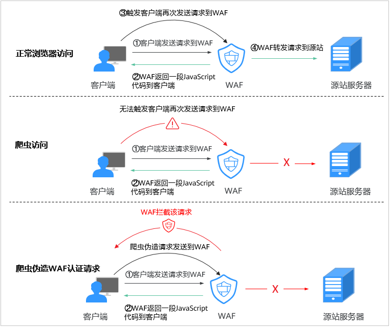
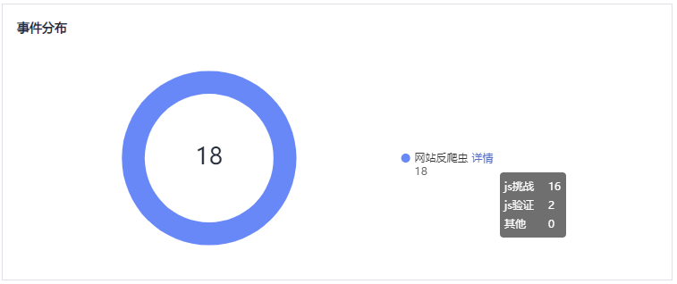
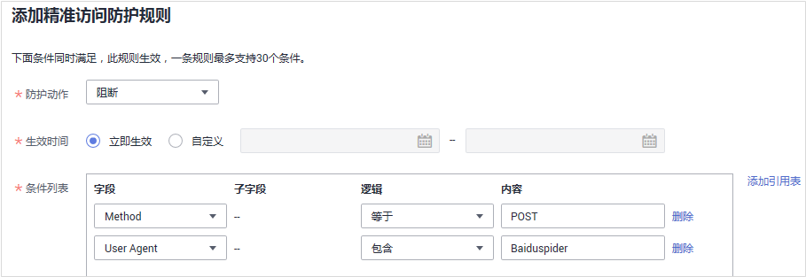

# 配置网站反爬虫防护规则防御爬虫攻击

您可以通过配置网站反爬虫防护规则，防护搜索引擎、扫描器、脚本工具、其它爬虫等爬虫，以及自定义JS脚本反爬虫防护规则。

> **说明：** 
>如果您已开通企业项目，您需要在“企业项目“下拉列表中选择您所在的企业项目并确保已开通操作权限，才能为该企业项目下域名配置防护策略。

## 前提条件

已添加防护网站或已[新增防护策略](步骤一-（可选）新增防护策略.md)。

-   云模式的接入方式参见[网站接入WAF（云模式）](网站接入WAF（云模式）.md)章节。
-   独享模式的接入方式参见[网站接入WAF（独享模式）](网站接入WAF（独享模式）.md)章节。
-   ELB模式的接入方式参见  [网站接入WAF（ELB模式）](网站接入WAF（ELB模式）.md)章节。

## 约束条件

-   JS脚本反爬虫依赖浏览器的Cookie机制、JavaScript解析能力，如果客户端浏览器不支持Cookie，此功能无法使用。
-   如果您的业务接入了CDN服务，请谨慎使用JS脚本反爬虫。

    由于CDN缓存机制的影响，JS脚本反爬虫特性将无法达到预期效果，并且有可能造成页面访问异常。

-   入门版和标准版不支持该功能。
-   防护网站部署模式为“ELB模式“时，不支持JS脚本反爬虫功能。
-   目前华北-北京一、华北-北京四、华东-上海一、华东-上海二、华南-广州、华南-深圳、西南-贵阳一、中国-香港、亚太-曼谷区域支持JS脚本反爬虫功能。
-   开启JS脚本反爬虫后，如果不能查看拦截记录，请参见[开启JS脚本反爬虫后，为什么有些请求被WAF拦截但查不到拦截记录？](https://support.huaweicloud.com/waf_faq/waf_01_0254.html)。
-   网站反爬虫“js挑战”和“js验证”的防护动作为仅记录，WAF不支持配置“js挑战”和“js验证”的防护动作。
-   WAF的JS脚本反爬虫功能只支持get请求，不支持post请求。

## JS脚本反爬虫检测机制

JS脚本检测流程如[图1](#fig0891191071116)所示，其中，①和②称为“js挑战”，③称为“js验证”。

**图 1**  JS脚本检测流程说明  

开启JS脚本反爬虫后，当客户端发送请求时，WAF会返回一段JavaScript代码到客户端。

-   如果客户端是正常浏览器访问，就可以触发这段JavaScript代码再发送一次请求到WAF，即WAF完成js验证，并将该请求转发给源站。
-   如果客户端是爬虫访问，就无法触发这段JavaScript代码再发送一次请求到WAF，即WAF无法完成js验证。
-   如果客户端爬虫伪造了WAF的认证请求，发送到WAF时，WAF将拦截该请求，js验证失败。

通过统计“js挑战”和“js验证”，就可以汇总出JS脚本反爬虫防御的请求次数。例如，[图2](#fig10806185634312)中JS脚本反爬虫共记录了18次事件，其中，“js挑战”（WAF返回JS代码）为16次，“js验证”（WAF完成JS验证）为2次，“其他”（即爬虫伪造WAF认证请求）为0次。

**图 2**  JS脚本反爬虫防护数据  

> **须知：** 
>“js挑战”和“js验证”的防护动作为仅记录，WAF不支持配置“js挑战”和“js验证”的防护动作。

## 操作步骤

1.  [登录管理控制台](https://console.huaweicloud.com/?locale=zh-cn)。
2.  单击管理控制台左上角的，选择区域或项目。
3.  单击页面左上方的，选择“安全与合规  \>  Web应用防火墙 WAF“。
4.  在左侧导航树中，选择“防护策略“，进入“防护策略“页面。
5.  单击目标策略名称，进入目标策略的防护配置页面。
6.  选择“网站反爬虫“配置框，用户可根据自己的需要开启或关闭网站反爬虫策略。
    -   ：开启状态。
    -   ：关闭状态。

7.  选择“特征反爬虫“页签，根据您的业务场景，开启合适的防护功能，如[图3](#fig127337271541)所示，检测项说明如[表1](#table173611272418)所示。

    特征反爬虫规则提供了两种防护动作：

    -   拦截

        发现攻击行为后立即阻断并记录。

        > **注意：** 
        >开启拦截后，可能会有以下影响 ：
        >-   拦截搜索引擎请求，可能影响网站的搜索引擎优化。
        >-   拦截脚本工具，可能会影响部分APP访问（部分APP的User-Agent未做修改，会匹配脚本工具类爬虫规则）。

    -   仅记录

        默认防护动作，发现攻击行为后只记录不阻断攻击。

    默认开启“扫描器“防护检测，用户可根据业务需要，配置防护动作并开启其他需要防护的检测类型。

    **图 3**  特征反爬虫防护  
    

    **表 1**  特征反爬虫检测项说明

    
    <table><thead align="left"><tr id="row13734927449"><th class="cellrowborder" valign="top" width="23.380000000000003%" id="mcps1.2.4.1.1">
检测项

    </th>
    <th class="cellrowborder" valign="top" width="35.709999999999994%" id="mcps1.2.4.1.2">
说明

    </th>
    <th class="cellrowborder" valign="top" width="40.910000000000004%" id="mcps1.2.4.1.3">
功能说明

    </th>
    </tr>
    </thead>
    <tbody><tr id="row473452713417"><td class="cellrowborder" valign="top" width="23.380000000000003%" headers="mcps1.2.4.1.1 ">
搜索引擎

    </td>
    <td class="cellrowborder" valign="top" width="35.709999999999994%" headers="mcps1.2.4.1.2 ">
搜索引擎执行页面内容爬取任务，如Googlebot、Baiduspider。

    </td>
    <td class="cellrowborder" valign="top" width="40.910000000000004%" headers="mcps1.2.4.1.3 ">
开启后，WAF将检测并阻断搜索引擎爬虫。

    
 说明： 

如果不开启“搜索引擎”，WAF针对谷歌和百度爬虫不会拦截，如果您希望拦截百度爬虫的POST请求，可参照<a href="#section1110674010446">配置示例-搜索引擎</a>进行配置。

    

    </td>
    </tr>
    <tr id="row77358273420"><td class="cellrowborder" valign="top" width="23.380000000000003%" headers="mcps1.2.4.1.1 ">
扫描器

    </td>
    <td class="cellrowborder" valign="top" width="35.709999999999994%" headers="mcps1.2.4.1.2 ">
执行漏洞扫描、病毒扫描等Web扫描任务，如OpenVAS、Nmap。

    </td>
    <td class="cellrowborder" valign="top" width="40.910000000000004%" headers="mcps1.2.4.1.3 ">
开启后，WAF将检测并阻断扫描器爬虫。

    </td>
    </tr>
    <tr id="row7735927945"><td class="cellrowborder" valign="top" width="23.380000000000003%" headers="mcps1.2.4.1.1 ">
脚本工具

    </td>
    <td class="cellrowborder" valign="top" width="35.709999999999994%" headers="mcps1.2.4.1.2 ">
用于执行自动化任务、程序脚本等，如httpclient、okhttp、python程序等。

    </td>
    <td class="cellrowborder" valign="top" width="40.910000000000004%" headers="mcps1.2.4.1.3 ">
开启后，WAF将检测并阻断执行自动化任务、程序脚本等。

    
 说明： 

如果您的应用程序中使用了httpclient、okhttp、python程序等脚本工具，建议您关闭“脚本工具”，否则，WAF会将使用了httpclient、okhttp、python程序等脚本工具当成恶意爬虫，拦截该应用程序。

    

    </td>
    </tr>
    <tr id="row197350271414"><td class="cellrowborder" valign="top" width="23.380000000000003%" headers="mcps1.2.4.1.1 ">
其他爬虫

    </td>
    <td class="cellrowborder" valign="top" width="35.709999999999994%" headers="mcps1.2.4.1.2 ">
各类用途的爬虫程序，如站点监控、访问代理、网页分析等。

    
 说明： 

“访问代理”是指当网站接入WAF后，为避免爬虫被WAF拦截，爬虫者使用大量IP代理实现爬虫的一种技术手段。

    

    </td>
    <td class="cellrowborder" valign="top" width="40.910000000000004%" headers="mcps1.2.4.1.3 ">
开启后，WAF将检测并阻断各类用途的爬虫程序。

    </td>
    </tr>
    </tbody>
    </table>

8.  选择“JS脚本反爬虫“页签，用户可根据业务需求更改JS脚本反爬虫的“状态“和“防护模式“。

    默认关闭JS脚本反爬虫，单击，在弹出的“警告“提示框中，单击“确定“，开启JS脚本反爬虫。

    > **须知：** 
    >-   JS脚本反爬虫依赖浏览器的Cookie机制、JavaScript解析能力，如果客户端浏览器不支持Cookie，此功能无法使用。
    >-   如果您的业务接入了CDN服务，请谨慎使用JS脚本反爬虫。
    >    由于CDN缓存机制的影响，JS脚本反爬虫特性将无法达到预期效果，并且有可能造成页面访问异常。

9.  根据业务配置JS脚本反爬虫规则，相关参数说明如[表2](#table158689225415)所示。

    JS脚本反爬虫规则提供了“防护所有请求“和“防护指定请求“两种防护动作。

    -   除了指定请求规则以外，防护其他所有请求

        “防护模式“选择“防护所有请求“，单击“添加排除请求规则“，配置排除请求规则后，单击“确认“。

        **图 4**  添加排除防护路径  
        

    -   只防护指定请求时

        “防护模式“选择“防护指定请求“，单击“添加请求规则“，配置请求规则后，单击“确认“。

        **图 5**  添加请求规则  
        

    **表 2**  JS脚本反爬虫参数说明

    
    <table><thead align="left"><tr id="row886918226415"><th class="cellrowborder" valign="top" width="26.242624262426244%" id="mcps1.2.4.1.1">
参数

    </th>
    <th class="cellrowborder" valign="top" width="44.72447244724472%" id="mcps1.2.4.1.2">
参数说明

    </th>
    <th class="cellrowborder" valign="top" width="29.03290329032903%" id="mcps1.2.4.1.3">
示例

    </th>
    </tr>
    </thead>
    <tbody><tr id="row1987072264111"><td class="cellrowborder" valign="top" width="26.242624262426244%" headers="mcps1.2.4.1.1 ">
规则名称

    </td>
    <td class="cellrowborder" valign="top" width="44.72447244724472%" headers="mcps1.2.4.1.2 ">
自定义规则名称。

    </td>
    <td class="cellrowborder" valign="top" width="29.03290329032903%" headers="mcps1.2.4.1.3 ">
waf

    </td>
    </tr>
    <tr id="row887013227413"><td class="cellrowborder" valign="top" width="26.242624262426244%" headers="mcps1.2.4.1.1 ">
规则描述

    </td>
    <td class="cellrowborder" valign="top" width="44.72447244724472%" headers="mcps1.2.4.1.2 ">
可选参数，设置该规则的备注信息。

    </td>
    <td class="cellrowborder" valign="top" width="29.03290329032903%" headers="mcps1.2.4.1.3 ">
-

    </td>
    </tr>
    <tr id="row187042211416"><td class="cellrowborder" valign="top" width="26.242624262426244%" headers="mcps1.2.4.1.1 ">
生效时间

    </td>
    <td class="cellrowborder" valign="top" width="44.72447244724472%" headers="mcps1.2.4.1.2 ">
立即生效。

    </td>
    <td class="cellrowborder" valign="top" width="29.03290329032903%" headers="mcps1.2.4.1.3 ">
立即生效

    </td>
    </tr>
    <tr id="row14871202234111"><td class="cellrowborder" valign="top" width="26.242624262426244%" headers="mcps1.2.4.1.1 ">
条件列表

    </td>
    <td class="cellrowborder" valign="top" width="44.72447244724472%" headers="mcps1.2.4.1.2 ">
条件设置参数说明如下：

    <ul id="ul152241959762"><li>字段：在下拉列表中选择需要防护的字段，当前仅支持“路径”、“User Agent”。</li><li>子字段</li><li>逻辑：在“逻辑”下拉列表中选择需要的逻辑关系。
 说明： 

选择“包含任意一个”、“不包含所有”、“等于任意一个”、“不等于所有”、“前缀为任意一个”、“前缀不为所有”、“后缀为任意一个”或者“后缀不为所有”时，“内容”需要选择引用表名称，创建引用表的详细操作请参见<a href="https://support.huaweicloud.com/usermanual-waf/waf_01_0081.html" target="_blank" rel="noopener noreferrer">创建引用表</a>。

    

    </li><li>内容：输入或者选择条件匹配的内容。</li></ul>
    </td>
    <td class="cellrowborder" valign="top" width="29.03290329032903%" headers="mcps1.2.4.1.3 ">
“路径”包含“/admin/”

    </td>
    </tr>
    <tr id="row118711822164111"><td class="cellrowborder" valign="top" width="26.242624262426244%" headers="mcps1.2.4.1.1 ">
优先级

    </td>
    <td class="cellrowborder" valign="top" width="44.72447244724472%" headers="mcps1.2.4.1.2 ">
设置该条件规则检测的顺序值。如果您设置了多条规则，则多条规则间有先后匹配顺序，即访问请求将根据您设定的优先级依次进行匹配，优先级较小的规则优先匹配。

    </td>
    <td class="cellrowborder" valign="top" width="29.03290329032903%" headers="mcps1.2.4.1.3 ">
5

    </td>
    </tr>
    </tbody>
    </table>

## 相关操作

-   规则添加成功后，默认的“规则状态“为“已开启“，若您暂时不想使该规则生效，可在目标规则所在行的“操作“列，单击“关闭“。
-   若需要修改添加的JS脚本反爬虫规则，可单击待修改的路径规则所在行的“修改“，修改该规则。
-   若需要删除添加的JS脚本反爬虫规则时，可单击待删除的路径规则所在行的“删除“，删除该规则。

## 配置示例-仅记录脚本工具爬虫

假如防护域名“www.example.com“已接入WAF，您可以参照以下操作步骤验证反爬虫防护效果。

1.  执行JS脚本工具，爬取网页内容。
2.  在“特征反爬虫“页签，开启“脚本工具“，“防护动作“设置为“仅记录“（WAF检测为攻击行为后，只记录不阻断）。

    **图 6**  开启“脚本工具“  
    

3.  开启网站反爬虫。

    **图 7**  网站反爬虫配置框  
    

4.  在左侧导航树中，单击“防护事件“，进入“防护事件“页面，您可以查看该防护事件。

    **图 8**  查看防护事件-脚本爬虫  
    

## 配置示例-搜索引擎

放行百度或者谷歌的搜索引擎，同时拦截百度的POST请求。

1.  参照[6](#li862654012419)将“搜索引擎“设置为放行，即将“搜索引擎“的“状态“设置为。
2.  参照[配置精准访问防护规则定制化防护策略](配置精准访问防护规则定制化防护策略.md)配置如[图9](#fig1439052051516)的规则。

    **图 9**  拦截POST请求  
    

