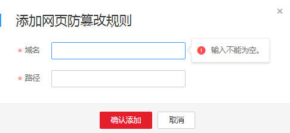

# 配置网页防篡改规则

该任务指导用户通过Web应用防火墙服务配置网页防篡改规则。

当用户需要防护静态页面被篡改时，可配置网页防篡改规则。

网页防篡改具有以下优势：

-   加速请求的响应

    当配置网页防篡改规则后，Web应用防火墙缓存服务端的静态网页，当Web应用防火墙接收到Web访问者的请求时，直接将缓存的网页返回给Web访问者。

-   网页防篡改

    当攻击者将服务端的静态网页篡改后，Web应用防火墙将缓存的未被篡改的网页返回给Web访问者，保证Web访问者访问的是正确的页面。

    Web应用防火墙具有随机抽取Web访问者的一个请求，将请求的页面与服务端页面进行对比的功能，若发现页面被篡改，将以短信或者Email的形式通知用户。

## 前提条件

-   已获取管理控制台的帐号和密码。
-   已添加防护域名。

## 操作步骤

1.  登录管理控制台（https://console.huaweicloud.com/）。
2.  单击页面上方的“服务列表“，选择“安全  \>  Web应用防火墙“，在左侧导航树中选择“域名配置“，进入“域名配置“页面。
3.  在目标域名所在行的“防护策略“栏中，单击策略名称，进入防护配置页面，如[图1](#waf_01_0008_fig164792010154510)所示。

    **图 1**  防护策略  
    

4.  在“网页防篡改“配置框中，单击“自定义网页防篡改“，进入网页防篡改规则的配置页面，如[图2](#fig795612134311)所示。

    单击，开启防护检测。

    **图 2**  网页防篡改配置框  
    

5.  在页面左上角，单击“添加规则“，添加网页防篡改规则，如[图3](#fig13729129125420)所示。

    **图 3**  添加网页防篡改规则  
    

    **表 1**  参数说明

    
    <table><thead align="left"><tr id="row546914299207"><th class="cellrowborder" valign="top" width="23%" id="mcps1.2.4.1.1">
参数

    </th>
    <th class="cellrowborder" valign="top" width="37%" id="mcps1.2.4.1.2">
参数说明

    </th>
    <th class="cellrowborder" valign="top" width="40%" id="mcps1.2.4.1.3">
取值样例

    </th>
    </tr>
    </thead>
    <tbody><tr id="row13866404146"><td class="cellrowborder" valign="top" width="23%" headers="mcps1.2.4.1.1 ">
域名

    </td>
    <td class="cellrowborder" valign="top" width="37%" headers="mcps1.2.4.1.2 ">
设置防篡改的域名。

    </td>
    <td class="cellrowborder" valign="top" width="40%" headers="mcps1.2.4.1.3 ">
www.domin.com

    </td>
    </tr>
    <tr id="row1247062911209"><td class="cellrowborder" valign="top" width="23%" headers="mcps1.2.4.1.1 ">
路径

    </td>
    <td class="cellrowborder" valign="top" width="37%" headers="mcps1.2.4.1.2 ">
设置防篡改的URL链接。

    </td>
    <td class="cellrowborder" valign="top" width="40%" headers="mcps1.2.4.1.3 ">
/admin

    </td>
    </tr>
    </tbody>
    </table>

6.  单击“确认添加“，在页面右上角弹出“添加成功“，则表示添加网页防篡改规则成功。

    > **说明：**   
    >-   若防篡改的网页内容有修改，需要WAF重新缓存网页内容，可单击待更新的网页防篡改规则所在行的“更新缓存“。  
    >-   若需要删除添加的网页防篡改规则时，可单击待删除的网页防篡改规则所在行的“删除“，删除网页防篡改规则。  

