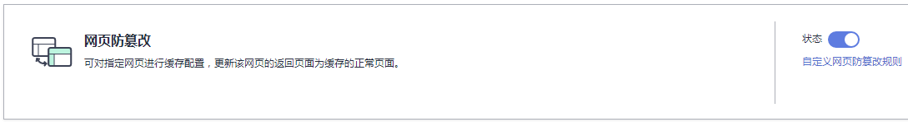
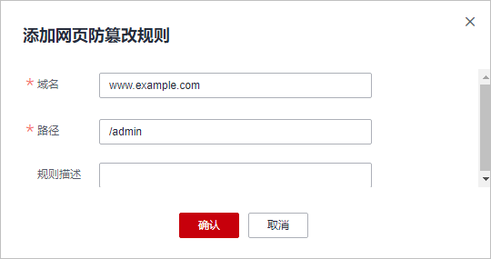

# 配置网页防篡改规则

WAF支持对网站的静态网页进行缓存配置。配置网页防篡改规则后，可以实现以下功能：

-   当WAF接收到正常的访问请求时，直接将缓存的网页返回给Web访问者，加速请求响应。
-   如果攻击者篡改了网站的静态网页，WAF将缓存的未被篡改的网页返回给Web访问者，保证Web访问者访问的是正确的页面。
-   WAF将对页面路径下的所有子文件进行防护。例如，对“www.example.com/admin“静态页面配置了网页防篡改规则，则WAF将防护“/admin“路径下所有子文件。

> **说明：** 
>如果您已开通企业项目，您需要在“企业项目“下拉列表中选择您所在的企业项目并确保已开通操作权限，才能为该企业项目下域名配置防护策略。

## 前提条件

已添加防护网站。

## 约束条件

添加或修改防护规则后，规则生效需要几分钟。规则生效后，您可以在“防护事件“页面查看防护效果。

## 规格限制

云模式的检测版和ELB模式不支持该功能。

## 应用场景

-   加速请求的响应

    当配置网页防篡改规则后，Web应用防火墙缓存服务端的静态网页，当Web应用防火墙接收到Web访问者的请求时，直接将缓存的网页返回给Web访问者。

-   网页防篡改

    当攻击者将服务端的静态网页篡改后，Web应用防火墙将缓存的未被篡改的网页返回给Web访问者，保证Web访问者访问的是正确的页面。

    Web应用防火墙具有随机抽取Web访问者的一个请求，将请求的页面与服务端页面进行对比的功能，若发现页面被篡改，您将接收到告警通知（通知方式由您设置），告警通知的设置请参考[开启告警通知](开启告警通知.md)。

## 操作步骤

1.  [登录管理控制台](https://console.huaweicloud.com/?locale=zh-cn)。
2.  进入防护策略配置入口，如[图1](#waf_01_0008_fig089771664710)所示。

    **图 1**  防护策略配置入口  
    

3.  在“网页防篡改“配置框中，用户可根据自己的需要更改“状态“，单击“自定义网页防篡改“，进入网页防篡改规则的配置页面，如[图2](#fig795612134311)所示。

    **图 2**  网页防篡改配置框  
    

4.  在“网页防篡改“规则的配置页面左上角，单击“添加规则“。
5.  在弹出的对话框中，添加网页防篡改规则，如[图3](#fig13729129125420)所示，参数说明如[表1](#table2046816299203)所示。

    **图 3**  添加网页防篡改规则  
    

    **表 1**  参数说明

    
    <table><thead align="left"><tr id="row546914299207"><th class="cellrowborder" valign="top" width="23.03%" id="mcps1.2.4.1.1">
参数

    </th>
    <th class="cellrowborder" valign="top" width="37.12%" id="mcps1.2.4.1.2">
参数说明

    </th>
    <th class="cellrowborder" valign="top" width="39.85%" id="mcps1.2.4.1.3">
取值样例

    </th>
    </tr>
    </thead>
    <tbody><tr id="row13866404146"><td class="cellrowborder" valign="top" width="23.03%" headers="mcps1.2.4.1.1 ">
域名

    </td>
    <td class="cellrowborder" valign="top" width="37.12%" headers="mcps1.2.4.1.2 ">
设置防篡改的域名。

    </td>
    <td class="cellrowborder" valign="top" width="39.85%" headers="mcps1.2.4.1.3 ">
www.example.com

    </td>
    </tr>
    <tr id="row1247062911209"><td class="cellrowborder" valign="top" width="23.03%" headers="mcps1.2.4.1.1 ">
路径

    </td>
    <td class="cellrowborder" valign="top" width="37.12%" headers="mcps1.2.4.1.2 ">
设置防篡改的URL链接中的路径（不包含域名）。

    
URL用来定义网页的地址。基本的URL格式如下：

    
协议名://域名或IP地址[:端口号]/[路径名/…/文件名]。

    
例如，URL为“http://www.example.com/admin”，则“路径”设置为“/admin”。

    
 说明： 
<ul id="ul20707155819344"><li>该路径不支持正则。</li><li>路径里不能含有连续的多条斜线的配置，如“///admin”，WAF引擎会将“///”转为“/”。</li></ul>
    

    </td>
    <td class="cellrowborder" valign="top" width="39.85%" headers="mcps1.2.4.1.3 ">
/admin

    </td>
    </tr>
    <tr id="row54371936124517"><td class="cellrowborder" valign="top" width="23.03%" headers="mcps1.2.4.1.1 ">
规则描述

    </td>
    <td class="cellrowborder" valign="top" width="37.12%" headers="mcps1.2.4.1.2 ">
可选参数，设置该规则的备注信息。

    </td>
    <td class="cellrowborder" valign="top" width="39.85%" headers="mcps1.2.4.1.3 ">
--

    </td>
    </tr>
    </tbody>
    </table>

6.  单击“确认添加“，添加的网页防篡改规则展示在网页防篡改规则列表中。

    **图 4**  网页防篡改规则列表  
    

## 防护效果

假如已添加域名且配置了网页防篡改防护规则，当网页被篡改时，您可以在左侧导航树中，单击“防护事件“，进入“防护事件“页面，查看网页防篡改防护事件。

## 相关操作

-   规则添加成功后，默认的“规则状态“为“已开启“，若您暂时不想使该规则生效，可在目标规则所在行的“操作“列，单击“关闭“。
-   若被防护页面进行了内容修改，必须单击待更新的网页防篡改规则所在行的“更新缓存“来更新缓存，如果您在页面更新后未更新缓存，WAF将始终返回最近一次缓存的页面内容。
-   若需要删除添加的网页防篡改规则时，可单击待删除的网页防篡改规则所在行的“删除“，删除网页防篡改规则。

