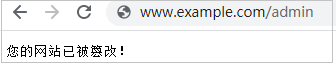

# 配置网页防篡改规则避免静态网页被篡改

网站接入WAF后，您可以通过设置网页防篡改规则，锁定需要保护的网站页面（例如敏感页面）。当被锁定的页面在收到请求时，返回已设置的缓存页面，预防源站页面内容被恶意篡改。

> **说明：** 
>如果您已开通企业项目，您需要在“企业项目“下拉列表中选择您所在的企业项目并确保已开通操作权限，才能为该企业项目下域名配置防护策略。

## 工作原理

-   当WAF接收到正常的访问请求时，直接将缓存的网页返回给Web访问者，加速请求响应。
-   如果攻击者篡改了网站的静态网页，WAF将缓存的未被篡改的网页返回给Web访问者，保证Web访问者访问的是正确的页面。
-   WAF将对页面路径下的所有相关资源进行防护。例如，对“www.example.com/index.html“静态页面配置了网页防篡改规则，则WAF将防护“/index.html“的网页以及这个网页关联的相关资源。

    即若请求中Referer请求头的值中的URL路径与您配置的防篡改路径一致，如“/index.html“  ，则该请求命中的资源（结尾为png、jpg、 jpeg、gif、bmp、css、js的所有资源）也会同时被缓存下来。

-   同时，WAF支持缓存自定义的Header字段。在网页防篡改页面上方，单击“修改字段“可配置需要通过WAF缓存的Header字段。

## 前提条件

已添加防护网站或已[新增防护策略](步骤一-（可选）新增防护策略.md)。

-   云模式的接入方式参见[网站接入WAF（云模式）](网站接入WAF（云模式）.md)章节。
-   独享模式的接入方式参见[网站接入WAF（独享模式）](网站接入WAF（独享模式）.md)章节。
-   ELB模式的接入方式参见  [网站接入WAF（ELB模式）](网站接入WAF（ELB模式）.md)章节。

## 约束条件

-   云模式的入门版和ELB模式不支持该防护规则。
-   添加或修改防护规则后，规则生效需要几分钟。规则生效后，您可以在“防护事件“页面查看防护效果。
-   请确保源站响应中包括Content-Type响应头，否则可能导致WAF无法缓存源站响应。
-   仅以下区域支持配置WAF缓存自定义的Header字段：
    -   华北-北京一
    -   华北-北京二
    -   华北-北京四
    -   华东-上海一
    -   华东-上海二
    -   华南-广州
    -   华南-深圳
    -   西南-贵阳一
    -   中国-香港
    -   亚太-曼谷
    -   亚太-新加坡

## 应用场景

-   加速请求的响应

    配置网页防篡改规则后，Web应用防火墙将对服务端的静态网页进行缓存。当Web应用防火墙接收到Web访问者的请求时，直接将缓存的网页返回给Web访问者。

-   网页防篡改

    攻击者将服务端的静态网页篡改后，Web应用防火墙将缓存的未被篡改的网页返回给Web访问者，以保证Web访问者访问的是正确的页面。

    Web应用防火墙具有如下功能：随机抽取Web访问者的一个请求，将请求的页面与服务端页面进行对比，若发现页面被篡改，您将接收到告警通知（通知方式由您设置），告警通知的设置请参考[开启告警通知](开启告警通知.md)。

## 操作步骤

1.  [登录管理控制台](https://console.huaweicloud.com/?locale=zh-cn)。
2.  单击管理控制台左上角的，选择区域或项目。
3.  单击页面左上方的，选择“安全与合规  \>  Web应用防火墙 WAF“。
4.  在左侧导航树中，选择“防护策略“，进入“防护策略“页面。
5.  单击目标策略名称，进入目标策略的防护配置页面。
6.  选择“网页防篡改“配置框，用户可根据自己的需要开启或关闭网页防篡改策略。
    -   ：开启状态。
    -   ：关闭状态。

7.  在“网页防篡改“规则配置列表的左上方，单击“添加规则“。
8.  在弹出的对话框中，添加网页防篡改规则，参数说明如[表1](#table2046816299203)所示。

    **图 1**  添加网页防篡改规则  
    

    **表 1**  参数说明

    
    <table><thead align="left"><tr id="row546914299207"><th class="cellrowborder" valign="top" width="23.03%" id="mcps1.2.4.1.1">
参数

    </th>
    <th class="cellrowborder" valign="top" width="37.12%" id="mcps1.2.4.1.2">
参数说明

    </th>
    <th class="cellrowborder" valign="top" width="39.85%" id="mcps1.2.4.1.3">
取值样例

    </th>
    </tr>
    </thead>
    <tbody><tr id="row13866404146"><td class="cellrowborder" valign="top" width="23.03%" headers="mcps1.2.4.1.1 ">
域名

    </td>
    <td class="cellrowborder" valign="top" width="37.12%" headers="mcps1.2.4.1.2 ">
设置防篡改的域名。

    </td>
    <td class="cellrowborder" valign="top" width="39.85%" headers="mcps1.2.4.1.3 ">
www.example.com

    </td>
    </tr>
    <tr id="row1247062911209"><td class="cellrowborder" valign="top" width="23.03%" headers="mcps1.2.4.1.1 ">
路径

    </td>
    <td class="cellrowborder" valign="top" width="37.12%" headers="mcps1.2.4.1.2 ">
设置防篡改的URL链接中的路径（不包含域名）。

    
URL用来定义网页的地址。基本的URL格式如下：

    
协议名://域名或IP地址[:端口号]/[路径名/…/文件名]。

    
例如，URL为“http://www.example.com/admin”，则“路径”设置为“/admin”。

    
 说明： 
<ul id="ul20707155819344"><li>该路径不支持正则。</li><li>路径里不能含有连续的多条斜线的配置，如“///admin”，WAF引擎会将“///”转为“/”。</li></ul>
    

    </td>
    <td class="cellrowborder" valign="top" width="39.85%" headers="mcps1.2.4.1.3 ">
/admin

    </td>
    </tr>
    <tr id="row54371936124517"><td class="cellrowborder" valign="top" width="23.03%" headers="mcps1.2.4.1.1 ">
规则描述

    </td>
    <td class="cellrowborder" valign="top" width="37.12%" headers="mcps1.2.4.1.2 ">
可选参数，设置该规则的备注信息。

    </td>
    <td class="cellrowborder" valign="top" width="39.85%" headers="mcps1.2.4.1.3 ">
--

    </td>
    </tr>
    </tbody>
    </table>

9.  单击“确认“，添加的网页防篡改规则展示在网页防篡改规则列表中。

## 相关操作

-   规则添加成功后，默认的“规则状态“为“已开启“，若您暂时不想使该规则生效，可在目标规则所在行的“操作“列，单击“关闭“。
-   若被防护页面进行了内容修改，必须单击待更新的网页防篡改规则所在行的“更新缓存“来更新缓存，如果您在页面更新后未更新缓存，WAF将始终返回最近一次缓存的页面内容。
-   若需要删除添加的网页防篡改规则时，可单击待删除的网页防篡改规则所在行的“删除“，删除网页防篡改规则。

## 配置示例-静态页面防篡改

假如防护域名“www.example.com“已接入WAF，“/admin“静态页面已被篡改，您可以参照以下操作步骤验证防护效果。

1.  在浏览器中访问“http://www.example.com/admin“静态页面。

    此时，显示的是被篡改的页面。

    **图 2**  静态页面被篡改示例  
    

2.  添加一条网页防篡改规则。

    **图 3**  添加网页防篡改规则  
    

3.  开启网页防篡改。

    **图 4**  网页防篡改配置框  
    

4.  在浏览器中访问“http://www.example.com/admin“， 等待WAF缓存静态页面。
5.  在浏览器中访问篡改后的页面。

    此时，显示的是被篡改前的页面。

