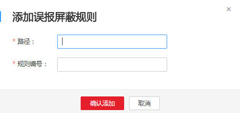

# 配置误报屏蔽规则

该任务指导用户通过Web应用防火墙服务配置误报屏蔽规则。

对于误报情况可以添加白名单对误报进行清除，对某些规则ID进行忽略设置（例如，某URL不进行XSS的检查，可设置屏蔽规则，屏蔽XSS检查）。

## 前提条件

-   已获取管理控制台的帐号和密码。
-   已添加防护域名。

## 操作步骤

1.  登录管理控制台（https://console.huaweicloud.com/）。
2.  单击页面上方的“服务列表“，选择“安全  \>  Web应用防火墙“，在左侧导航树中选择“域名配置“，进入“域名配置“页面。
3.  在目标域名所在行的“防护策略“栏中，单击策略名称，进入防护配置页面，如[图1](#waf_01_0008_fig164792010154510)所示。

    **图 1**  防护策略  
    

4.  在“误报屏蔽“配置框中，单击“自定义误报屏蔽规则“，进入“误报屏蔽“规则配置页面，如[图2](#fig44151977327)所示。

    单击，开启防护检测。

    **图 2**  误报屏蔽配置框  
    

5.  在页面左上角，单击“添加规则“，添加误报屏蔽规则，如[图3](#fig14415389105236)所示。参数说明如[表1](#table4696626918715)所示。

    **图 3**  添加误报屏蔽规则  
    

    **表 1**  添加误报屏蔽规则参数说明

    
    <table><thead align="left"><tr id="row151760118715"><th class="cellrowborder" valign="top" width="23.84%" id="mcps1.2.4.1.1">
参数

    </th>
    <th class="cellrowborder" valign="top" width="44.21%" id="mcps1.2.4.1.2">
参数说明

    </th>
    <th class="cellrowborder" valign="top" width="31.95%" id="mcps1.2.4.1.3">
取值样例

    </th>
    </tr>
    </thead>
    <tbody><tr id="row125751318715"><td class="cellrowborder" valign="top" width="23.84%" headers="mcps1.2.4.1.1 ">
路径

    </td>
    <td class="cellrowborder" valign="top" width="44.21%" headers="mcps1.2.4.1.2 ">
误报路径，完整的URL链接，不包含域名。

    </td>
    <td class="cellrowborder" valign="top" width="31.95%" headers="mcps1.2.4.1.3 ">
/admin/xxx

    </td>
    </tr>
    <tr id="row3251580618715"><td class="cellrowborder" valign="top" width="23.84%" headers="mcps1.2.4.1.1 ">
规则编号

    </td>
    <td class="cellrowborder" valign="top" width="44.21%" headers="mcps1.2.4.1.2 ">
“安全总览 &gt; 事件详情”列表中事件类型为非“自定义规则”的误报攻击事件所对应的规则编号。

    
可单击该攻击事件所在行的“误报处理”获取规则编号。

    
由6位数字组成，不能为空。

    </td>
    <td class="cellrowborder" valign="top" width="31.95%" headers="mcps1.2.4.1.3 ">
010001

    </td>
    </tr>
    </tbody>
    </table>

6.  单击“确认添加“，在页面右上角弹出“添加成功“，则表示添加误报屏蔽规则成功。

    > **说明：**   
    >若需要删除添加的误报屏蔽规则时，可单击待删除的误报屏蔽规则所在行的“删除“，删除误报屏蔽规则。  

