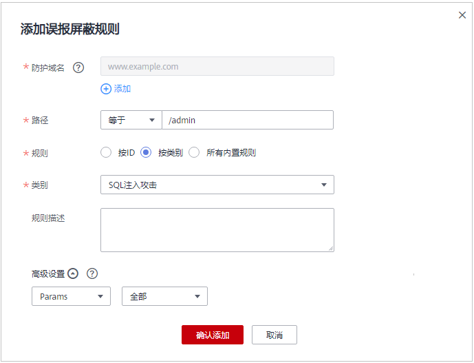

# 配置误报屏蔽规则

对于误报情况，可以添加白名单对误报进行忽略，对某些规则ID或者事件类别进行忽略设置（例如，某URL不进行XSS的检查，可设置屏蔽规则，屏蔽XSS检查）。

## 操作须知

-   仅对WAF预置的Web基础防护规则拦截或记录的攻击事件可以配置误报屏蔽规则。
-   您可以通过[处理误报事件](处理误报事件.md)来配置误报屏蔽规则，处理误报事件后，您可以在误报屏蔽规则列表中查看该误报事件对应的误报屏蔽规则。

## 前提条件

已添加防护网站。

## 操作步骤

1.  [登录管理控制台](https://console.huaweicloud.com/?locale=zh-cn)。
2.  进入防护策略配置入口，如[图1](#zh-cn_topic_0110861309_fig089771664710)所示。

    **图 1**  防护策略配置入口  
    

3.  在“误报屏蔽“配置框中，用户可根据自己的需要更改“状态“，单击“自定义误报屏蔽规则“，进入“误报屏蔽“规则配置页面，如[图2](#fig44151977327)所示。

    **图 2**  误报屏蔽配置框  
    

4.  在“误报屏蔽“规则配置页面左上角，单击“添加规则“。
5.  添加误报屏蔽规则，如[图3](#fig14415389105236)所示，参数说明如[表1](#table15761232696)所示。

    **图 3**  添加误报屏蔽规则  
    

    **表 1**  添加误报屏蔽规则参数说明

    
    <table><thead align="left"><tr id="row77714324910"><th class="cellrowborder" valign="top" width="24.09240924092409%" id="mcps1.2.4.1.1">
参数

    </th>
    <th class="cellrowborder" valign="top" width="47.22472247224723%" id="mcps1.2.4.1.2">
参数说明

    </th>
    <th class="cellrowborder" valign="top" width="28.682868286828683%" id="mcps1.2.4.1.3">
取值样例

    </th>
    </tr>
    </thead>
    <tbody><tr id="row97713325920"><td class="cellrowborder" valign="top" width="24.09240924092409%" headers="mcps1.2.4.1.1 ">
防护域名

    </td>
    <td class="cellrowborder" valign="top" width="47.22472247224723%" headers="mcps1.2.4.1.2 ">
策略下绑定的域名。

    
如果您需要防护的是泛域名对应的单域名，需要手动输入完整的域名。

    </td>
    <td class="cellrowborder" valign="top" width="28.682868286828683%" headers="mcps1.2.4.1.3 ">
www.example.com

    </td>
    </tr>
    <tr id="row877432191"><td class="cellrowborder" valign="top" width="24.09240924092409%" headers="mcps1.2.4.1.1 ">
路径

    </td>
    <td class="cellrowborder" valign="top" width="47.22472247224723%" headers="mcps1.2.4.1.2 ">
误报路径，完整的URL链接，不包含域名。<ul id="ul1187017515530"><li>前缀匹配：选择“前缀为”，代表以输入的路径为前缀。例如，需要防护的路径为“/admin/test.php”或 “/adminabc”，则路径可以填写为“/admin”。</li><li>精准匹配：选择“等于”，需要防护的路径需要与此处填写的路径完全相等。例如，需要防护的路径为“/admin/test.php”，该规则必须填写为“/admin/test.php”。</li></ul>
    

    
 说明： 
<ul id="ul982719519561"><li>该路径不支持正则，仅支持前缀匹配和精准匹配的逻辑。</li><li>路径里不能含有连续的多条斜线的配置，如“///admin”，访问时，引擎会将“///”转为“/”。</li></ul>
    

    </td>
    <td class="cellrowborder" valign="top" width="28.682868286828683%" headers="mcps1.2.4.1.3 ">
等于

    
/admin

    </td>
    </tr>
    <tr id="row107717321692"><td class="cellrowborder" valign="top" width="24.09240924092409%" headers="mcps1.2.4.1.1 ">
规则

    </td>
    <td class="cellrowborder" valign="top" width="47.22472247224723%" headers="mcps1.2.4.1.2 ">
您可以选择以下三种方式进行配置：

    <ul id="ul52161845421"><li>按ID：按攻击事件的ID进行配置。</li><li>按类别：按攻击事件类别进行配置。</li><li>所有内置规则：<a href="zh-cn_topic_0110861309.md">Web基础防护规则</a>里开启的所有防护规则。</li></ul>
    </td>
    <td class="cellrowborder" valign="top" width="28.682868286828683%" headers="mcps1.2.4.1.3 ">
按类别

    </td>
    </tr>
    <tr id="row978193214915"><td class="cellrowborder" valign="top" width="24.09240924092409%" headers="mcps1.2.4.1.1 ">
ID

    </td>
    <td class="cellrowborder" valign="top" width="47.22472247224723%" headers="mcps1.2.4.1.2 ">
当“规则”选择“按ID”时，需要配置此参数。

    
“防护事件”列表中事件类型为非自定义规则的攻击事件所对应的规则编号。单击该攻击事件所在行的“误报处理”获取ID编号。建议您直接参照<a href="处理误报事件.md">处理误报事件</a>在防护事件页面配置误报屏蔽。

    </td>
    <td class="cellrowborder" valign="top" width="28.682868286828683%" headers="mcps1.2.4.1.3 ">
041046

    </td>
    </tr>
    <tr id="row1378032696"><td class="cellrowborder" valign="top" width="24.09240924092409%" headers="mcps1.2.4.1.1 ">
类别

    </td>
    <td class="cellrowborder" valign="top" width="47.22472247224723%" headers="mcps1.2.4.1.2 ">
当“规则”选择“按类别”时，需要配置此参数。

    
在下拉框中选择事件类别。

    
WAF支持的防护事件类别有：XSS攻击、网站木马、其他类型攻击、SQL注入攻击、恶意爬虫、远程文件包含、本地文件包含、命令注入攻击。

    </td>
    <td class="cellrowborder" valign="top" width="28.682868286828683%" headers="mcps1.2.4.1.3 ">
SQL注入攻击

    </td>
    </tr>
    <tr id="row5786321496"><td class="cellrowborder" valign="top" width="24.09240924092409%" headers="mcps1.2.4.1.1 ">
规则描述

    </td>
    <td class="cellrowborder" valign="top" width="47.22472247224723%" headers="mcps1.2.4.1.2 ">
可选参数，设置该规则的备注信息。

    </td>
    <td class="cellrowborder" valign="top" width="28.682868286828683%" headers="mcps1.2.4.1.3 ">
不拦截SQL注入攻击

    </td>
    </tr>
    <tr id="row1978532299"><td class="cellrowborder" valign="top" width="24.09240924092409%" headers="mcps1.2.4.1.1 ">
高级设置

    </td>
    <td class="cellrowborder" valign="top" width="47.22472247224723%" headers="mcps1.2.4.1.2 ">
如果您只想忽略来源于某攻击事件下指定字段的攻击，可在“高级设置”里选择指定字段进行配置，配置完成后，WAF将不再拦截指定字段的攻击事件。

    
在左边第一个下拉列表中选择目标字段。支持的字段有：Params、Cookie、Header、Body、Multipart。<ul id="ul12516155092514"><li>当选择“Params”、“Cookie”或者“Header”字段时，可以配置“全部”或根据需求配置子字段。</li><li>当选择“Body”或“Multipart”字段时，可以配置“全部”。</li><li>当选择“Cookie”字段时，“防护域名”和“路径”可以为空。</li></ul>
    
 说明： 

当字段配置为“全部”时，配置完成后，WAF将不再拦截该字段的所有攻击事件。

    

    

    </td>
    <td class="cellrowborder" valign="top" width="28.682868286828683%" headers="mcps1.2.4.1.3 ">
Params

    
全部

    </td>
    </tr>
    </tbody>
    </table>

6.  单击“确认添加“，添加的误报屏蔽规则展示在误报屏蔽规则列表中。

    **图 4**  误报屏蔽规则列表  
    

    -   规则添加成功后，默认的“规则状态“为“已开启“，若您暂时不想使该规则生效，可在目标规则所在行的“操作“列，单击“关闭“。
    -   若需要删除添加的误报屏蔽规则时，可单击待删除的误报屏蔽规则所在行的“删除“，删除误报屏蔽规则。

