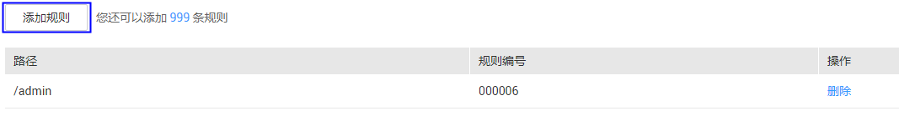

# 配置误报屏蔽规则

该任务指导用户通过Web应用防火墙服务配置误报屏蔽规则。

对于误报情况，可以添加白名单对误报进行忽略，对某些规则ID进行忽略设置（例如，某URL不进行XSS的检查，可设置屏蔽规则，屏蔽XSS检查）。

## 前提条件

-   已获取管理控制台的帐号和密码。
-   已添加防护域名。

## 操作步骤

1.  登录管理控制台（https://console.huaweicloud.com/）。
2.  单击管理控制台左上角的，选择区域或项目。
3.  单击页面上方的“服务列表“，选择“安全  \>  Web应用防火墙“，在左侧导航树中选择“域名配置“，进入“域名配置“页面，如[图1](#waf_01_0008_fig164792010154510)所示。

    **图 1**  域名配置页面  
    

4.  在目标域名所在行的“防护策略“栏中，单击“配置防护策略“，进入“防护配置“页面。
5.  在“误报屏蔽“配置框中，设置“状态“为开启状态，单击“自定义误报屏蔽规则“，进入“误报屏蔽“规则配置页面，如[图2](#fig44151977327)所示。

    **图 2**  误报屏蔽配置框  
    

6.  在“误报屏蔽“规则配置页面左上角，单击“添加规则“，如[图3](#fig678219231364)所示。

    **图 3**  添加规则  
    

7.  添加误报屏蔽规则，如[图4](#fig14415389105236)所示，参数说明如[表1](#table4696626918715)所示。

    **图 4**  添加误报屏蔽规则  
    

    **表 1**  添加误报屏蔽规则参数说明

    
    <table><thead align="left"><tr id="row151760118715"><th class="cellrowborder" valign="top" width="23.84%" id="mcps1.2.4.1.1">
参数

    </th>
    <th class="cellrowborder" valign="top" width="44.21%" id="mcps1.2.4.1.2">
参数说明

    </th>
    <th class="cellrowborder" valign="top" width="31.95%" id="mcps1.2.4.1.3">
取值样例

    </th>
    </tr>
    </thead>
    <tbody><tr id="row125751318715"><td class="cellrowborder" valign="top" width="23.84%" headers="mcps1.2.4.1.1 ">
路径

    </td>
    <td class="cellrowborder" valign="top" width="44.21%" headers="mcps1.2.4.1.2 ">
误报路径，完整的URL链接，不包含域名。

    <ul id="ul1515617591337"><li>前缀匹配：以*结尾代表以该路径为前缀。例如，需要防护的路径为“/admin/test.php”或 “/adminabc”，则路径可以填写为“/admin*”。</li><li>精准匹配：需要防护的路径需要与此处填写的路径完全相等。例如，需要防护的路径为“/admin”，该规则必须填写为“/admin”。</li></ul>
    
 说明： 
<ul id="ul20707155819344"><li>该路径不支持正则，仅支持前缀匹配和精准匹配的逻辑。</li><li>路径里不能含有连续的多条斜线的配置，如“///admin”，访问时，引擎会将“///”转为“/”。</li></ul>
    

    </td>
    <td class="cellrowborder" valign="top" width="31.95%" headers="mcps1.2.4.1.3 ">
/admin

    
例如：需要防护的URL为“http://www.example.com/admin”，则“路径”设置为“/admin”。

    </td>
    </tr>
    <tr id="row3251580618715"><td class="cellrowborder" valign="top" width="23.84%" headers="mcps1.2.4.1.1 ">
规则编号

    </td>
    <td class="cellrowborder" valign="top" width="44.21%" headers="mcps1.2.4.1.2 ">
“防护事件”列表中事件类型为非“自定义规则”的误报攻击事件所对应的规则编号。

    
可单击该攻击事件所在行的“误报处理”获取规则编号。

    
由6位数字组成，不能为空。

    </td>
    <td class="cellrowborder" valign="top" width="31.95%" headers="mcps1.2.4.1.3 ">
000006

    </td>
    </tr>
    </tbody>
    </table>

8.  单击“确认添加“，在页面右上角弹出“添加成功“，则表示添加误报屏蔽规则成功。

    若需要删除添加的误报屏蔽规则时，可单击待删除的误报屏蔽规则所在行的“删除“，删除误报屏蔽规则。

