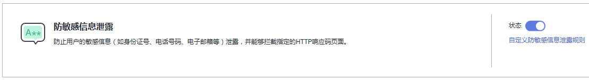

# 配置防敏感信息泄露规则

该任务指导用户通过Web应用防火墙配置防敏感信息泄露规则。

该规则可添加两种类型的防敏感信息泄露规则：

-   敏感信息过滤，配置后可对返回业面中包含的敏感信息做屏蔽处理，防止用户的敏感信息（例如：身份证号、电话号码、电子邮箱等）泄露，
-   响应码拦截，配置后可拦截指定的HTTP响应码页面。

## 前提条件

-   已获取管理控制台的帐号和密码。
-   已添加防护域名。

## 操作步骤

1.  登录管理控制台（https://console.huaweicloud.com/）。
2.  单击管理控制台左上角的，选择区域或项目。
3.  单击页面上方的“服务列表“，选择“安全  \>  Web应用防火墙“，在左侧导航树中选择“域名配置“，进入“域名配置“页面，如[图1](#waf_01_0008_fig164792010154510)所示。

    **图 1**  域名配置页面  
    

4.  在目标域名所在行的“防护策略“栏中，单击“配置防护策略“，进入“防护配置“页面。
5.  在“防敏感信息泄露“的配置框中，用户可根据自己的需要更改“状态“，单击“自定义防敏感信息泄露规则“，进入“防敏感信息泄露“规则配置页面，如[图2](#fig1257034345115)所示。

    **图 2**  防敏感信息泄露配置框  
    

6.  在“防敏感信息泄露“规则配置页面左上角，单击“添加规则“。
7.  在弹出的对话框，添加防敏感信息泄露规则。

    “防敏感信息泄露“规则既能防止用户的敏感信息（例如：身份证号、电话号码、电子邮箱等）泄露，也能够拦截指定的HTTP响应码页面，参数说明如[表1](#table1156133013104)所示。

    **表 1**  参数说明

    
    <table><thead align="left"><tr id="row856530161017"><th class="cellrowborder" valign="top" width="22%" id="mcps1.2.4.1.1">
参数名称

    </th>
    <th class="cellrowborder" valign="top" width="53%" id="mcps1.2.4.1.2">
参数说明

    </th>
    <th class="cellrowborder" valign="top" width="25%" id="mcps1.2.4.1.3">
取值样例

    </th>
    </tr>
    </thead>
    <tbody><tr id="row9571630101014"><td class="cellrowborder" valign="top" width="22%" headers="mcps1.2.4.1.1 ">
路径

    </td>
    <td class="cellrowborder" valign="top" width="53%" headers="mcps1.2.4.1.2 ">
需要过滤敏感信息（例如：身份证号、电话号码、电子邮箱等）或者拦截响应码的URL不包含域名的路径。

    <ul id="ul20810143683616"><li>前缀匹配：填写的路径前缀与需要防护的路径相同即可。
如果防护路径为“/admin”，该规则填写为“/admin*”，该规则生效。

    </li><li>精准匹配：需要防护的路径需要与此处填写的路径完全相等。
如果防护路径为“/admin”，该规则必须填写为“/admin”。

    
 说明： 
<ul id="ul20707155819344"><li>该路径不支持正则，仅支持前缀匹配和精准匹配的逻辑。</li><li>路径里不能含有多条斜线的配置，如“///admin”，访问时，引擎会将“///”转为“/”。</li></ul>
    

    </li></ul>
    </td>
    <td class="cellrowborder" valign="top" width="25%" headers="mcps1.2.4.1.3 ">
/admin*

    </td>
    </tr>
    <tr id="row157103021019"><td class="cellrowborder" valign="top" width="22%" headers="mcps1.2.4.1.1 ">
类型

    </td>
    <td class="cellrowborder" valign="top" width="53%" headers="mcps1.2.4.1.2 "><ul id="ul26881320101620"><li>敏感信息过滤：防止用户的敏感信息（例如：身份证号、电话号码、电子邮箱等）泄露。</li><li>响应码拦截：拦截指定的HTTP响应码页面。</li></ul>
    </td>
    <td class="cellrowborder" valign="top" width="25%" headers="mcps1.2.4.1.3 ">
敏感信息过滤

    </td>
    </tr>
    <tr id="row657212281518"><td class="cellrowborder" valign="top" width="22%" headers="mcps1.2.4.1.1 ">
内容

    </td>
    <td class="cellrowborder" valign="top" width="53%" headers="mcps1.2.4.1.2 ">
防护“类型”对应的防护内容，支持多选。

    </td>
    <td class="cellrowborder" valign="top" width="25%" headers="mcps1.2.4.1.3 ">
身份证号码

    </td>
    </tr>
    </tbody>
    </table>

1.  单击“确定“，在页面右上角弹出“添加成功“，则表示添加防敏感信息泄露规则成功。
    -   当您需要修改添加的防敏感信息泄露规则时，在待修改的防敏感信息泄露规则所在行，单击“修改“，修改防敏感信息泄露规则。
    -   当您需要删除添加的防敏感信息泄露规则时，在待删除的防敏感信息泄露规则所在行，单击“删除“，删除防敏感信息泄露规则。

