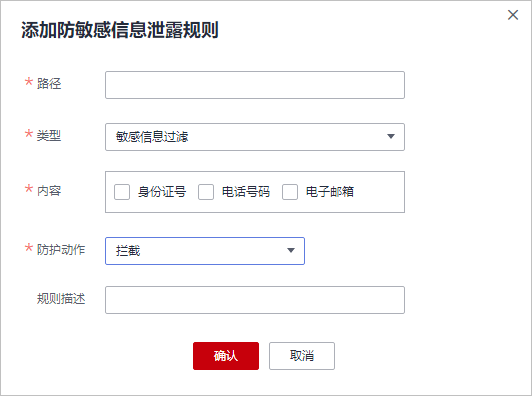
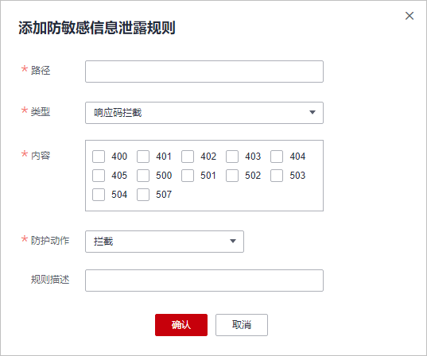

# 配置防敏感信息泄露规则避免敏感信息泄露

您可以添加两种类型的防敏感信息泄露规则：

-   敏感信息过滤。配置后可对返回页面中包含的敏感信息做屏蔽处理，防止用户的敏感信息（例如：身份证号、电话号码、电子邮箱等）泄露。
-   响应码拦截。配置后可拦截指定的HTTP响应码页面。

> **说明：** 
>如果您已开通企业项目，您需要在“企业项目“下拉列表中选择您所在的企业项目并确保已开通操作权限，才能为该企业项目下域名配置防护策略。

## 前提条件

已添加防护网站或已[新增防护策略](步骤一-（可选）新增防护策略.md)。

-   云模式的接入方式参见[网站接入WAF（云模式）](网站接入WAF（云模式）.md)章节。
-   独享模式的接入方式参见[网站接入WAF（独享模式）](网站接入WAF（独享模式）.md)章节。
-   ELB模式的接入方式参见  [网站接入WAF（ELB模式）](网站接入WAF（ELB模式）.md)章节。

## 约束条件

-   云模式的入门版、标准版，以及ELB模式不支持该防护规则。
-   添加或修改防护规则后，规则生效需要几分钟。规则生效后，您可以在“防护事件“页面查看防护效果。
-   仅WAF以下区域支持将“防护动作“配置为“仅记录“模式：
    -   华北-北京一
    -   华北-北京二
    -   华北-北京四
    -   华东-上海一
    -   华东-上海二
    -   华南-广州
    -   华南-深圳
    -   西南-贵阳一
    -   中国-香港
    -   亚太-曼谷
    -   亚太-新加坡

## 操作步骤

1.  [登录管理控制台](https://console.huaweicloud.com/?locale=zh-cn)。
2.  单击管理控制台左上角的，选择区域或项目。
3.  单击页面左上方的，选择“安全与合规  \>  Web应用防火墙 WAF“。
4.  在左侧导航树中，选择“防护策略“，进入“防护策略“页面。
5.  单击目标策略名称，进入目标策略的防护配置页面。
6.  选择“防敏感信息泄露“配置框，用户可根据自己的需要开启或关闭防敏感信息泄露策略。
    -   ：开启状态。
    -   ：关闭状态。

7.  在“防敏感信息泄露“规则配置列表的左上方，单击“添加规则“。
8.  在弹出的对话框，添加防敏感信息泄露规则，如[图1](#fig1077215502209)和[图2](#fig134221027101710)所示，参数说明如[表1](#table242612276178)所示。

    “防敏感信息泄露“规则既能防止用户的敏感信息（例如：身份证号、电话号码、电子邮箱等）泄露，也能够拦截指定的HTTP响应码页面。

    敏感信息过滤：针对网站页面中可能存在的电话号码和身份证等敏感信息，配置相应的规则对其进行屏蔽处理。例如，您可以通过设置以下防护规则，屏蔽身份证号、电话号码和电子邮箱敏感信息。

    **图 1**  敏感信息泄露  
    

    响应码拦截：针对特定的HTTP请求状态码，可配置规则将其拦截，避免服务器敏感信息泄露。例如，您可以通过设置以下防护规则，拦截HTTP 404、502、503状态码。

    **图 2**  响应码拦截  
    

    **表 1**  参数说明

    
    <table><thead align="left"><tr id="row1942310273174"><th class="cellrowborder" valign="top" width="22%" id="mcps1.2.4.1.1">
参数名称

    </th>
    <th class="cellrowborder" valign="top" width="53%" id="mcps1.2.4.1.2">
参数说明

    </th>
    <th class="cellrowborder" valign="top" width="25%" id="mcps1.2.4.1.3">
取值样例

    </th>
    </tr>
    </thead>
    <tbody><tr id="row10424132716173"><td class="cellrowborder" valign="top" width="22%" headers="mcps1.2.4.1.1 ">
路径

    </td>
    <td class="cellrowborder" valign="top" width="53%" headers="mcps1.2.4.1.2 ">
需要过滤敏感信息（例如：身份证号、电话号码、电子邮箱等）或者拦截响应码的URL不包含域名的路径。

    <ul id="ul942442781712"><li>前缀匹配：填写的路径前缀与需要防护的路径相同即可。
如果防护路径为“/admin”，该规则填写为“/admin*”，该规则生效。

    </li><li>精准匹配：需要防护的路径需要与此处填写的路径完全相等。
如果防护路径为“/admin”，该规则必须填写为“/admin”。

    
 说明： 
<ul id="ul0424152720171"><li>该路径不支持正则，仅支持前缀匹配和精准匹配的逻辑。</li><li>路径里不能含有多条斜线的配置，如“///admin”，访问时，引擎会将“///”转为“/”。</li></ul>
    

    </li></ul>
    </td>
    <td class="cellrowborder" valign="top" width="25%" headers="mcps1.2.4.1.3 ">
/admin*

    </td>
    </tr>
    <tr id="row184251827121714"><td class="cellrowborder" valign="top" width="22%" headers="mcps1.2.4.1.1 ">
类型

    </td>
    <td class="cellrowborder" valign="top" width="53%" headers="mcps1.2.4.1.2 "><ul id="ul1442582716174"><li>敏感信息过滤：防止用户的敏感信息（例如：身份证号、电话号码、电子邮箱等）泄露。</li><li>响应码拦截：拦截指定的HTTP响应码页面。</li></ul>
    </td>
    <td class="cellrowborder" valign="top" width="25%" headers="mcps1.2.4.1.3 ">
敏感信息过滤

    </td>
    </tr>
    <tr id="row1426162712179"><td class="cellrowborder" valign="top" width="22%" headers="mcps1.2.4.1.1 ">
内容

    </td>
    <td class="cellrowborder" valign="top" width="53%" headers="mcps1.2.4.1.2 ">
防护“类型”对应的防护内容，支持多选。

    </td>
    <td class="cellrowborder" valign="top" width="25%" headers="mcps1.2.4.1.3 ">
身份证号码

    </td>
    </tr>
    <tr id="row3127152033"><td class="cellrowborder" valign="top" width="22%" headers="mcps1.2.4.1.1 ">
防护动作

    </td>
    <td class="cellrowborder" valign="top" width="53%" headers="mcps1.2.4.1.2 ">
可选择“拦截”或者“仅记录”。

    </td>
    <td class="cellrowborder" valign="top" width="25%" headers="mcps1.2.4.1.3 ">
拦截

    </td>
    </tr>
    <tr id="row19426192771717"><td class="cellrowborder" valign="top" width="22%" headers="mcps1.2.4.1.1 ">
规则描述

    </td>
    <td class="cellrowborder" valign="top" width="53%" headers="mcps1.2.4.1.2 ">
可选参数，设置该规则的备注信息。

    </td>
    <td class="cellrowborder" valign="top" width="25%" headers="mcps1.2.4.1.3 ">
--

    </td>
    </tr>
    </tbody>
    </table>

9.  单击“确认“，添加的防敏感信息泄露规则展示在防敏感信息泄露规则列表中。

## 相关操作

-   规则添加成功后，默认的“规则状态“为“已开启“，若您暂时不想使该规则生效，可在目标规则所在行的“操作“列，单击“关闭“。
-   当您需要修改添加的防敏感信息泄露规则时，在待修改的防敏感信息泄露规则所在行，单击“修改“，修改防敏感信息泄露规则。
-   当您需要删除添加的防敏感信息泄露规则时，在待删除的防敏感信息泄露规则所在行，单击“删除“，删除防敏感信息泄露规则。

## 配置示例-敏感信息过滤

假如防护域名“www.example.com“已接入WAF，您可以参照以下操作步骤验证敏感信息过滤防护效果。

1.  添加一条敏感信息过滤规则。

    **图 3**  敏感信息泄露  
    

2.  开启防敏感信息泄露。

    **图 4**  防敏感信息泄露配置框  
    

3.  清理浏览器缓存，在浏览器中访问“http://www.example.com/admin/“页面。

    该页面的电子邮箱、电话号码和身份号码信息被屏蔽。

    **图 5**  敏感信息屏蔽示例  
    

