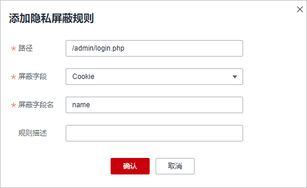

# 配置隐私屏蔽规则

您可以通过Web应用防火墙服务配置隐私屏蔽规则。隐私信息屏蔽，避免用户的密码等信息出现在事件日志中。

> **须知：**   
>检测版不支持配置该规则。  

## 前提条件

已添加防护网站。

## 操作步骤

1.  [登录管理控制台](https://console.huaweicloud.com/?locale=zh-cn)。
2.  进入防护策略配置入口，如[图1](#waf_01_0008_fig089771664710)所示。

    **图 1**  防护策略配置入口  
    

3.  在“隐私屏蔽“配置框中，用户可根据自己的需要更改“状态“，单击“自定义隐私屏蔽规则“，进入隐私屏蔽规则配置页面，如[图2](#fig163378412590)所示。

    **图 2**  隐私设置配置框  
    

4.  在“隐私屏蔽“规则配置页面左上角，单击“添加规则“。
5.  添加隐私屏蔽规则，如[图3](#fig49385421125519)所示，根据[表1](#table4696626918715)配置参数。

    **图 3**  添加隐私屏蔽规则  
    

    **表 1**  添加隐私屏蔽规则参数说明

    
    <table><thead align="left"><tr id="row151760118715"><th class="cellrowborder" valign="top" width="15.85%" id="mcps1.2.4.1.1">
参数

    </th>
    <th class="cellrowborder" valign="top" width="52.2%" id="mcps1.2.4.1.2">
参数说明

    </th>
    <th class="cellrowborder" valign="top" width="31.95%" id="mcps1.2.4.1.3">
取值样例

    </th>
    </tr>
    </thead>
    <tbody><tr id="row125751318715"><td class="cellrowborder" valign="top" width="15.85%" headers="mcps1.2.4.1.1 ">
路径

    </td>
    <td class="cellrowborder" valign="top" width="52.2%" headers="mcps1.2.4.1.2 ">
完整的URL链接，不包含域名。

    <ul id="ul1515617591337"><li>前缀匹配：以*结尾代表以该路径为前缀。例如，需要防护的路径为“/admin/test.php”或 “/adminabc”，则路径可以填写为“/admin*”。</li><li>精准匹配：需要防护的路径需要与此处填写的路径完全相等。例如，需要防护的路径为“/admin”，该规则必须填写为“/admin”。</li></ul>
    
 说明： 
<ul id="ul20707155819344"><li>该路径不支持正则，仅支持前缀匹配和精准匹配的逻辑。</li><li>路径里不能含有连续的多条斜线的配置，如“///admin”，访问时，引擎会将“///”转为“/”。</li></ul>
    

    </td>
    <td class="cellrowborder" valign="top" width="31.95%" headers="mcps1.2.4.1.3 ">
/admin/login.php

    
例如：需要防护的URL为“http://www.example.com/admin/login.php”，则“路径”设置为“/admin/login.php”。

    </td>
    </tr>
    <tr id="row12212154685910"><td class="cellrowborder" valign="top" width="15.85%" headers="mcps1.2.4.1.1 ">
屏蔽字段

    </td>
    <td class="cellrowborder" valign="top" width="52.2%" headers="mcps1.2.4.1.2 ">
设置为屏蔽的字段。<ul id="ul16778520183811"><li>Params：请求参数。</li><li>Cookie：根据Cookie区分的Web访问者。</li><li>Header：自定义HTTP首部。</li><li>Form：表单参数。</li></ul>
    

    </td>
    <td class="cellrowborder" rowspan="2" valign="top" width="31.95%" headers="mcps1.2.4.1.3 "><ul id="ul3574205795514"><li>“屏蔽字段”为“Params”时，屏蔽字段名请根据实际使用需求设置，如果设置为“id”，设置后，与“id”匹配的内容将被屏蔽。</li><li>“屏蔽字段”为“Cookie”时，屏蔽字段名请根据实际使用需求设置，如果设置为“name”，设置后，与“name”匹配的内容将被屏蔽。</li></ul>
    </td>
    </tr>
    <tr id="row3251580618715"><td class="cellrowborder" valign="top" headers="mcps1.2.4.1.1 ">
屏蔽字段名

    </td>
    <td class="cellrowborder" valign="top" headers="mcps1.2.4.1.2 ">
根据“屏蔽字段”设置字段名，被屏蔽的字段将不会出现在日志中。

    
 须知： 

子字段的长度不能超过2048字节，且只能由数字、字母、下划线和中划线组成。

    

    </td>
    </tr>
    <tr id="row997355282"><td class="cellrowborder" valign="top" width="15.85%" headers="mcps1.2.4.1.1 ">
规则描述

    </td>
    <td class="cellrowborder" valign="top" width="52.2%" headers="mcps1.2.4.1.2 ">
可选参数，设置该规则的备注信息。

    </td>
    <td class="cellrowborder" valign="top" width="31.95%" headers="mcps1.2.4.1.3 ">
--

    </td>
    </tr>
    </tbody>
    </table>

6.  单击“确认添加“，添加的隐私屏蔽规则展示在隐私屏蔽规则列表中。

    **图 4**  隐私屏蔽规则列表  
    

    -   规则添加成功后，默认的“规则状态“为“已开启“，若您暂时不想使该规则生效，可在目标规则所在行的“操作“列，单击“关闭“。
    -   若需要修改添加的隐私屏蔽规则时，可单击待修改的隐私屏蔽规则所在行的“修改“，修改隐私屏蔽规则。
    -   若需要删除添加的隐私屏蔽规则时，可单击待删除的隐私屏蔽规则所在行的“删除“，删除隐私屏蔽规则。

