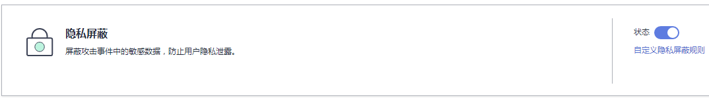

# 配置隐私屏蔽规则

该任务指导用户通过Web应用防火墙服务配置隐私屏蔽规则。隐私信息屏蔽，避免用户的密码等信息出现在事件日志中。

## 前提条件

-   已获取管理控制台的帐号和密码。
-   已添加防护域名。

## 操作步骤

1.  登录管理控制台（https://console.huaweicloud.com/）。
2.  单击页面上方的“服务列表“，选择“安全  \>  Web应用防火墙“，在左侧导航树中选择“域名配置“，进入“域名配置“页面。
3.  在目标域名所在行的“防护策略“栏中，单击策略名称，进入防护配置页面，如[图1](#waf_01_0008_fig164792010154510)所示。

    **图 1**  防护策略  
    

4.  在“隐私屏蔽“配置框中，单击“自定义隐私屏蔽规则“，进入隐私屏蔽规则配置页面，如[图2](#fig163378412590)所示。

    单击，开启防护检测。

    **图 2**  隐私设置配置框  
    

5.  在页面左上角，单击“添加规则“，添加隐私屏蔽规则，如[图3](#fig49385421125519)所示，根据[表1](#table4696626918715)配置参数。

    **图 3**  添加隐私屏蔽规则  
    

    **表 1**  添加隐私屏蔽规则参数说明

    
    <table><thead align="left"><tr id="row151760118715"><th class="cellrowborder" valign="top" width="15.85%" id="mcps1.2.4.1.1">
参数

    </th>
    <th class="cellrowborder" valign="top" width="52.2%" id="mcps1.2.4.1.2">
参数说明

    </th>
    <th class="cellrowborder" valign="top" width="31.95%" id="mcps1.2.4.1.3">
取值样例

    </th>
    </tr>
    </thead>
    <tbody><tr id="row125751318715"><td class="cellrowborder" valign="top" width="15.85%" headers="mcps1.2.4.1.1 ">
路径

    </td>
    <td class="cellrowborder" valign="top" width="52.2%" headers="mcps1.2.4.1.2 ">
完整的URL链接，不包含域名。

    </td>
    <td class="cellrowborder" valign="top" width="31.95%" headers="mcps1.2.4.1.3 ">
/Admin/login.php

    </td>
    </tr>
    <tr id="row12212154685910"><td class="cellrowborder" valign="top" width="15.85%" headers="mcps1.2.4.1.1 ">
屏蔽字段

    </td>
    <td class="cellrowborder" valign="top" width="52.2%" headers="mcps1.2.4.1.2 ">
设置为屏蔽的字段。<ul id="ul16778520183811"><li>params：请求参数。</li><li>cookie：根据Cookie区分的Web访问者。</li><li>header：自定义HTTP首部。
例如：Accept（设置接受的内容类型）、Accept-Charset（设置接受的字符编码）、Accept-Encoding（设置接受编码的格式）等。

    </li><li>form：表单参数。</li></ul>
    

    </td>
    <td class="cellrowborder" valign="top" width="31.95%" headers="mcps1.2.4.1.3 ">
cookie

    </td>
    </tr>
    <tr id="row3251580618715"><td class="cellrowborder" valign="top" width="15.85%" headers="mcps1.2.4.1.1 ">
屏蔽字段名

    </td>
    <td class="cellrowborder" valign="top" width="52.2%" headers="mcps1.2.4.1.2 ">
根据“屏蔽字段” 设置字段名。

    </td>
    <td class="cellrowborder" valign="top" width="31.95%" headers="mcps1.2.4.1.3 ">
name

    </td>
    </tr>
    </tbody>
    </table>

6.  单击“确认添加“，在页面右上角弹出“添加成功“，则表示添加隐私屏蔽规则成功。

    > **说明：**   
    >当您需要修改添加的隐私屏蔽规则时，可单击待修改的隐私屏蔽规则所在行的“修改“，修改隐私屏蔽规则。  
    >当您需要删除添加的隐私屏蔽规则时，可单击待删除的隐私屏蔽规则所在行的“删除“，删除隐私屏蔽规则。  

