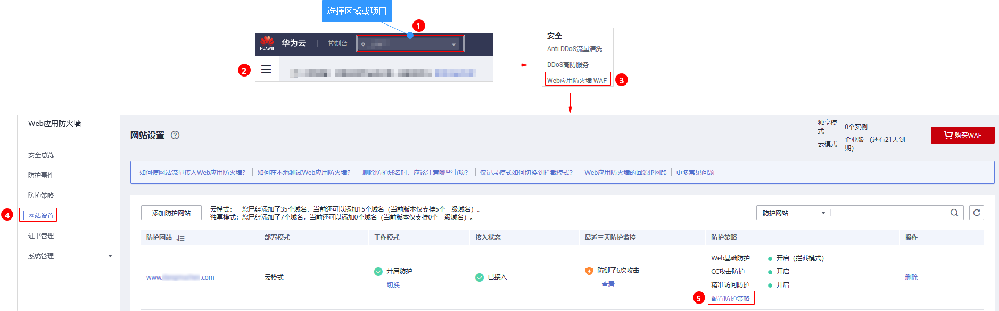
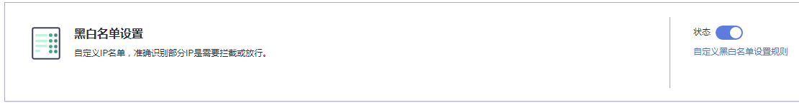
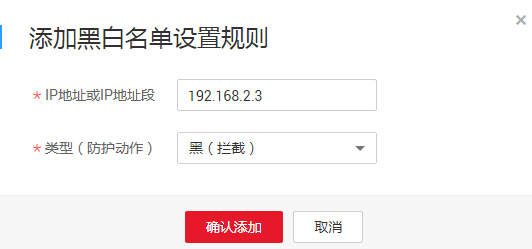
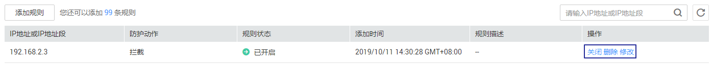
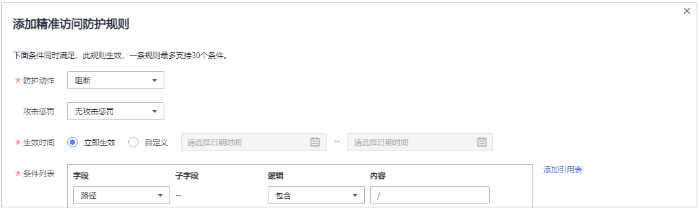

# 配置黑白名单规则

您可以通过Web应用防火墙服务配置黑白名单规则，阻断、仅记录或放行指定IP的访问请求，即设置IP黑/白名单。

## 操作须知

-   检测版不支持配置该规则。
-   将IP或IP地址段配置为黑名单/白名单后，来自该IP或IP地址段的访问，WAF将不会做任何检测，直接拦截/放行。
-   配置的白名单规则优先级优于黑名单规则。
-   当黑白名单规则的“防护动作“设置为“拦截“时，您可以设置攻击惩罚。设置攻击惩罚后，如果访问者的IP、Cookie或Params恶意请求被拦截时，WAF将根据攻击惩罚设置的拦截时长来封禁访问者。有关配置攻击惩罚的详细操作，请参见[配置攻击惩罚标准](zh-cn_topic_0272541691.md)。

## 前提条件

已添加防护网站。

## 操作步骤

1.  [登录管理控制台](https://console.huaweicloud.com/?locale=zh-cn)。
2.  进入防护策略配置入口，如[图1](#zh-cn_topic_0110861309_fig089771664710)所示。

    **图 1**  防护策略配置入口  
    

3.  在“黑白名单设置“配置框中，用户可根据自己的需要更改“状态“，单击“自定义黑白名单设置规则“，进入黑白名单设置规则页面，如[图2](#fig0358162863015)所示。

    **图 2**  黑白名单配置框  
    

4.  在“黑白名单“设置规则页面左上角，单击“添加规则“。
5.  在弹出的对话框中，添加黑白名单规则，如[图3](#fig16699125187)所示，参数说明如[表1](#table147241231818)所示。

    > **说明：** 
    >-   将IP配置为仅记录后，来自该IP的访问，WAF将根据防护规则进行检测并记录该IP的防护事件数据。
    >-   其他的IP将根据配置的WAF防护规则进行检测。

    **图 3**  添加黑白名单规则  
    

    **表 1**  黑白名单参数说明

    
    <table><thead align="left"><tr id="row167071221814"><th class="cellrowborder" valign="top" width="18.81188118811881%" id="mcps1.2.4.1.1">
参数

    </th>
    <th class="cellrowborder" valign="top" width="36.633663366336634%" id="mcps1.2.4.1.2">
参数说明

    </th>
    <th class="cellrowborder" valign="top" width="44.554455445544555%" id="mcps1.2.4.1.3">
取值样例

    </th>
    </tr>
    </thead>
    <tbody><tr id="row671212161816"><td class="cellrowborder" valign="top" width="18.81188118811881%" headers="mcps1.2.4.1.1 ">
IP地址或IP地址段

    </td>
    <td class="cellrowborder" valign="top" width="36.633663366336634%" headers="mcps1.2.4.1.2 ">
支持IPv4和IPv6格式的IP地址或IP地址段。

    <ul id="ul16332155911817"><li>IP地址：添加黑名单或者白名单的IP地址。</li><li>IP地址段：IP地址与子网掩码。</li></ul>
    
 须知： 

当前仅“华北”区域支持IPv6防护，且仅企业版和旗舰版支持IPv6。

    

    </td>
    <td class="cellrowborder" valign="top" width="44.554455445544555%" headers="mcps1.2.4.1.3 "><ul id="ul20137241191011"><li>IPv4格式：<ul id="ul2071625551110"><li>192.168.2.3</li><li>10.1.1.0/24</li></ul>
    </li><li>IPv6格式：1050:0:0:0:5:600:300c:326b</li></ul>
    </td>
    </tr>
    <tr id="row127111201815"><td class="cellrowborder" valign="top" width="18.81188118811881%" headers="mcps1.2.4.1.1 ">
防护动作

    </td>
    <td class="cellrowborder" valign="top" width="36.633663366336634%" headers="mcps1.2.4.1.2 "><ul id="ul14238171916485"><li>拦截：IP地址或IP地址段设置的是黑名单且需要拦截，则选择“拦截”。</li><li>放行：IP地址或IP地址段设置的是白名单，则选择“放行”。</li><li>仅记录：需要观察的IP地址或IP地址段，可选择“仅记录”。再根据<a href="zh-cn_topic_0124433570.md">防护事件数据</a>判断该IP地址或IP地址段是黑名单还是白名单。</li></ul>
    </td>
    <td class="cellrowborder" valign="top" width="44.554455445544555%" headers="mcps1.2.4.1.3 ">
拦截

    </td>
    </tr>
    <tr id="row145743412307"><td class="cellrowborder" valign="top" width="18.81188118811881%" headers="mcps1.2.4.1.1 ">
攻击惩罚

    </td>
    <td class="cellrowborder" valign="top" width="36.633663366336634%" headers="mcps1.2.4.1.2 ">
当“防护动作”设置为“拦截”时，您可以设置攻击惩罚标准。设置攻击惩罚后，当访问者的IP、Cookie或Params恶意请求被拦截时，WAF将根据惩罚标准设置的拦截时长来封禁访问者。

    </td>
    <td class="cellrowborder" valign="top" width="44.554455445544555%" headers="mcps1.2.4.1.3 ">
长时间IP拦截

    </td>
    </tr>
    <tr id="row147241221818"><td class="cellrowborder" valign="top" width="18.81188118811881%" headers="mcps1.2.4.1.1 ">
规则描述

    </td>
    <td class="cellrowborder" valign="top" width="36.633663366336634%" headers="mcps1.2.4.1.2 ">
可选参数，设置该规则的备注信息。

    </td>
    <td class="cellrowborder" valign="top" width="44.554455445544555%" headers="mcps1.2.4.1.3 ">
--

    </td>
    </tr>
    </tbody>
    </table>

6.  输入完成后，单击“确认添加“，添加的黑白名单展示在黑白名单规则列表中。

    **图 4**  黑白名单规则列表  
    

    -   规则添加成功后，默认的“规则状态“为“已开启“，若您暂时不想使该规则生效，可在目标规则所在行的“操作“列，单击“关闭“。
    -   若需要修改添加的黑白名单规则时，可单击待修改的黑白名单IP规则所在行的“修改“，修改黑白名单规则。
    -   若需要删除添加的黑白名单规则时，可单击待删除的黑白名单IP规则所在行的“删除“，删除黑白名单规则。

## 配置示例

假如您仅需要放行3个IP，其他的IP全部拦截。

**配置方法**：利用[精准访问防护规则](配置精准访问防护规则.md)，配置如[图5](#fig1556814102038)的规则；再将三个IP分别配置为白名单。

**图 5**  阻断所有的请求  

## 防护效果

假如已添加域名“www.example.com“。可参照以下步骤验证防护效果：

1.  清理浏览器缓存，在浏览器中输入防护域名，测试网站域名是否能正常访问。
    -   不能正常访问，参照[域名接入WAF](zh-cn_topic_0125242653.md)章节重新完成域名接入。
    -   能正常访问，执行[2](#li885731953512)。

2.  参照[操作步骤](#section61533550183130)，将您的客户端IP配置为黑名单。
3.  清理浏览器缓存，在浏览器中访问“http://www.example.com“页面，正常情况下，WAF会阻断该IP的访问请求，返回拦截页面。
4.  返回Web应用防火墙控制界面，在左侧导航树中，单击“防护事件“，进入“防护事件“页面，查看防护域名拦截日志，您也可以[下载防护事件数据](zh-cn_topic_0124433570.md)。

