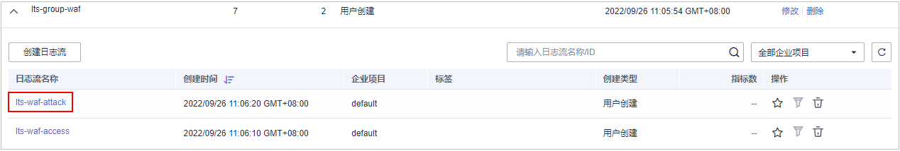

# 防护日志记录到LTS

云日志服务（Log Tank Service，简称LTS）对于采集的日志数据，通过海量日志数据的分析与处理，可以为您提供一个实时、高效、安全的日志处理能力。WAF支持将攻击日志、访问日志记录到LTS中，当日志记录到LTS后，日志可以长期保存，您可以通过LTS记录的日志数据，快速高效地进行实时决策分析、设备运维管理以及业务趋势分析。

> **说明：**   
>在WAF管理控制台，您可以查看最近30天的防护日志、下载5天内的所有防护域名的防护日志数据。  

## 注意事项

LTS按流量单独计费。有关LTS的计费详情，请参见[LTS价格详情](https://www.huaweicloud.com/pricing.html#/lts)。

## 前提条件

已成功添加防护域名。

## 将防护日志配置到LTS

1.  [登录管理控制台](https://console.huaweicloud.com/?locale=zh-cn)。
2.  进入全量日志配置入口，如[图1](#fig1030319478517)所示。

    **图 1**  全量日志入口  
    

3.  开启全量日志，并选择日志组和日志流，如[图2](#fig928951613101)所示，相关参数说明如[表1](#table11535733111515)所示。

    **图 2**  配置全量日志  
    

    **表 1**  全量日志配置参数

    
    <table><thead align="left"><tr id="row353613334158"><th class="cellrowborder" valign="top" width="26.12261226122612%" id="mcps1.2.4.1.1">
参数

    </th>
    <th class="cellrowborder" valign="top" width="40.54405440544054%" id="mcps1.2.4.1.2">
参数说明

    </th>
    <th class="cellrowborder" valign="top" width="33.33333333333333%" id="mcps1.2.4.1.3">
取值样例

    </th>
    </tr>
    </thead>
    <tbody><tr id="row15536143321520"><td class="cellrowborder" valign="top" width="26.12261226122612%" headers="mcps1.2.4.1.1 ">
选择日志组

    </td>
    <td class="cellrowborder" valign="top" width="40.54405440544054%" headers="mcps1.2.4.1.2 ">
选择已创建的日志组，或者单击“查看日志组”，跳转到LTS管理控制台创建新的日志组。

    </td>
    <td class="cellrowborder" valign="top" width="33.33333333333333%" headers="mcps1.2.4.1.3 ">
lts-group-waf

    </td>
    </tr>
    <tr id="row15536133111516"><td class="cellrowborder" valign="top" width="26.12261226122612%" headers="mcps1.2.4.1.1 ">
记录攻击日志

    </td>
    <td class="cellrowborder" valign="top" width="40.54405440544054%" headers="mcps1.2.4.1.2 ">
选择已创建的日志流，或者单击“查看日志流”，跳转到LTS管理控制台创建新的日志流。

    
攻击日志记录每一个攻击告警信息，包括攻击事件类型、防护动作、攻击源IP等信息。

    </td>
    <td class="cellrowborder" valign="top" width="33.33333333333333%" headers="mcps1.2.4.1.3 ">
lts-topic-waf-attack

    </td>
    </tr>
    <tr id="row5536143301512"><td class="cellrowborder" valign="top" width="26.12261226122612%" headers="mcps1.2.4.1.1 ">
记录访问日志

    </td>
    <td class="cellrowborder" valign="top" width="40.54405440544054%" headers="mcps1.2.4.1.2 ">
选择已创建的日志流，或者单击“查看日志流”，跳转到LTS管理控制台创建新的日志流。

    
访问日志记录每一个HTTP访问的关键信息，包括访问时间、访问客户端IP、访问资源URL等信息。

    </td>
    <td class="cellrowborder" valign="top" width="33.33333333333333%" headers="mcps1.2.4.1.3 ">
lts-topic-waf-access

    </td>
    </tr>
    </tbody>
    </table>

4.  单击“确定“，全量日志配置成功。

    您可以在LTS管理控制台查看WAF的防护日志。

## 在LTS上查看WAF防护日志

当您将WAF防护日志配置记录到LTS上后，请参考以下操作步骤，在LTS管理控制台查看、分析记录的WAF日志数据。

1.  [登录管理控制台](https://console.huaweicloud.com/?locale=zh-cn)。
2.  进入日志流入口，如[图3](#fig11902193715135)所示。

    **图 3**  日志流入口  
    

3.  查看WAF防护日志。
    -   查看攻击日志
        1.  在日志流列表，单击配置的攻击日志流“lts-topic-waf-attack“，如[图4](#fig472533374310)所示。

            **图 4**  单击攻击日志流名称  
            

        2.  查看攻击日志，日志示例如[图5](#fig3630258133613)所示。

            **图 5**  查看攻击日志  
            

    -   查看访问日志
        1.  在日志流列表，单击配置的访问日志流“lts-topic-waf-access“，如[图6](#fig1079183718507)所示。

            **图 6**  单击访问日志流名称  
            

        2.  查看访问日志，日志示例如[图7](#fig3826175165212)所示。

            **图 7**  查看访问日志  
            

## 相关操作

如果您不需要将攻击日志、访问日志记录到LTS，您可以关闭全量日志。

