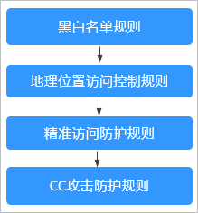

# 防护配置引导

本文介绍Web应用防火墙（Web Application Firewall，WAF）服务的防护策略的配置流程以及WAF引擎检测机制及规则的检测顺序。

## 策略配置流程

网站接入WAF防护后，您可以参照以下步骤，为网站配置防护策略。

<table><thead align="left"><tr id="row19721847191115"><th class="cellrowborder" valign="top" width="39.269999999999996%" id="mcps1.1.3.1.1">
步骤

</th>
<th class="cellrowborder" valign="top" width="60.73%" id="mcps1.1.3.1.2">
说明

</th>
</tr>
</thead>
<tbody><tr id="row49723476116"><td class="cellrowborder" valign="top" width="39.269999999999996%" headers="mcps1.1.3.1.1 ">
<a href="步骤一-（可选）新增防护策略.md">步骤一：（可选）新增防护策略</a>

</td>
<td class="cellrowborder" valign="top" width="60.73%" headers="mcps1.1.3.1.2 ">
域名添加到WAF后，WAF会自动为该域名绑定一个防护策略，该策略中包含了WAF默认的防护规则，如果需要重新定制防护策略，可新增防护策略。

</td>
</tr>
<tr id="row5972547111115"><td class="cellrowborder" valign="top" width="39.269999999999996%" headers="mcps1.1.3.1.1 ">
<a href="步骤二-为策略配置防护规则.md">步骤二：为策略配置防护规则</a>

</td>
<td class="cellrowborder" valign="top" width="60.73%" headers="mcps1.1.3.1.2 ">
防护策略是防护规则的合集，WAF支持的防护规则见<a href="#zh-cn_topic_0000001271159206_zh-cn_topic_0199698323_table14874354152011">表1</a>。

</td>
</tr>
<tr id="row697220477119"><td class="cellrowborder" valign="top" width="39.269999999999996%" headers="mcps1.1.3.1.1 ">
<a href="步骤三-添加策略适用的防护域名.md">步骤三：添加策略适用的防护域名</a>

</td>
<td class="cellrowborder" valign="top" width="60.73%" headers="mcps1.1.3.1.2 ">
一条防护策略可以适用于多个防护域名，如果多个域名适用这条策略，可为策略添加适用的防护域名。

</td>
</tr>
</tbody>
</table>

**表 1**  可配置的防护规则

<table><thead align="left"><tr id="zh-cn_topic_0000001271159206_zh-cn_topic_0199698323_row387516548205"><th class="cellrowborder" valign="top" width="27.700000000000003%" id="mcps1.2.4.1.1">
防护规则

</th>
<th class="cellrowborder" valign="top" width="38.64%" id="mcps1.2.4.1.2">
说明

</th>
<th class="cellrowborder" valign="top" width="33.660000000000004%" id="mcps1.2.4.1.3">
参考文档

</th>
</tr>
</thead>
<tbody><tr id="zh-cn_topic_0000001271159206_zh-cn_topic_0199698323_row187565419201"><td class="cellrowborder" valign="top" width="27.700000000000003%" headers="mcps1.2.4.1.1 ">
Web基础防护规则

</td>
<td class="cellrowborder" valign="top" width="38.64%" headers="mcps1.2.4.1.2 ">
覆盖OWASP（Open Web Application Security Project，简称OWASP）TOP 10中常见安全威胁，通过预置丰富的信誉库，对恶意扫描器、IP、网马等威胁进行检测和拦截。

</td>
<td class="cellrowborder" valign="top" width="33.660000000000004%" headers="mcps1.2.4.1.3 ">
<a href="配置Web基础防护规则防御常见Web攻击.md">配置Web基础防护规则防御常见Web攻击</a>

</td>
</tr>
<tr id="zh-cn_topic_0000001271159206_zh-cn_topic_0199698323_row148751545201"><td class="cellrowborder" valign="top" width="27.700000000000003%" headers="mcps1.2.4.1.1 ">
CC攻击防护规则

</td>
<td class="cellrowborder" valign="top" width="38.64%" headers="mcps1.2.4.1.2 ">
可以自定义CC防护规则，限制单个IP/Cookie/Referer访问者对您的网站上特定路径（URL）的访问频率，WAF会根据您配置的规则，精准识别CC攻击以及有效缓解CC攻击。

</td>
<td class="cellrowborder" valign="top" width="33.660000000000004%" headers="mcps1.2.4.1.3 ">
<a href="配置CC攻击防护规则防御CC攻击.md">配置CC攻击防护规则防御CC攻击</a>

</td>
</tr>
<tr id="zh-cn_topic_0000001271159206_zh-cn_topic_0199698323_row1387525413206"><td class="cellrowborder" valign="top" width="27.700000000000003%" headers="mcps1.2.4.1.1 ">
精准访问防护规则

</td>
<td class="cellrowborder" valign="top" width="38.64%" headers="mcps1.2.4.1.2 ">
精准访问防护策略可对HTTP首部、Cookie、访问URL、请求参数或者客户端IP进行条件组合，定制化防护策略，为您的网站带来更精准的防护。

</td>
<td class="cellrowborder" valign="top" width="33.660000000000004%" headers="mcps1.2.4.1.3 ">
<a href="配置精准访问防护规则定制化防护策略.md">配置精准访问防护规则定制化防护策略</a>

</td>
</tr>
<tr id="zh-cn_topic_0000001271159206_zh-cn_topic_0199698323_row18875115412200"><td class="cellrowborder" valign="top" width="27.700000000000003%" headers="mcps1.2.4.1.1 ">
黑白名单规则

</td>
<td class="cellrowborder" valign="top" width="38.64%" headers="mcps1.2.4.1.2 ">
配置黑白名单规则，阻断、仅记录或放行指定IP的访问请求，即设置IP黑/白名单。

</td>
<td class="cellrowborder" valign="top" width="33.660000000000004%" headers="mcps1.2.4.1.3 ">
<a href="配置IP黑白名单规则拦截-放行指定IP.md">配置IP黑白名单规则拦截/放行指定IP</a>

</td>
</tr>
<tr id="row63659134717"><td class="cellrowborder" valign="top" width="27.700000000000003%" headers="mcps1.2.4.1.1 ">
攻击惩罚规则

</td>
<td class="cellrowborder" valign="top" width="38.64%" headers="mcps1.2.4.1.2 ">
当恶意请求被拦截时，可设置自动封禁访问者一段时间，该功能和其他规则结合使用。

</td>
<td class="cellrowborder" valign="top" width="33.660000000000004%" headers="mcps1.2.4.1.3 ">
<a href="配置攻击惩罚标准自动封禁访问者指定时长.md">配置攻击惩罚标准自动封禁访问者指定时长</a>

</td>
</tr>
<tr id="zh-cn_topic_0000001271159206_zh-cn_topic_0199698323_row10875105492011"><td class="cellrowborder" valign="top" width="27.700000000000003%" headers="mcps1.2.4.1.1 ">
地理位置访问控制规则

</td>
<td class="cellrowborder" valign="top" width="38.64%" headers="mcps1.2.4.1.2 ">
针对指定国家、地区的来源IP自定义访问控制。

</td>
<td class="cellrowborder" valign="top" width="33.660000000000004%" headers="mcps1.2.4.1.3 ">
<a href="配置地理位置访问控制规则拦截-放行特定区域请求.md">配置地理位置访问控制规则拦截/放行特定区域请求</a>

</td>
</tr>
<tr id="zh-cn_topic_0000001271159206_zh-cn_topic_0199698323_row38751454192010"><td class="cellrowborder" valign="top" width="27.700000000000003%" headers="mcps1.2.4.1.1 ">
网页防篡改规则

</td>
<td class="cellrowborder" valign="top" width="38.64%" headers="mcps1.2.4.1.2 ">
当用户需要防护静态页面被篡改时，可配置网页防篡改规则。

</td>
<td class="cellrowborder" valign="top" width="33.660000000000004%" headers="mcps1.2.4.1.3 ">
<a href="配置网页防篡改规则避免静态网页被篡改.md">配置网页防篡改规则避免静态网页被篡改</a>

</td>
</tr>
<tr id="zh-cn_topic_0000001271159206_zh-cn_topic_0199698323_row0699639122212"><td class="cellrowborder" valign="top" width="27.700000000000003%" headers="mcps1.2.4.1.1 ">
网站反爬虫规则

</td>
<td class="cellrowborder" valign="top" width="38.64%" headers="mcps1.2.4.1.2 ">
动态分析网站业务模型，结合人机识别技术和数据风控手段，精准识别爬虫行为。

</td>
<td class="cellrowborder" valign="top" width="33.660000000000004%" headers="mcps1.2.4.1.3 ">
<a href="配置网站反爬虫防护规则防御爬虫攻击.md">配置网站反爬虫防护规则防御爬虫攻击</a>

</td>
</tr>
<tr id="zh-cn_topic_0000001271159206_zh-cn_topic_0199698323_row569919395228"><td class="cellrowborder" valign="top" width="27.700000000000003%" headers="mcps1.2.4.1.1 ">
防敏感信息泄露规则

</td>
<td class="cellrowborder" valign="top" width="38.64%" headers="mcps1.2.4.1.2 ">
该规则可添加两种类型的防敏感信息泄露规则：

<ul id="zh-cn_topic_0000001271159206_zh-cn_topic_0199698323_ul171121523162819"><li>敏感信息过滤。配置后可对返回页面中包含的敏感信息做屏蔽处理，防止用户的敏感信息（例如：身份证号、电话号码、电子邮箱等）泄露。</li><li>响应码拦截。配置后可拦截指定的HTTP响应码页面。</li></ul>
</td>
<td class="cellrowborder" valign="top" width="33.660000000000004%" headers="mcps1.2.4.1.3 ">
<a href="配置防敏感信息泄露规则避免敏感信息泄露.md">配置防敏感信息泄露规则避免敏感信息泄露</a>

</td>
</tr>
<tr id="zh-cn_topic_0000001271159206_zh-cn_topic_0199698323_row8699133972219"><td class="cellrowborder" valign="top" width="27.700000000000003%" headers="mcps1.2.4.1.1 ">
全局白名单（原误报屏蔽）规则

</td>
<td class="cellrowborder" valign="top" width="38.64%" headers="mcps1.2.4.1.2 ">
针对特定请求忽略某些攻击检测规则，用于处理误报事件。

</td>
<td class="cellrowborder" valign="top" width="33.660000000000004%" headers="mcps1.2.4.1.3 ">
<a href="配置全局白名单（原误报屏蔽）规则对误报进行忽略.md">配置全局白名单（原误报屏蔽）规则对误报进行忽略</a>

</td>
</tr>
<tr id="zh-cn_topic_0000001271159206_zh-cn_topic_0199698323_row12341732172215"><td class="cellrowborder" valign="top" width="27.700000000000003%" headers="mcps1.2.4.1.1 ">
隐私屏蔽规则

</td>
<td class="cellrowborder" valign="top" width="38.64%" headers="mcps1.2.4.1.2 ">
隐私信息屏蔽，避免用户的密码等信息出现在事件日志中。

</td>
<td class="cellrowborder" valign="top" width="33.660000000000004%" headers="mcps1.2.4.1.3 ">
<a href="配置隐私屏蔽规则防隐私信息泄露.md">配置隐私屏蔽规则防隐私信息泄露</a>

</td>
</tr>
</tbody>
</table>

## WAF引擎检测机制

Web应用防火墙内置的防护规则，可帮助您防范常见的Web应用攻击，包括XSS攻击、SQL注入、爬虫检测、Webshell检测等。同时，您也可以根据自己网站防护的需要，灵活配置防护规则，Web应用防火墙根据您配置的防护规则更好的防护您的网站业务。WAF引擎内置防护规则的检测流程如[图1](#zh-cn_topic_0000001271159206_zh-cn_topic_0199698323_fig1628214208241)所示，自定义规则的检测顺序如[图2](#zh-cn_topic_0000001271159206_zh-cn_topic_0199698323_fig2084820326445)所示。

**图 1**  WAF引擎检测图  

**图 2**  自定义防护规则的检测顺序  

**响应动作**：

-   pass：命中规则后无条件放行当前请求。
-   block：命中规则后拦截当前请求。
-   captcha：命中规则后执行人机验证动作。
-   redirect：命中规则后通知客户端执行重定向动作。
-   log：命中规则后仅记录攻击信息。
-   mask：命中规则后对相关敏感信息进行脱敏处理。

