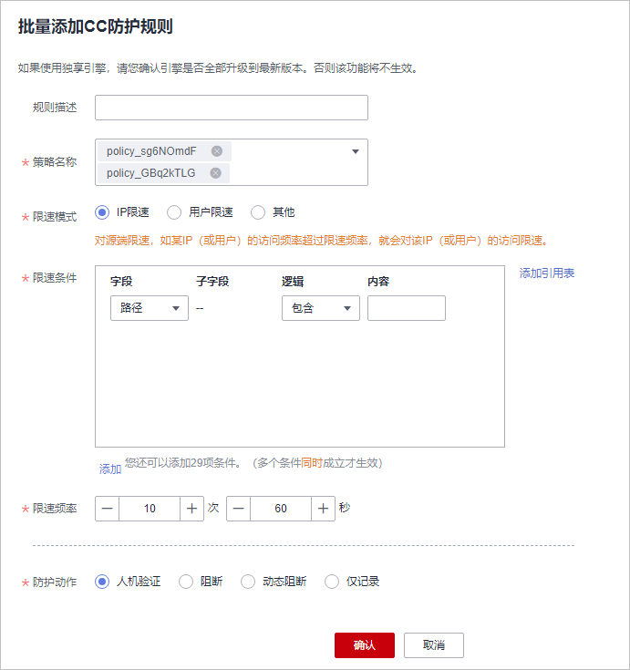

# （可选）批量添加防护规则

您可以通过Web应用防火墙服务为防护策略批量添加防护规则。

> **说明：** 
>如果您已开通企业项目，您需要在“企业项目“下拉列表中选择您所在的企业项目并确保已开通操作权限，才能为该企业项目批量添加防护规则。

## 前提条件

已添加防护网站。

## 约束条件

入门版仅支持批量添加全局白名单（原误报屏蔽）规则。

## 操作步骤

1.  [登录管理控制台](https://console.huaweicloud.com/?locale=zh-cn)。
2.  单击管理控制台左上角的，选择区域或项目。
3.  单击页面左上方的，选择“安全与合规  \>  Web应用防火墙 WAF“。
4.  在左侧导航树中，选择“防护策略“，进入“防护策略“页面。
5.  在页面左上角，单击“所有策略规则“。
6.  在待配置规则列表的左上角，单击“批量添加“，进入对应的规则配置页面。
7.  选择策略名称，在“策略名称“的下拉框中选择策略名，可批量多选。

    **图 1**  批量添加防护规则  
    

8.  完成除“策略名称“以外其它参数的配置。
    -   “CC攻击防护“请参见[表1](配置CC攻击防护规则防御CC攻击.md#table480817611214)进行参数配置。
    -   “精准访问防护“请参见[表1](配置精准访问防护规则定制化防护策略.md#table2299936310457)进行参数配置。
    -   “黑白名单设置“请参见[表1](配置IP黑白名单规则拦截-放行指定IP.md#table147241231818)进行参数配置。
    -   “地理位置访问控制“请参见[表1](配置地理位置访问控制规则拦截-放行特定区域请求.md#table157961352154713)进行参数配置。
    -   “网页防篡改“请参见[表1](配置网页防篡改规则避免静态网页被篡改.md#table2046816299203)进行参数配置。
    -   “防敏感信息泄露“请参见[表1](配置防敏感信息泄露规则避免敏感信息泄露.md#table242612276178)进行参数配置。
    -   “全局白名单“请参见[表1](配置全局白名单（原误报屏蔽）规则对误报进行忽略.md#table1623195815237)进行参数配置。
    -   “隐私屏蔽“请参见[表1](配置隐私屏蔽规则防隐私信息泄露.md#table4696626918715)进行参数配置。

9.  单击“确认“，批量添加防护规则成功。

## 相关操作

-   规则添加成功后，默认的“规则状态“为“已开启“，若您暂时不想使该策略生效，可在目标策略所在行的“操作“列，单击“关闭“，也可以批量勾选多条策略规则，单击列表上方的“批量关闭“，同时关闭多条策略规则。
-   当您需要修改添加的规则时，在待修改的规则所在行，单击“修改“，修改规则，也可以批量勾选不同策略下的多条规则，单击列表上方的“批量修改“，同时修改多条策略规则。
-   当您需要删除添加的规则时，在待删除的规则所在行，单击“删除“，删除规则，也可以批量勾选多条策略规则，单击列表上方的“批量删除“，同时删除多条策略规则。
-   当您需要批量开启策略规则时，批量勾选多条策略规则，单击列表上方的“批量开启“，同时开启多条策略规则。

